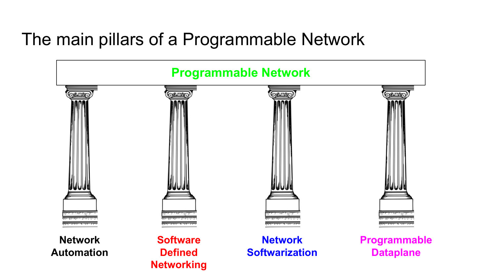

# 001 - Course Introduction and Motivation

## Why did the Internet foster enormous innovation at the edge but become difficult to change inside the network?

The Internet succeeded partly because its network core was deliberately under-specified: it offered a general best-effort packet-delivery service, while hosts were free to run arbitrary applications. This narrow waist let developers introduce the Web, peer-to-peer systems, VoIP, and many other applications without redesigning routers.

The situation inside the network evolved differently. Network equipment became vertically integrated: software was bundled with specialized hardware, interfaces were vendor-specific, and new protocols required slow standardization. Consequently, only a small number of equipment vendors could change network behavior, and introducing a feature could take years.

This contrast explains the motivation for programmable networks: bring software-like flexibility and open interfaces into the network itself, while preserving the performance and reliability expected from the infrastructure.

_Source: Lecture 001, slides 5-6._

## What is Internet ossification, and why is it a problem?

Internet ossification is the tendency of the network infrastructure to become rigid and difficult to evolve. It is not simply that old protocols remain in use; it is that closed equipment, tightly coupled hardware and software, vendor-specific interfaces, and slow standardization make new behavior hard to deploy.

The practical consequence is a long innovation cycle. Operators cannot easily experiment with new forwarding, security, or management functions, so improvements in performance, reliability, and cost arrive slowly. Programmability attacks this problem by making behavior expressible in software and controllable through standard interfaces.

_Source: Lecture 001, slides 6 and 8._

## Why are traditional networks considered hard and expensive to manage?

Traditional operation depends heavily on manual configuration, proprietary command-line interfaces, and complex device software. Operating expenditure can exceed the cost of purchasing the network, yet operator mistakes still cause a large fraction of outages.

The devices themselves may contain tens of millions of lines of code, so bugs can cause cascading failures or vulnerabilities. Moreover, the network can become an obstacle to rapidly changing applications, especially in data centers where large numbers of virtual machines must be created, moved, and connected dynamically.

The key lesson is that management problems are architectural, not merely a need for better scripts: automation, abstraction, and programmable control are required to reduce human error and make network behavior repeatable.

_Source: Lecture 001, slide 7._

## What are the four main pillars of a programmable network, and how do they complement one another?

The four pillars are **network automation**, **software-defined networking (SDN)**, **network softwarization**, and the **programmable data plane**.

- Network automation makes configuration and operation systematic and repeatable through models, APIs, and software tools.
- SDN separates control decisions from packet forwarding and exposes a programmable, logically centralized view of the network.
- Network softwarization implements network functions as software, for example through NFV, so services can be deployed and scaled independently of dedicated appliances.
- A programmable data plane makes the packet-processing pipeline itself configurable, allowing new headers, matches, and actions at high speed.

Together they cover different layers of the problem: automation changes how devices are operated, SDN changes how the network is controlled, softwarization changes where functions execute, and data-plane programmability changes what the forwarding hardware can do.

_Source: Lecture 001, slides 9-11._
