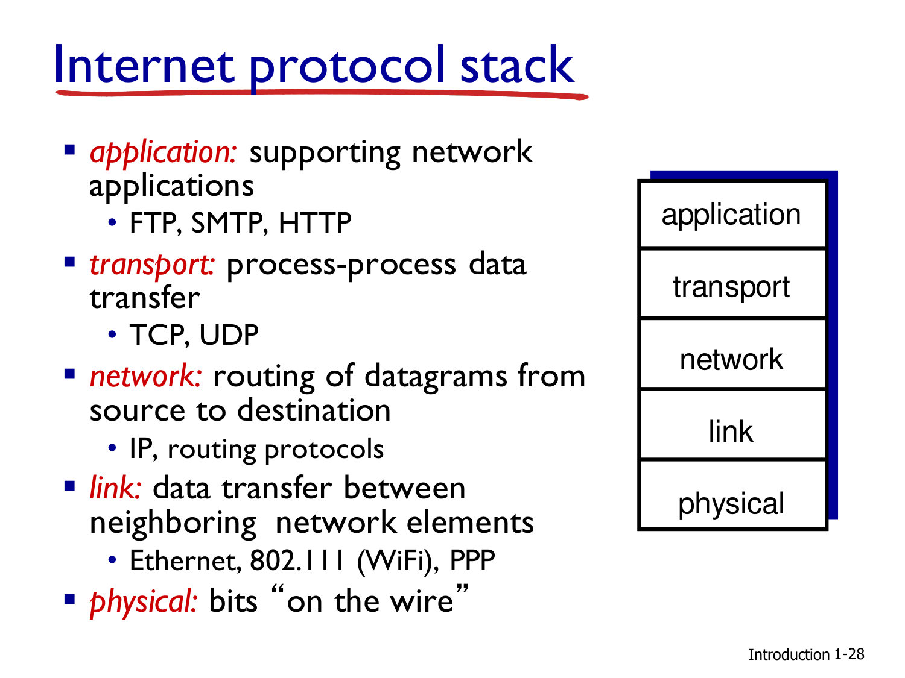
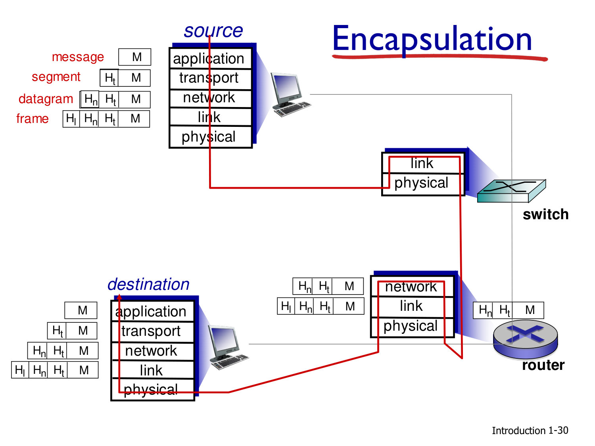
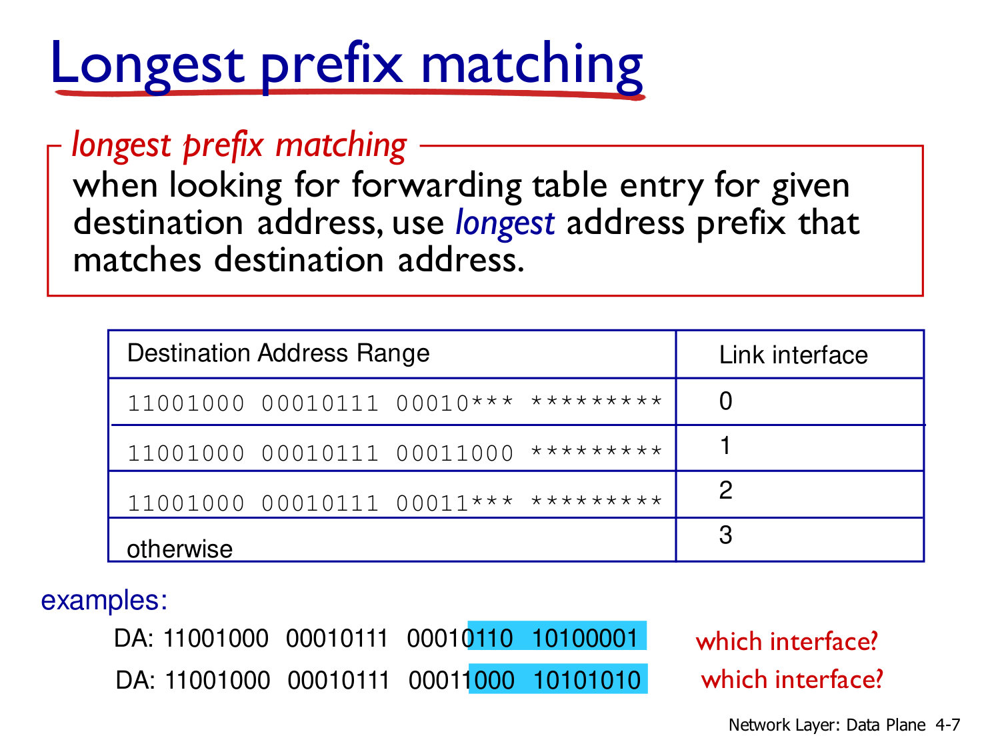
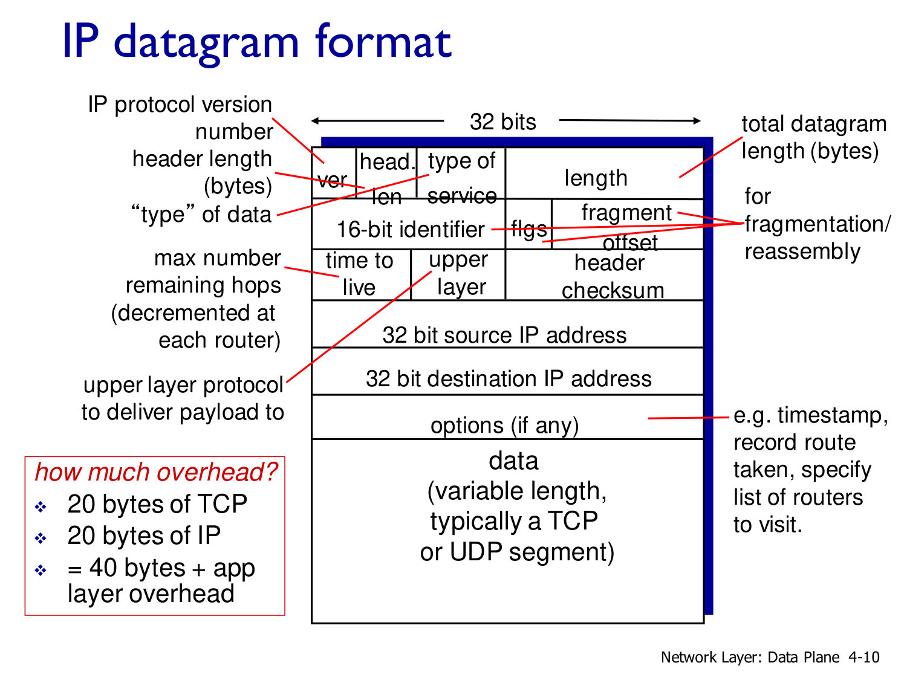
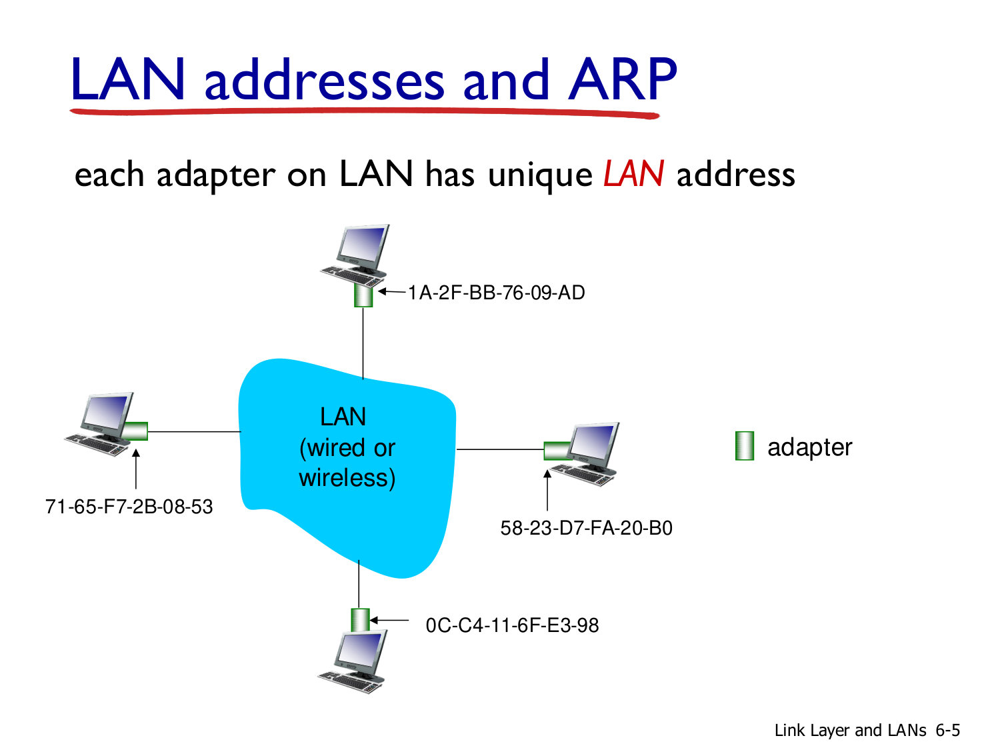
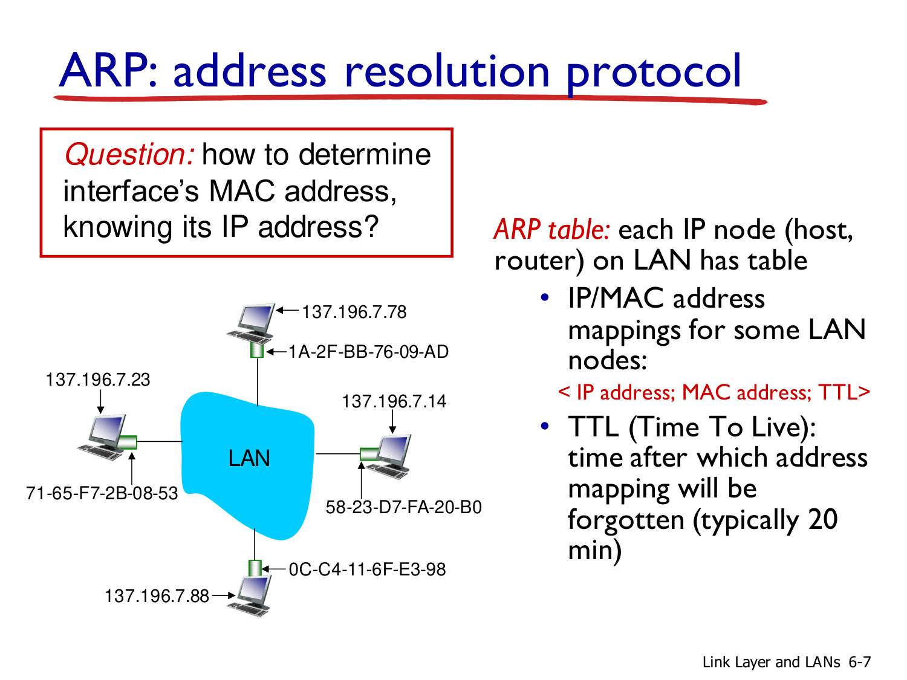
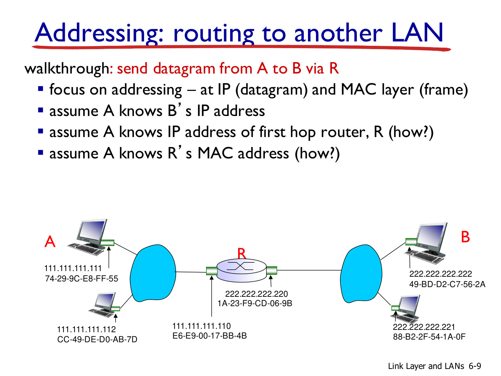
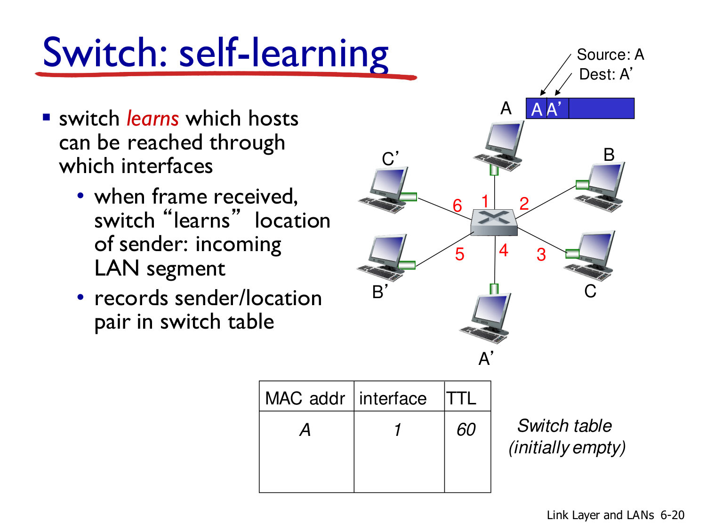
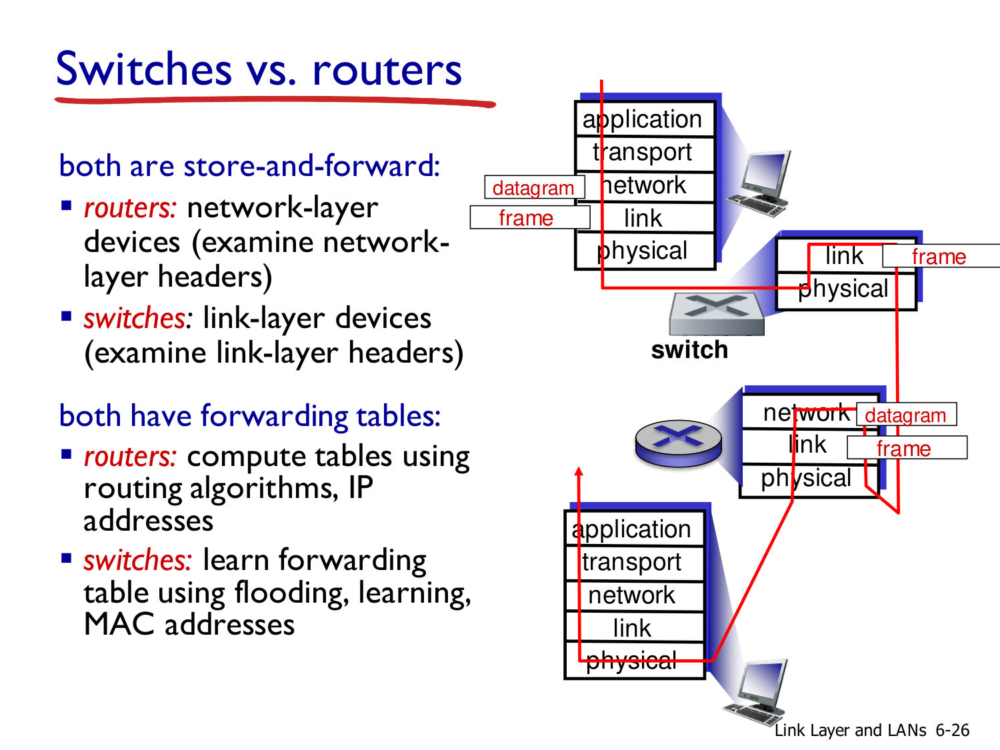

# 002 - Networking Basics

## Describe the Internet from a "nuts and bolts" perspective.

The Internet is a network of interconnected end systems, communication links, and packet switches. End systems - hosts such as phones, laptops, and servers - run network applications. Links carry bits over media such as fiber, copper, radio, or satellite and are characterized by a transmission rate, or bandwidth.

Routers and switches are packet switches: they receive packets, examine relevant headers, and move the packets toward their destinations. Local access networks connect through regional and global providers, producing a network of networks rather than one monolithic system.

This physical view matters because every higher-level service ultimately depends on finite link capacity and on packet-by-packet decisions made by intermediate devices.

_Source: Lecture 002, slide 1._

## Distinguish routing from forwarding.

**Forwarding** is the local data-plane operation performed at one router: the router examines an arriving packet and moves it from an input port to the appropriate output port. It uses a forwarding table and must operate at packet timescale.

**Routing** is the network-wide control-plane process that determines the path packets should take from a source to a destination. Routing algorithms and protocols compute or distribute the information from which forwarding tables are built.

A useful analogy is a road trip: routing plans the complete trip, while forwarding chooses the correct exit at one interchange. Routing establishes the policy; forwarding executes it repeatedly and quickly.

_Source: Lecture 002, slides 2 and 5-6._

## What are the layers of the Internet protocol stack, and what service does each provide?

The stack separates communication into five layers:

- **Application:** implements network applications and application protocols, such as HTTP, SMTP, and FTP.
- **Transport:** provides process-to-process data transfer, typically through TCP or UDP.
- **Network:** delivers datagrams from a source host to a destination host using IP and routing protocols.
- **Link:** transfers a frame between physically adjacent nodes over technologies such as Ethernet, Wi-Fi, or PPP.
- **Physical:** transmits raw bits over the medium.

Each layer uses the service of the layer below and presents a cleaner abstraction to the layer above. This modularity allows, for example, an application to work over several link technologies without being rewritten for each one.

_Source: Lecture 002, slide 3._

## Explain encapsulation and decapsulation across hosts, switches, and routers.

At the source, the application produces a message. The transport layer adds a transport header to create a segment; the network layer adds an IP header to create a datagram; and the link layer adds a link header to create a frame. This progressive wrapping is **encapsulation**.

A link-layer switch examines the frame header and forwards the frame without decapsulating it to IP. A router removes the incoming link-layer framing, examines the network-layer header, decides the next hop, and constructs new framing for the outgoing link. The IP payload and end-to-end addresses normally remain the same, but the router decrements the IPv4 TTL and recomputes the header checksum, so the datagram is not literally bit-for-bit identical. At the destination, headers are removed in reverse order until the application receives the original message.

The important implication is that link-layer headers are hop-specific, whereas the IP source and destination normally identify the end-to-end communication.

_Source: Lecture 002, slide 4._

## What is the difference between the network-layer data plane and control plane?

The **data plane** is local to each router and determines how a datagram arriving on one input port is forwarded to an output port. It implements the forwarding function using state already installed in the device.

The **control plane** contains network-wide logic that decides the paths between hosts and establishes the state used by the data plane. In traditional networks, distributed routing protocols run inside routers. In SDN, much of this logic is implemented by remote controller software.

Separating the two concepts is essential: the control plane reasons at the timescale of topology or policy changes, while the data plane must process every packet at line rate.

_Source: Lecture 002, slide 6._

## How does longest-prefix matching select a forwarding-table entry, and why is it used?

Several IP prefixes can match the same destination address. Longest-prefix matching selects the matching entry with the greatest number of fixed leading bits, because it represents the most specific route. A default route has the shortest possible prefix and is used only when no more specific entry matches.

This rule allows hierarchical aggregation: a router can keep one broad route for a large address block while installing exceptions for smaller subnets. The more specific entries override the aggregate without requiring a separate entry for every individual address.

High-speed routers often implement the lookup with TCAM. A TCAM compares the destination against many ternary patterns - 0, 1, or wildcard - in parallel, giving effectively constant lookup time at the cost of specialized, power-hungry memory.

_Source: Lecture 002, slides 7-8._

## Work through the two longest-prefix-matching destinations shown in the lecture.

The relevant entries can be read as progressively more specific binary prefixes:

| Entry | Matching destination prefix | Interface |
| --- | --- | ---: |
| General first range | `11001000 00010111 00010*** ********` | 0 |
| Exact third octet | `11001000 00010111 00011000 ********` | 1 |
| General second range | `11001000 00010111 00011*** ********` | 2 |
| Default | otherwise | 3 |

For `11001000 00010111 00010110 10100001`, the third octet starts with `00010`, so only the first listed prefix matches and the router selects **interface 0**.

For `11001000 00010111 00011000 10101010`, both the broad `00011***` entry and the exact `00011000` entry match. The exact eight-bit third-octet prefix is longer, so it wins and the router selects **interface 1**, not interface 2. The important oral-exam habit is to list every match first and only then choose the most specific one.

_Source: Lecture 002, slide 7._

## Which functions and protocols make up the Internet network layer?

The network layer combines three closely related elements:

- **IP** defines addressing conventions, the datagram format, and packet-handling rules.
- **Routing protocols** such as RIP, OSPF, and BGP select paths and populate forwarding information.
- **ICMP** reports errors and conveys control or diagnostic information associated with IP forwarding.

The resulting forwarding table links control-plane decisions to data-plane behavior. Transport protocols such as TCP and UDP sit above this layer, while link and physical technologies carry each datagram over individual hops below it.

_Source: Lecture 002, slide 9._

## Explain the main fields of an IPv4 datagram and the overhead they introduce.

An IPv4 header includes the version and header length; type of service; total length; identification, flags, and fragment offset for fragmentation; time to live; upper-layer protocol; header checksum; source and destination addresses; and optional fields.

The time to live is decremented at each router, preventing a packet from circulating indefinitely. The protocol field identifies the payload handler, such as TCP or UDP. The checksum protects the IPv4 header and must be recomputed when mutable fields such as TTL change.

Without options, the IPv4 header is 20 bytes. A typical TCP header adds another 20 bytes, so an ordinary TCP/IPv4 packet has at least 40 bytes of transport-plus-network overhead before application data and link-layer framing.

_Source: Lecture 002, slide 10._

## Is an IPv4 address assigned to a host, a router, or an interface?

Strictly speaking, an IPv4 address identifies a **network interface**. An interface is the attachment between a host or router and a physical or logical link.

A host commonly has one or two interfaces, for example Ethernet and Wi-Fi, and therefore may have several IP addresses. A router must connect different networks and normally has multiple interfaces, each with its own address in the corresponding subnet.

This distinction explains why saying "the router's IP address" can be ambiguous: the relevant address depends on which interface and link are being discussed.

_Source: Lecture 002, slide 11._

## What service does the link layer provide, and what is a frame?

The link layer transfers a network-layer datagram between two **physically adjacent** nodes over one link. Hosts and routers are nodes; wired links, wireless links, and LANs are examples of links.

The link-layer protocol encapsulates the datagram in a **frame**, adding the fields needed for local delivery and link operation. The frame exists for one hop. When a router forwards the datagram onto a different link, it normally removes the old frame and creates a new one appropriate for the outgoing link technology.

_Source: Lecture 002, slide 12._

## Compare the scope and purpose of a LAN address with those of an IP address.

A LAN address, normally a MAC address on Ethernet, identifies an **adapter on one local link**. It is used in the frame header so switches and adapters can deliver a frame within that LAN. It is flat rather than topologically hierarchical: the value does not by itself say where the adapter is in the Internet.

An IP address identifies a **network-layer interface** and contains a routable prefix. Routers use that hierarchy to carry a datagram across several networks. Consequently, the IP source and destination normally remain end-to-end, while the source and destination MAC addresses are replaced at each routed hop.

ARP connects the two scopes on an IPv4 LAN: given the next-hop IP address, it discovers the MAC address needed for the current frame. A useful summary is: **the IP destination identifies the end endpoint and drives route/next-hop selection; the destination MAC delivers the frame to that selected next hop on the current link**.

_Source: Lecture 002, slides 13-15._

## What problem does ARP solve, and how does an ARP table work?

On a LAN, an IP sender needs a destination MAC address to build the link-layer frame. ARP resolves a known IPv4 address into the MAC address of the corresponding local interface.

Each node caches mappings of the form `<IP address, MAC address, TTL>` in an ARP table. If the mapping is absent, the sender broadcasts an ARP request; the node that owns the queried IP address replies with its MAC address. The result is cached, but only temporarily, because interfaces and assignments can change. The slides use a typical cache lifetime of about 20 minutes.

ARP is therefore the bridge between network-layer naming and local link-layer delivery.

_Source: Lecture 002, slides 13-14._

## When a datagram crosses a router to another LAN, which addresses remain stable and which change?

The end-to-end IPv4 source and destination normally remain the addresses of hosts A and B. The link-layer source and destination addresses change at every routed hop.

On A's LAN, A builds a frame whose source MAC is A's adapter and whose destination MAC is the first-hop router interface. ARP can supply that router MAC. The router removes the frame, routes the IP datagram, and creates a new frame on B's LAN using its outgoing-interface MAC as source and B's MAC as destination. It can use ARP on that LAN to learn B's MAC.

The reason is scope: IP addresses express end-to-end network-layer endpoints, while MAC addresses deliver a frame only across the current local link.

_Source: Lecture 002, slide 15._

## How does an Ethernet switch learn where hosts are located?

A self-learning switch builds its forwarding table from the **source MAC address** of each frame it receives. It records that the source can be reached through the incoming interface and associates an aging timer with the entry.

For a known destination, the switch forwards the frame only on the recorded interface. If the destination is unknown, it floods the frame on eligible ports other than the incoming one. The response then reveals the destination's location, so future traffic can be forwarded selectively.

Learning from source addresses is important because it requires no manual topology configuration and adapts when a host moves or an entry expires.

_Source: Lecture 002, slide 16._

## Why does self-learning continue to work when several switches are interconnected?

Each switch applies exactly the same rule whether the source is attached directly or reached through another switch: it associates the frame's source MAC with the interface on which the frame arrived.

When a destination is initially unknown, flooding propagates the frame through the switched LAN. As frames and replies traverse the topology, every switch along the path learns which port leads toward each source. The switches therefore discover multi-switch reachability without running an IP routing protocol.

The mechanism still needs a loop-free active topology, because uncontrolled flooding and learning in a Layer-2 loop would create persistent duplicates and unstable tables.

_Source: Lecture 002, slide 17._

## Compare switches and routers.

Both are store-and-forward packet devices and both use forwarding tables, but they operate at different layers.

- A **switch** is primarily a link-layer device. It examines frame headers, uses MAC addresses, and learns its forwarding table through observation and flooding.
- A **router** is a network-layer device. It examines IP datagram headers and uses routes computed or distributed by routing algorithms and protocols.

A switch extends a LAN and provides hop-local frame delivery. A router connects IP networks, separates link-layer domains, and selects paths across a wider topology. Modern equipment can combine both roles, but the conceptual distinction remains useful.

_Source: Lecture 002, slide 18._
