# 003 - NETCONF, SNMP, and YANG

## What roles do NETCONF and YANG play, and why are they normally used together?

NETCONF is a network configuration protocol. It provides secure, structured remote operations to retrieve, install, modify, validate, and delete device configuration. It also defines RPC exchanges, configuration datastores, capabilities, locking, and transactional behavior.

YANG is a data-modeling language. It describes the structure, types, constraints, configuration data, operational state, RPCs, and notifications understood by a device or service.

They solve different layers of the problem: YANG defines **what the data means and how it is shaped**, while NETCONF defines **how a client exchanges and manipulates that data**. Their combination replaces fragile screen-scraping of proprietary CLIs with model-driven management.

_Source: Lecture 003, slides 1-2 and 48-49._

## Compare the "network is the record" and "generate everything" configuration models.

In the **network is the record** model, the devices themselves are the authoritative source. Operators type or script proprietary CLI commands and may keep backups to reconstruct what changed. This approach is widespread but labor-intensive, hard to audit, and prone to configuration drift and human error.

In the **generate everything** model, intended state lives in a network-wide configuration database. Device-specific configurations are derived from that source and pushed automatically; devices are ideally not edited manually.

The second model treats configuration like reproducible software: one can compare intent with reality, review changes, regenerate a device, and coordinate updates across the network.

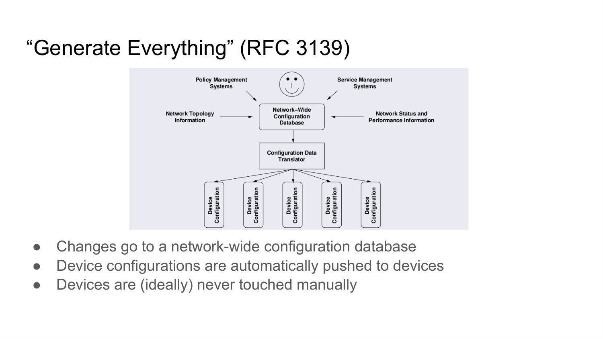

_Source: Lecture 003, slides 5-6._

## Why must configuration management distinguish configuration state from operational state?

**Configuration state** is explicitly chosen intent, such as a statically assigned interface address or an enabled protocol. **Operational state** is observed or learned while the device runs, such as packet counters, errors, link status, or an address learned from DHCP.

The distinction prevents accidental feedback loops and incorrect edits. A counter should be read but not treated as intended configuration; a learned address may disappear even though the configuration did not change. It also lets tools ask whether they want intended state, live state, or both.

_Source: Lecture 003, slides 7-8._

## What concurrency support should a configuration protocol provide?

The protocol must prevent simultaneous changes from producing an unintended combined result. The simplest technique is strict locking: an operator or application locks the relevant datastore before editing it. A more concurrent system can detect conflicts and resolve or reject them.

Lock granularity creates a trade-off. A coarse lock is easier to reason about but blocks unrelated work; a fine-grained lock permits more parallelism but needs more intelligence to detect semantic conflicts. The purpose is not just mutual exclusion - it is preserving a coherent intended configuration when several management applications act at once.

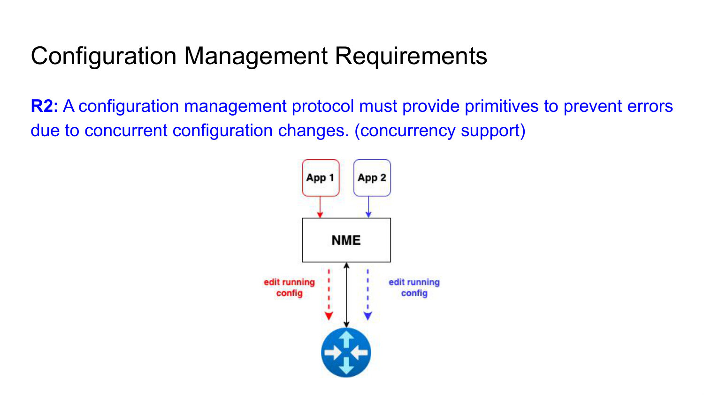

_Source: Lecture 003, slides 9-10._

## Why are configuration transactions necessary for multi-device changes?

A network-wide change may be harmful if only some devices accept it. For example, during network renumbering, activating new addresses on one subset before the rest is ready may break connectivity.

A transaction-oriented protocol lets a manager stage a group of commands, validate them, commit them as a unit, and roll back if the outcome is not acceptable. NETCONF provides these primitives **per server and datastore**; it does not make a set of independent devices one distributed atomic transaction. A network-wide manager must coordinate the devices, detect partial success, and execute a recovery or roll-forward plan.

The central idea is that a configuration is not merely a sequence of commands; it is a state transition that should either reach a consistent new state or return to the old one.

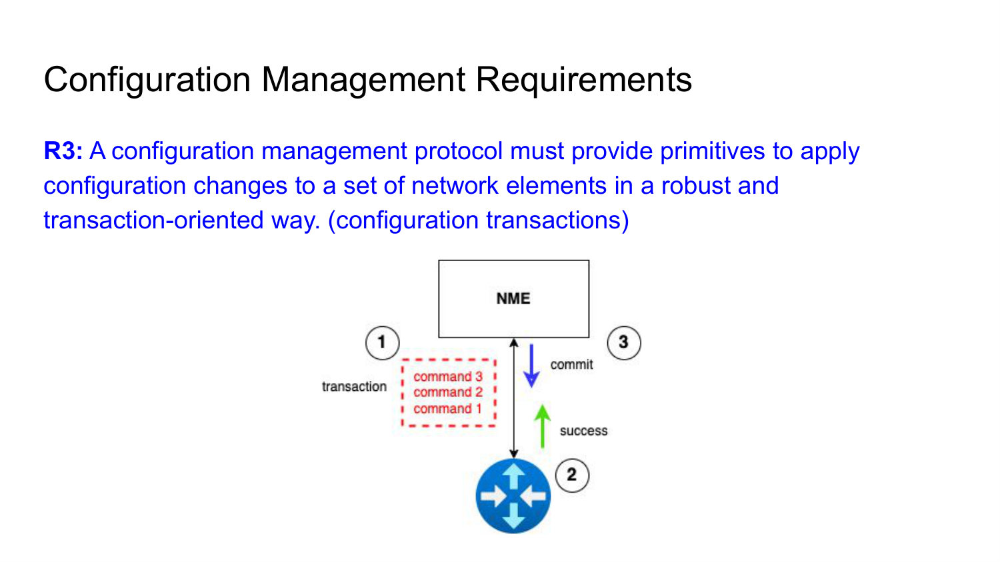

_Source: Lecture 003, slides 11-12._

## Why should a network device support multiple configuration datastores?

Configurations can be large and risky to edit in place. Separate datastores let an operator prepare a candidate, distinguish the active state from the state used at reboot, and keep external or server-supported recovery copies without editing live state directly.

NETCONF reflects these needs with `running`, `candidate`, and, when supported, `startup` datastores. Their separation supports safer staging, explicit activation, and recovery instead of forcing every edit to affect live traffic immediately.

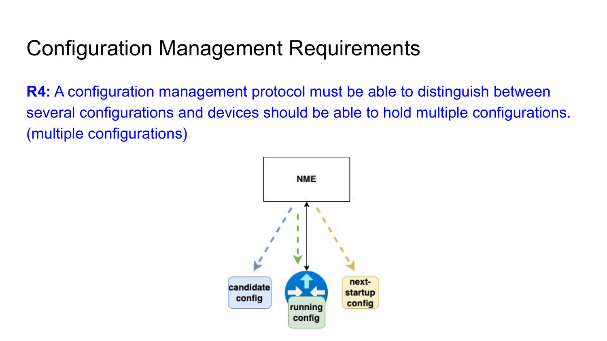

_Source: Lecture 003, slides 13-14 and 34-35._

## Why should configuration distribution be separated from activation?

Distribution answers **when the configuration reaches the device**; activation answers **when it takes effect**. Separating them lets an operator pre-position a large configuration in the candidate datastore and activate it later with a small, coordinated operation.

For example, the next scheduled topology can be staged before a maintenance window. At the scheduled time, the manager commits the candidate instead of retransmitting the full configuration. Standard NETCONF normally exposes one logical `candidate` datastore per server; retaining several named historical configurations is a broader platform or configuration-database feature, not something the candidate capability alone guarantees.

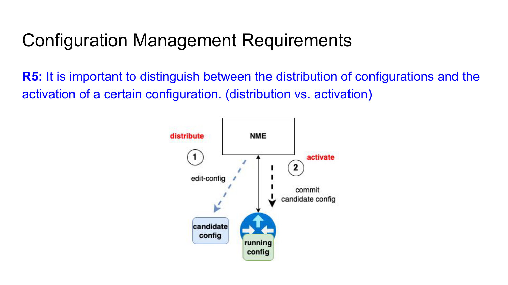

_Source: Lecture 003, slides 15-16._

## What persistence choices must configuration management make explicit?

A change may be temporary until the next reboot, immediately active and persistent across reboots, or prepared now but activated only at the next restart. These are different operational intentions and must not be implicit.

The distinction between active `running` state and next-start `startup` state makes the behavior explicit. Without it, an operator may fix a live problem only to lose the fix at reboot, or may accidentally make an experimental change permanent.

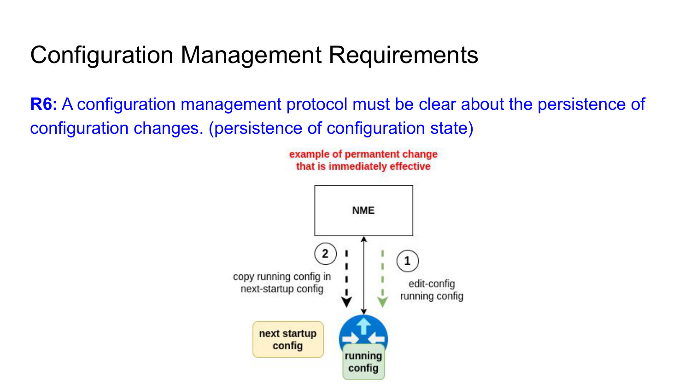

_Source: Lecture 003, slides 17-18._

## Why are configuration-change notifications and logs important?

Operational failures are often caused by a configuration change rather than a hardware fault. If a new firewall rule breaks an application, a timestamped event log lets the operator correlate the symptom with the exact change and actor.

A useful system can notify subscribers when a change occurs and preserve the event in a repository. This supports fault isolation, auditing, rollback, and accountability. Without change history, the current configuration shows what is true now but not how the network reached that state.

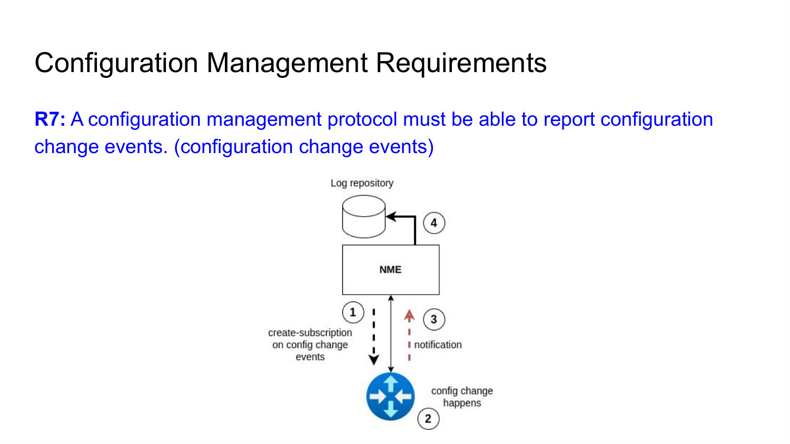

_Source: Lecture 003, slides 19-20._

## Why must configuration systems support full dump/restore and standard data tools?

Full dump and restore are basic disaster-recovery and migration operations: an operator must be able to capture the complete intended state and reconstruct it reliably.

The representation should also work with common comparison, conversion, version-control, and automation tools. Structured formats such as XML or JSON make it possible to diff revisions, validate data, integrate with home-grown systems, and review changes. This reduces integration effort and cost compared with opaque proprietary command output.

_Source: Lecture 003, slides 21-23._

## What are the three main components of SNMP?

An SNMP deployment contains:

- an **SNMP manager**, normally part of a Network Management System, which issues requests and receives events;
- **SNMP agents** on managed devices, which expose data and process SNMP operations;
- a **Management Information Base (MIB)**, which organizes the managed objects and their identifiers.

The manager-agent protocol moves values and notifications; the MIB supplies a shared schema so both sides agree on what each object represents.

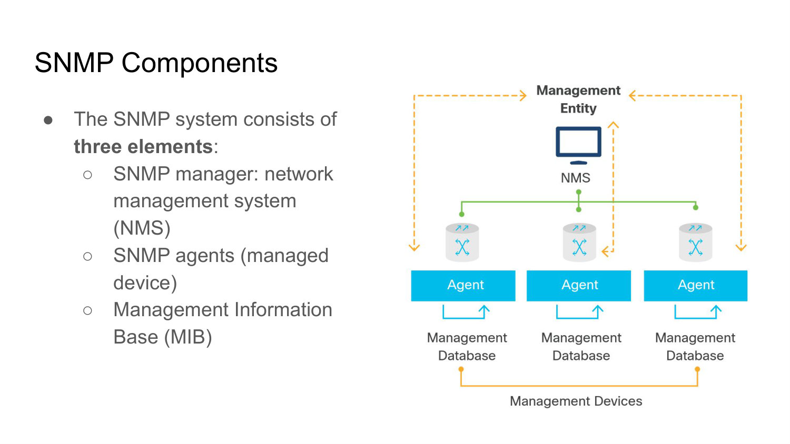

_Source: Lecture 003, slides 25-26._

## What are the main SNMP message types and their purposes?

| Message | Normal direction | Purpose |
| --- | --- | --- |
| `GetRequest` | manager -> agent | Retrieve named variables. |
| `GetNextRequest` | manager -> agent | Walk to the next OID in the MIB tree. |
| `GetBulkRequest` | manager -> agent | Retrieve a larger block efficiently. |
| `SetRequest` | manager -> agent | Request a change to a writable object. |
| `Response` | responder -> requester (normally agent -> manager) | Return values, acknowledgement, or an error. |
| `InformRequest` | manager -> manager | Send MIB information with acknowledgement. |
| `Trap` | agent -> manager | Report an exceptional event without a preceding request. |

The message set therefore supports both manager-initiated request/response management and device-initiated event reporting.

_Source: Lecture 003, slides 26-27._

## Compare SNMP polling with traps.

With **polling**, the manager periodically sends `get` requests. Polling is predictable and can detect state even when a device emits no event, but detection latency is bounded by the polling interval. Polling more frequently reduces latency while increasing management bandwidth and agent load.

A **trap** is sent by the agent without a prior request when an event occurs, such as a restart, link transition, authentication failure, or lost neighbor. It provides prompt notification with little idle traffic, but an unacknowledged trap can be lost and not every condition is necessarily configured to generate one.

In practice, event notifications and periodic reconciliation complement one another.

_Source: Lecture 003, slide 28._

## What are a MIB and an OID in SNMP?

A Management Information Base is a tree-structured description of the objects a device exposes through SNMP. Interior nodes organize namespaces, while terminal leaves represent individual variables.

An Object Identifier is the numeric path that uniquely identifies a node or variable in that tree. It functions like a globally unambiguous address for a managed object. The MIB provides the human meaning and type of the object; the OID is the identifier carried in SNMP operations.

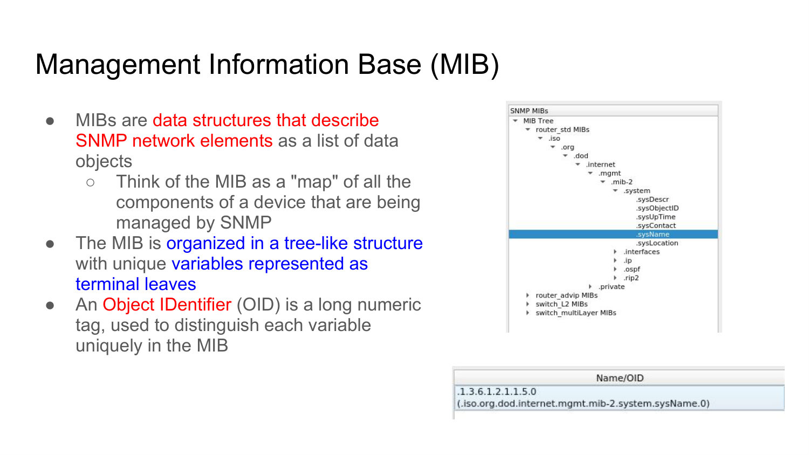

_Source: Lecture 003, slide 29._

## Why is SNMP considered inadequate for modern configuration management?

SNMP is effective for monitoring but has important configuration limitations. Its pull-oriented data retrieval scales poorly for high-density telemetry, it lacks a robust discovery process for the MIBs a device supports, and it does not provide a strong transaction model.

It also lacks first-class backup/restore primitives, and the industry has limited support for configuration MIBs. NETCONF was designed around configuration operations, datastores, capabilities, locking, validation, and commits, so it addresses configuration as a state-management problem rather than as individual scalar variables.

_Source: Lecture 003, slide 31._

## Describe the NETCONF deployment and layering models.

A NETCONF-enabled device runs a **server**. A management application runs a **client** and invokes operations on the server; even a device CLI can be implemented as a front end to such a client.

The protocol is layered. A secure transport, mandatorily SSH for implementation, supplies authentication, confidentiality, integrity, and the session. Above it, NETCONF defines RPC messages and extensible configuration operations. The content carried by those operations is structured according to data models such as YANG.

This separation lets the same management semantics reuse a standard secure channel and lets capabilities extend the protocol without redesigning the transport.

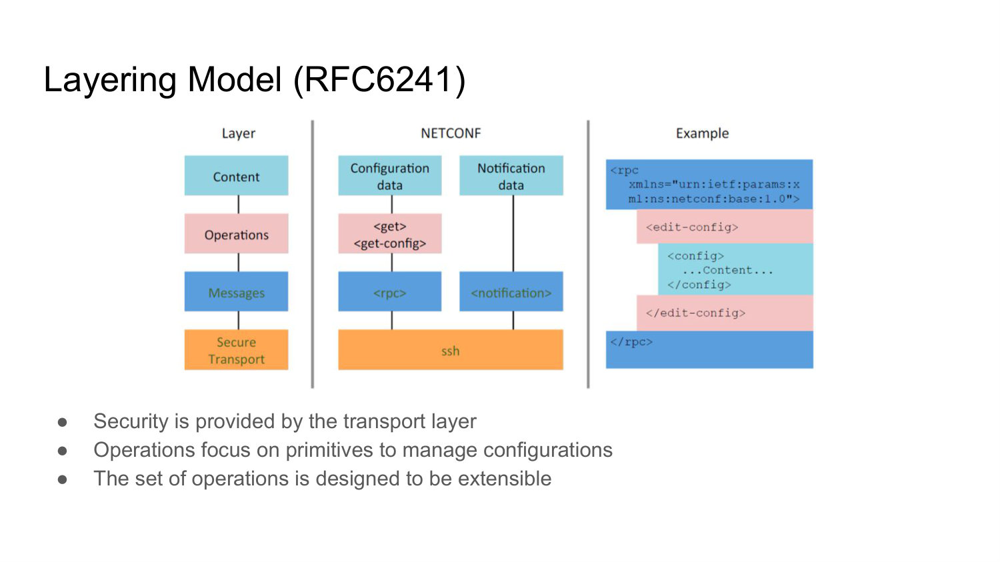

_Source: Lecture 003, slides 32-33 and 44._

## What are NETCONF's `running`, `startup`, and `candidate` datastores?

`running` is the currently active device configuration and is always present. Editing it directly changes live intended state.

`startup`, when supported, is the configuration loaded at the next device start. It expresses persistence independently of what is active now.

`candidate`, when supported, is a staging datastore. A client can edit and validate it without immediately affecting forwarding, then explicitly `commit` it to `running`. This candidate model is the basis for safer transactional workflows.

_Source: Lecture 003, slides 34-35._

## How do the direct, candidate, and distinct-startup NETCONF transaction models differ?

In the **direct model**, `edit-config` targets `running`, so accepted changes become active directly. Error options can still stop, continue, or roll back an operation, but there is no separate staging area.

In the **candidate model**, edits accumulate in `candidate`; an explicit `commit` copies the validated candidate into `running`. `discard-changes` abandons the staged work.

In the **distinct-startup model**, live `running` and reboot-time `startup` are separate. A `copy-config` operation is used when the operator wants the active state to persist after restart. A server can support more than one of these capabilities.

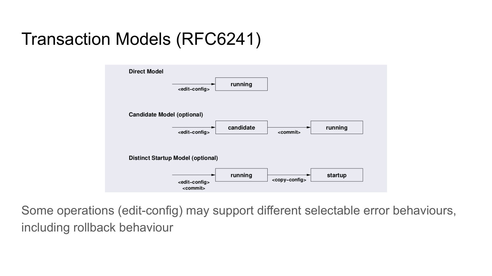

_Source: Lecture 003, slides 34-35 and 41._

## What happens during the NETCONF capability exchange?

After establishing the secure transport session, both peers send a `hello` message. The message lists supported NETCONF protocol versions and optional capabilities, such as `startup`, `candidate`, `confirmed-commit`, validation, and supported YANG modules. The server also supplies a session identifier.

The exchange is essential because NETCONF is extensible. A client must not assume that every server exposes the same datastores, operations, framing version, or data models. It adapts its workflow to the capabilities explicitly announced for that session.

_Source: Lecture 003, slides 36 and 45-46; RFC 6241, section 8.1._

## Read the lecture's NETCONF `hello`: what does each advertised capability tell the client?

A simplified server message is:

```xml
<hello xmlns="urn:ietf:params:xml:ns:netconf:base:1.0">
  <capabilities>
    <capability>urn:ietf:params:netconf:base:1.1</capability>
    <capability>urn:ietf:params:netconf:capability:startup:1.0</capability>
    <capability>urn:ietf:params:xml:ns:yang:ietf-interfaces?module=ietf-interfaces&amp;revision=2012-04-29</capability>
  </capabilities>
  <session-id>4</session-id>
</hello>
```

The base `1.1` URI says the server supports NETCONF 1.1. The `startup` capability says a distinct reboot-time datastore is available. The model URI announces the `ietf-interfaces` YANG module and revision, so the client knows which interface schema it may encode. `session-id` identifies this server-side session and can be referenced by administrative operations such as `kill-session`.

The capability strings above use the RFC 6241 forms. The lecture slide prints `xml:ns` inside the base and `startup` capability URIs; that is a slide-level notation error, not the URI a client should send. The `xmlns` value on the surrounding XML element is a namespace and correctly does contain `xml:ns`.

Both peers send `hello`; the client also advertises its own protocol support. The initial messages use the `]]>]]>` end marker. They switch subsequent traffic to NETCONF 1.1 chunked framing only when **both** sides announced base 1.1.

_Source: Lecture 003, slides 36 and 45-46; RFC 6241, section 8.1._

## How does a NETCONF RPC exchange work?

The client sends an XML `rpc` element containing a unique `message-id` and one requested operation, for example `get-config` with `running` as the source. The server returns an `rpc-reply` carrying the same `message-id`, so the response can be correlated with the request.

A successful retrieval contains a `data` element. A modification may return `ok`; failures are represented by structured `rpc-error` information. The RPC envelope is protocol machinery, while the operation and YANG-modeled content express the management intent.

_Source: Lecture 003, slide 37._

## Interpret a minimal NETCONF `get-config` RPC and its reply.

```xml
<rpc message-id="101"
     xmlns="urn:ietf:params:xml:ns:netconf:base:1.0">
  <get-config>
    <source><running/></source>
  </get-config>
</rpc>

<rpc-reply message-id="101"
           xmlns="urn:ietf:params:xml:ns:netconf:base:1.0">
  <data><!-- requested configuration subtree --></data>
</rpc-reply>
```

The NETCONF namespace identifies the protocol vocabulary. The client asks to read intended configuration from `running`; because there is no filter, it requests the complete configuration visible to the operation. The repeated `message-id="101"` correlates the asynchronous reply with this request, which matters when several RPCs are outstanding.

`<data>` is the success payload for a retrieval. A successful operation that has no data commonly returns `<ok/>`; a failure returns one or more structured `<rpc-error>` elements. Those are alternatives inside the reply envelope, not separate response protocols.

_Source: Lecture 003, slide 37._

## What is the difference between NETCONF `get-config` and `get`?

`get-config(source, filter)` retrieves all or part of a **configuration datastore** chosen as the source. It is appropriate when the client wants intended configuration only.

`get(filter)` returns data from the running configuration together with device operational state. It is appropriate for a combined live view.

The difference mirrors the fundamental separation between configuration and operational state. A controller doing version comparison should prefer `get-config`; a monitoring tool may need `get`.

_Source: Lecture 003, slides 38 and 40._

## What do the basic NETCONF datastore operations do?

The core operations cover the datastore lifecycle:

- `edit-config` modifies a target using merge, replace, create, or delete semantics; its test option can validate first, and its error option selects stop, continue, or rollback behavior.
- `copy-config` replaces a target with a complete source configuration.
- `delete-config` removes a named datastore where the capability permits it.
- `lock` and `unlock` protect a target against conflicting writers.
- `validate` checks whether a source configuration satisfies the server's constraints.

Together they support safe preparation, synchronization, and concurrency rather than only individual CLI-like commands.

_Source: Lecture 003, slides 38-39._

## Distinguish NETCONF `test-option` from `error-option` in `edit-config`.

They answer different questions. **`test-option` controls validation timing**:

| Test behavior | Meaning |
| --- | --- |
| `test-only` | Validate the proposed edit without applying it: a true dry run. |
| `test-then-set` | Validate first and apply only if validation succeeds. |
| `set` | Apply without a separate preliminary validation pass. |

**`error-option` controls what happens after an edit error**:

| Error behavior | Meaning |
| --- | --- |
| `stop-on-error` | Stop processing when the first error is found. |
| `continue-on-error` | Attempt the remaining edits and report all encountered errors. |
| `rollback-on-error` | Undo changes made by this operation so the target returns to its pre-edit state. |

Availability is capability-dependent: `test-only` requires the appropriate `:validate` support, and `rollback-on-error` requires `:rollback-on-error`. Validation and recovery are independent: testing can prevent invalid state from being applied, while the error option determines how the server contains a failure during application. Neither setting by itself creates atomicity across several devices.

_Source: Lecture 003, slide 38._

## How are NETCONF sessions terminated, and why are there two termination operations?

`close-session` gracefully ends the current session. The server can finish protocol cleanup and release resources and locks associated with that connection.

`kill-session(session-id)` asks the server to force another identified session to terminate. It is an administrative recovery tool for a stuck or misbehaving client, especially when that session holds a lock.

The distinction is between normal cooperative shutdown and external forced recovery.

_Source: Lecture 003, slide 40._

## Explain `commit`, confirmed commit, `cancel-commit`, and `discard-changes`.

With the candidate capability, `commit` promotes `candidate` to `running`. `discard-changes` does the opposite logically: it abandons candidate edits by restoring the candidate from `running`.

A **confirmed commit** makes the new running state provisional for a timeout. Unless a client confirms it, the server automatically rolls back. This is valuable for remote changes that might cut the manager's own connectivity. The operation can use persistence tokens so another session can confirm or cancel it; `cancel-commit` explicitly aborts the pending confirmed commit.

This workflow turns loss of management connectivity from a permanent outage into an automatic rollback condition.

_Source: Lecture 003, slide 41._

## Compare the NETCONF `merge`, `replace`, `create`, and `delete` edit operations.

`merge` combines supplied nodes with existing data, changing specified values while retaining unspecified siblings. `replace` makes the supplied data replace the existing target node or subtree.

`create` succeeds only if the target data does not already exist, which catches accidental duplication. `delete` removes existing target data and normally reports an error if that data is absent.

These explicit semantics are safer than an ambiguous command because the server can validate the intended preconditions. In the lecture example, the `replace` attribute on an interface supplies a new interface subtree with an MTU of 1500.

_Source: Lecture 003, slides 42-43._

## Read the lecture's `edit-config` example: exactly what does it replace?

```xml
<rpc message-id="101"
     xmlns="urn:ietf:params:xml:ns:netconf:base:1.0">
  <edit-config>
    <target><running/></target>
    <config xmlns:nc="urn:ietf:params:xml:ns:netconf:base:1.0">
      <interfaces xmlns="urn:ietf:params:xml:ns:yang:ietf-interfaces">
        <interface nc:operation="replace">
          <name>Ethernet0/0</name>
          <mtu>1500</mtu>
        </interface>
      </interfaces>
    </config>
  </edit-config>
</rpc>
```

The protocol envelope targets the live `running` datastore. The default namespace on `<interfaces>` selects the `ietf-interfaces` model, whereas prefix `nc` refers to NETCONF itself and qualifies the `operation` attribute.

The `replace` is attached to the `interface` node, so the supplied `Ethernet0/0` subtree replaces the existing instance of that interface; it does **not** replace every interface or the complete running configuration. Compared with `merge`, unspecified children of that interface are not implicitly preserved. This is why operation placement and namespace scope must be read as carefully as the values.

_Source: Lecture 003, slides 42-43._

## Why does NETCONF use SSH, and how are NETCONF messages framed over it?

SSH was already widely deployed for secure device CLIs, so using it reduces separate key-management and security costs. It authenticates peers, protects confidentiality and integrity, and can carry multiple logical channels over one transport association. SSH is the mandatory-to-implement NETCONF transport.

The initial `hello` is terminated by the special end-of-message marker `]]>]]>`. If both peers announce NETCONF 1.1, subsequent messages use chunked framing, which explicitly describes message chunks and avoids ambiguity when message content resembles the old delimiter.

_Source: Lecture 003, slides 44-46._

## What is a data model, and what properties make YANG useful for networks?

A data model is an agreed method for describing the structure and meaning of some domain. It names the elements, specifies their types and relationships, and constrains valid instances.

YANG is human-readable and uses a compact C/Java-like syntax. It can model both configuration and state, as well as RPCs and notifications. The model is independent of a single wire encoding: instances can be represented in XML or JSON and transported through mechanisms such as NETCONF over SSH or other management protocols.

This separation lets vendors and operators share semantics instead of agreeing only on ad hoc text commands.

_Source: Lecture 003, slides 48-49._

## What is the difference between a YANG module and a submodule?

A **module** is a self-contained collection of YANG definitions. It declares its namespace and prefix and can contain data nodes, types, groupings, RPCs, notifications, organization information, and revisions.

A **submodule** is a partial definition that belongs to a module. It can contribute derived types, groupings, nodes, RPCs, and notifications, allowing a large model to be split into maintainable files. A module includes its submodules; separate modules are related through imports and prefixes.

_Source: Lecture 003, slides 50-51._

## How do built-in and derived types work in YANG?

YANG supplies built-in categories such as signed and unsigned integers, decimal64, string, enumeration, boolean, bits, binary, leaf references, identity references, instance identifiers, unions, and empty values. Types can carry restrictions such as numeric ranges, string length or pattern, fraction digits, paths, or identity bases.

A `typedef` gives a reusable name to a constrained or composed type. For example, an IPv4 address can be represented as a string constrained by a pattern, and an `ip-address` type can be a union of the IPv4 and IPv6 derived types.

Derived types centralize validation and semantics: every node using the type inherits the same rules.

_Source: Lecture 003, slides 52-53._

## Compare YANG `leaf`, `leaf-list`, `container`, and `list` nodes.

- A `leaf` has one scalar value, no children, and one instance at its location.
- A `leaf-list` has scalar values and no children, but it may occur multiple times.
- A `container` has no value of its own; it groups related child nodes and has one instance.
- A `list` also groups child nodes but can have multiple entries, identified by a key.

The distinction is about both structure and cardinality. A hostname is naturally a leaf, DNS search domains a leaf-list, resolver settings a container, and nameserver records a keyed list.

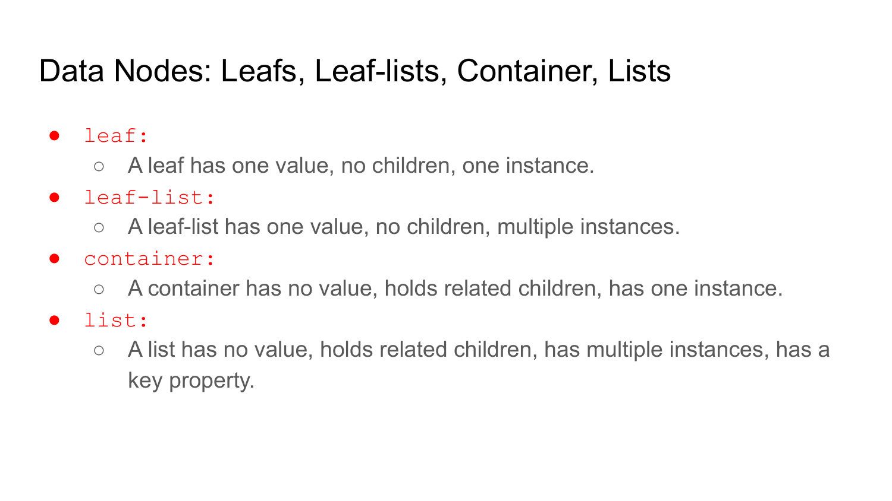

_Source: Lecture 003, slides 54-57._

## How do YANG node definitions map to encoded configuration data?

A YANG model defines a schema, while XML or JSON carries an instance. A `leaf domain` becomes one element such as `<domain>example.com</domain>`. A `leaf-list search` becomes repeated elements, preserving user order if `ordered-by user` is declared.

A `container system` becomes a nested element containing its child leaves and containers. A keyed `list nameserver` becomes repeated `nameserver` structures, each with an `address` key and other fields such as `status`.

Statements such as `type`, `mandatory`, `config`, ordering, and keys let the server validate whether an encoded instance is structurally and semantically legal.

_Source: Lecture 003, slides 55-57._

## Model resolver configuration with YANG, then show the corresponding XML instance.

The schema distinguishes grouping, scalar cardinality, repetition, and identity:

```yang
module resolver-example {
  namespace "urn:example:resolver";
  prefix rex;
  import ietf-inet-types { prefix inet; }

  container system {
    leaf hostname { type inet:domain-name; }
    container resolver {
      leaf domain {
        type inet:domain-name;
        mandatory true;
      }
      leaf-list search {
        type inet:domain-name;
        ordered-by user;
      }
      list nameserver {
        key address;
        leaf address { type inet:ip-address; }
        leaf status {
          type enumeration { enum enabled; enum disabled; }
        }
      }
    }
  }
}
```

One valid instance is:

```xml
<system xmlns="urn:example:resolver">
  <hostname>server.example.com</hostname>
  <resolver>
    <domain>example.com</domain>
    <search>eng.example.com</search>
    <search>example.com</search>
    <nameserver>
      <address>192.0.2.1</address>
      <status>enabled</status>
    </nameserver>
  </resolver>
</system>
```

`system` and `resolver` create hierarchy but carry no scalar value. Repeated `search` elements implement the ordered `leaf-list`. Repeated `nameserver` structures implement a list, and `address` is the key that uniquely identifies each entry. The YANG is the reusable schema; XML is one concrete data tree checked against it.

_Source: Lecture 003, slides 55-57._

## Describe a safe end-to-end NETCONF workflow for a risky remote configuration change.

First, establish NETCONF over SSH and inspect the `hello` capabilities and supported YANG models. Lock the relevant datastore if concurrent changes are possible. Read the current configuration for comparison and recovery.

If `candidate` is supported, edit the candidate with explicit operation semantics, then validate it. Use a confirmed commit so the change becomes active but automatically rolls back unless connectivity and behavior are verified. Confirm the commit only after the checks pass, copy to `startup` if persistence requires it, unlock the datastore, and close the session.

If a step fails, use structured RPC errors, `discard-changes`, `cancel-commit`, or rollback behavior. This workflow combines models, capability negotiation, concurrency control, transactions, validation, and persistence into one coherent safety strategy.

_Source: Lecture 003, slides 34-46._
