# 004 - SDN and OpenFlow

## What problem is Software-Defined Networking trying to solve, and what are its key ideas?

SDN addresses the mismatch between rapidly changing service requirements and a network infrastructure that is difficult to modify because of closed equipment, vertically integrated software and hardware, vendor interfaces, and slow protocol evolution.

Its objective is to bring software-like flexibility to network service provisioning. The main ideas are to use generalized match/action forwarding, separate the control plane from the data plane, and expose a standard open interface through which controller software instructs forwarding devices.

The result is an architecture in which innovation can happen in software with a network-wide view instead of requiring a new proprietary appliance for every behavior.

_Source: Lecture 004, slides 4-5._

## Compare the data, control, and management planes in traditional networking.

The **data plane** processes and forwards packets according to state already installed in the device. It operates at a fast, per-packet timescale.

The **control plane** decides where packets should go and establishes that state. Routing, traffic engineering, and firewall decisions occur at the slower timescale of control events. In a traditional router, protocols such as OSPF and their databases implement this plane.

The **management plane** configures the overall behavior of the control plane and device. It operates at human or automation timescales through configuration and policy. SDN primarily changes the relationship between the first two, while programmable management APIs also improve the third.

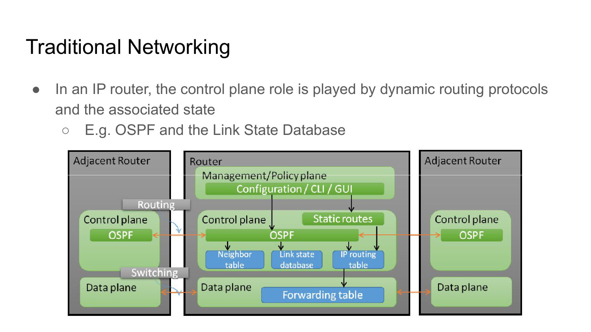

_Source: Lecture 004, slides 6-8._

## What is generalized forwarding?

Generalized forwarding represents packet processing as a set of **match/action** rules rather than as a fixed router, switch, firewall, or NAT function. A flow is identified by selected header fields, possibly using wildcards.

For a matching packet, a rule may forward, drop, modify fields, direct the packet to further processing, or send it to a controller. Priorities resolve overlaps, while counters record packets and bytes. A controller computes and installs these rules in a flow table.

This abstraction is powerful because the same hardware primitive can express several network functions; the behavior depends on the rules rather than on a hard-coded box identity.

_Source: Lecture 004, slides 10-11._

## Read three generalized-forwarding rules and explain how overlaps are resolved.

A compact version of the lecture's examples is:

| Rule | Selected match fields | Action |
| --- | --- | --- |
| L2 switching | `eth_dst = 00:1f:...` | output `port6` |
| Exact flow | `in_port=3`, selected L2/L3 fields, `ip_src=1.2.3.4`, `ip_dst=5.6.7.8`, `tcp_src=17264`, `tcp_dst=80` | output `port6` |
| Firewall | `tcp_dst = 22` | drop |

Every omitted field is a wildcard, so the first and third rules each cover many packets, whereas the second classifies a much narrower flow. The switch tests its supported match fields and chooses the **highest-priority** matching entry; textual order or the apparent number of specified fields is not a universal tie-breaker. The controller must therefore assign priorities deliberately when, for example, a broad forwarding rule overlaps a security drop rule.

Counters belong to the rule and accumulate the packets and bytes that selected it. They reveal both traffic volume and whether the intended policy is actually matching. A match/action table thus combines classification, programmed behavior, precedence, and observation.

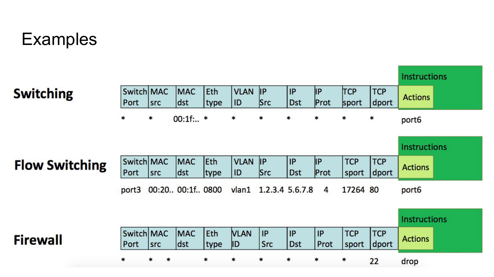

_Source: Lecture 004, slides 10-13._

## What information is contained in an OpenFlow-style flow-table entry?

A flow entry contains:

- **match fields**, drawn from ingress port and several protocol headers;
- **instructions and actions**, such as output, controller encapsulation, drop, normal processing, or field modification;
- **statistics**, including matched packet and byte counts;
- a **priority** for choosing among overlapping matches;
- **timeouts** that determine when the entry expires;
- a controller-selected **cookie** for identification and bookkeeping.

The separation is important: matches classify traffic, actions define behavior, and metadata such as counters, priority, and lifetime makes the rule manageable.

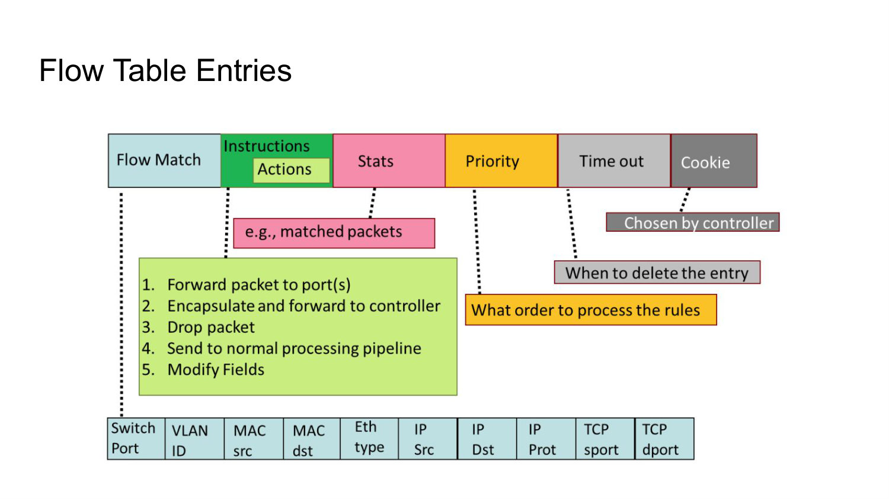

_Source: Lecture 004, slide 12._

## Show how generalized match/action rules can implement switching, routing, firewalling, VLAN switching, and NAT.

The network function follows from the fields matched and the action applied:

- Switching matches a destination MAC address and outputs to a controller-installed port. Autonomous MAC learning is not inherent in an OpenFlow table; it requires a controller application or delegation to the switch's conventional pipeline, for example through `NORMAL` when supported.
- IP routing matches a destination prefix and outputs to the next-hop port, with required header updates.
- A firewall matches addresses, protocol, or TCP/UDP ports and permits or drops the packet.
- VLAN switching includes a VLAN identifier and can output to one or several ports.
- NAT matches an address and port, rewrites them, and selects an output port.

Thus, specialized functions become configurations of a generic flow-processing device. Some functions still require state or actions supported by the target, so match/action expressiveness is bounded by hardware capabilities.

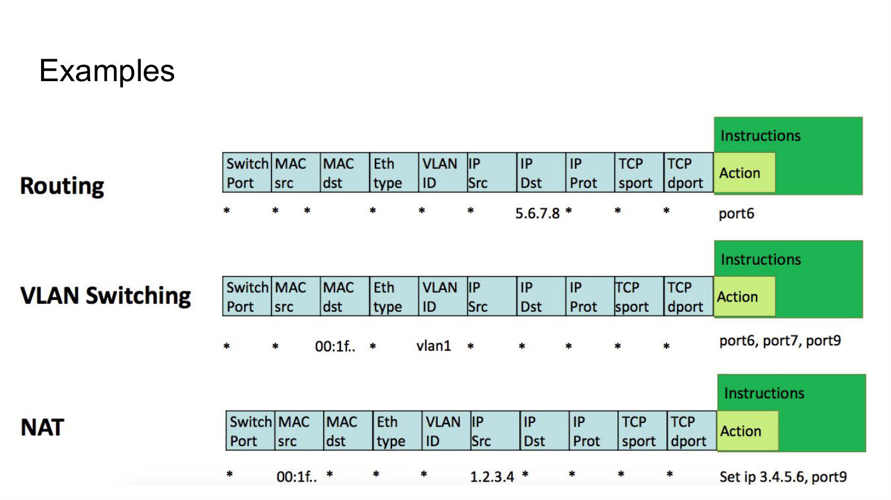

_Source: Lecture 004, slides 13-14 and 17._

## How does SDN decouple network functions from physical infrastructure?

Traditional equipment is vertically integrated: specialized features, control software, operating system, and hardware arrive as one closed appliance. SDN moves toward a horizontal architecture with open interfaces between applications, control software, and merchant forwarding chips.

The forwarding hardware becomes a generic substrate, while network applications and the controller determine its behavior. This speeds innovation and also complements NFV: SDN programs connectivity and forwarding, while NFV moves network functions from dedicated appliances into software instances.

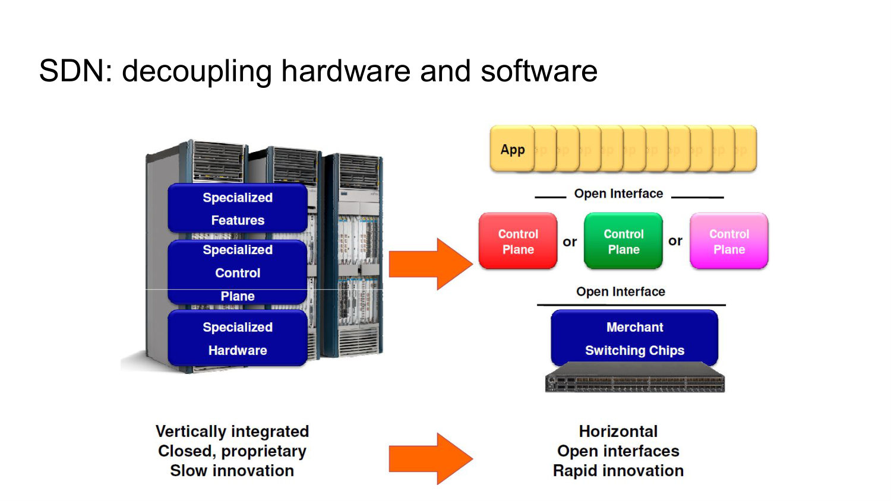

_Source: Lecture 004, slides 16 and 18-21._

## What is an SDN controller, and what does "logically centralized" mean?

An SDN controller is the control-plane platform that maintains network intelligence and remotely programs forwarding devices through a standard southbound interface. It runs on general-purpose computing resources and presents abstractions to network applications.

"Logically centralized" means applications can reason about the network as one system with a coherent state, even if the controller implementation is physically distributed for scale and fault tolerance. Centralization is therefore an abstraction and consistency goal, not necessarily a single server.

_Source: Lecture 004, slides 20-22._

## What are the main internal layers of an SDN controller?

The controller has three conceptual layers:

- an **application interface layer** exposing abstractions and APIs such as topology graphs, intents, or REST interfaces;
- a **network-wide state-management layer** that stores link, host, switch, flow, and service state, often in a distributed database;
- a **communication layer** that exchanges messages with controlled devices through protocols such as OpenFlow or SNMP.

This layering separates network applications from device-specific communication and gives applications a shared, consistent model of the infrastructure.

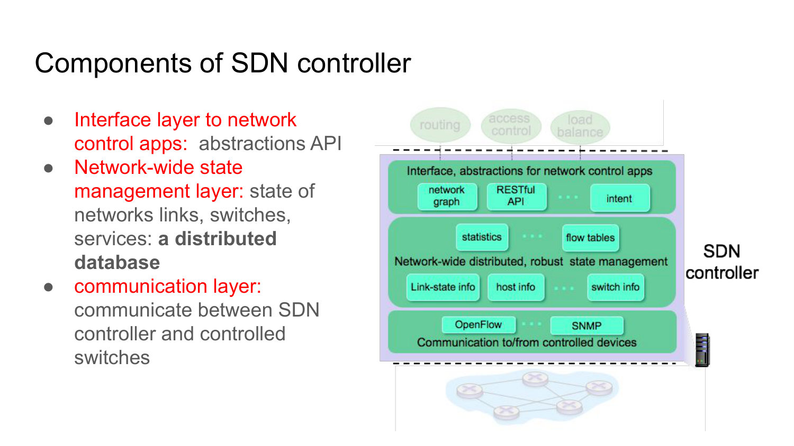

_Source: Lecture 004, slide 23._

## What is OpenFlow's role in SDN?

OpenFlow is a southbound protocol used between an SDN controller and the forwarding data plane. It provides a standardized way to discover switch capabilities, configure the device, install or remove flow entries, exchange packets with the controller, and receive asynchronous events.

OpenFlow is not SDN itself and is not the only possible southbound protocol. SDN is the broader architecture; OpenFlow is one protocol that realizes controller-to-switch communication within it.

_Source: Lecture 004, slide 25._

## What tables make up the OpenFlow logical datapath?

The datapath contains one or more **flow tables** arranged as a pipeline. A flow table matches packet fields and applies instructions or directs processing to a later table.

A **group table** provides advanced behavior that can affect one or more flows, such as replication, fast failover, or selecting among action buckets. A **meter table** measures traffic and applies performance-related behavior such as rate policing.

Packets are associated with flows - sequences of packets sharing selected header values - and the combination of these tables defines their processing.

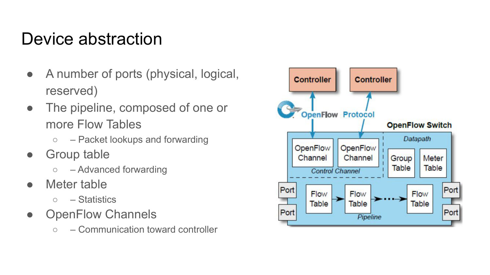

_Source: Lecture 004, slides 26-27._

## What are physical, logical, and reserved OpenFlow ports?

**Physical ports** correspond to switch hardware interfaces, commonly Ethernet interfaces. **Logical ports** are switch-defined interfaces without a one-to-one hardware connector, such as a tunnel endpoint.

**Reserved ports** represent generic processing destinations rather than ordinary interfaces. They express actions such as send to the controller, restart the OpenFlow pipeline, flood, or invoke the traditional switch pipeline.

This abstraction lets OpenFlow use one output-port field for physical transmission, virtual interfaces, and well-known processing behaviors.

_Source: Lecture 004, slide 28._

## What do the required reserved OpenFlow ports `ALL`, `CONTROLLER`, `TABLE`, `IN_PORT`, and `ANY` mean?

- `ALL` outputs to every port eligible for forwarding the packet.
- `CONTROLLER` represents the control channel and may be an ingress or output port.
- `TABLE` resubmits the packet to the beginning of the OpenFlow pipeline.
- `IN_PORT` refers to the packet's ingress interface and is used as an output when the packet must be sent back through it.
- `ANY` is a wildcard value used in some management commands when no specific port is intended; it is not a real ingress or output port.

The exact validity of each value matters because some are actions, while `ANY` is only a command wildcard.

_Source: Lecture 004, slides 29-30._

## What do the optional reserved OpenFlow ports `LOCAL`, `NORMAL`, and `FLOOD` mean?

`LOCAL` connects to the switch's own networking and management stack and can be used as ingress or output. `NORMAL` hands a packet to the device's conventional, non-OpenFlow processing pipeline.

`FLOOD` invokes normal flooding behavior, sending through eligible ports except the incoming port and blocked ports. It is an output behavior, not an ordinary physical port.

These ports provide controlled interoperability between the OpenFlow pipeline and built-in switch functions.

_Source: Lecture 004, slide 31._

## How is a packet processed through an OpenFlow pipeline?

At each table, the switch chooses the highest-priority matching entry. The instructions may modify packet or metadata fields, update an accumulated action set, execute actions immediately, or send the packet to another table, group, or meter.

If no entry matches, the table-miss behavior applies; typical choices are drop or send to the controller. When pipeline traversal ends, the accumulated action set is executed.

The distinction between immediate actions and the action set allows different tables to contribute to one final forwarding decision.

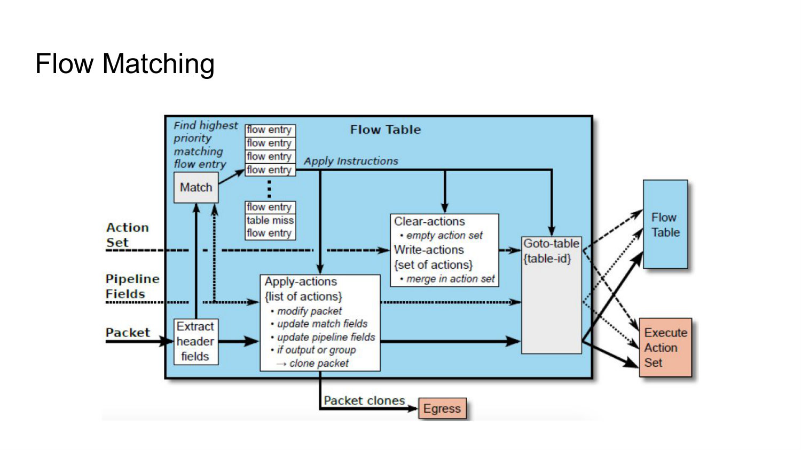

_Source: Lecture 004, slides 32-33._

## Distinguish `Apply-Actions`, `Write-Actions`, `Clear-Actions`, metadata updates, and `Goto-Table`.

These instructions operate at different times or on different pipeline state:

| Instruction | Effect |
| --- | --- |
| `Apply-Actions` | Execute its action list immediately; packet and pipeline fields can change before the next table. |
| `Write-Actions` | Merge actions into the packet's accumulated action set for execution when pipeline traversal ends. |
| `Clear-Actions` | Empty that accumulated action set; it does not undo actions already applied immediately. |
| `Write-Metadata` | Change pipeline metadata that later tables can match; it does not directly change on-wire header bytes. |
| `Goto-Table` | Continue in a later-numbered flow table, carrying the current packet, metadata, and action set. |

For example, one table can immediately normalize a header with `Apply-Actions`, record a classification in metadata, and let a later table add the eventual output action with `Write-Actions`. If traversal stops, the final action set executes. The distinction prevents the common mistake of assuming every action attached to a rule runs at the moment that rule matches.

_Source: Lecture 004, slides 32-33._

## What are the three classes of OpenFlow messages?

**Controller-to-switch** messages query or change the device. **Asynchronous** messages originate at the switch to report packets or events without a preceding request. **Symmetric** messages may be initiated by either peer for miscellaneous session purposes.

The messages are normally exchanged over TCP, with optional channel encryption in the lecture's model. This mix supports both deliberate controller programming and event-driven reaction from the data plane.

_Source: Lecture 004, slide 34._

## What are the key controller-to-switch OpenFlow messages?

`features` discovers switch capabilities. `configure` reads or sets configuration parameters. `modify-state` adds, changes, or deletes flow entries and other forwarding state. `packet-out` instructs the switch to emit a controller-supplied or buffered packet through a specified port.

Together they let the controller discover the target, program persistent behavior, and handle individual packets when a reactive decision is needed.

_Source: Lecture 004, slide 35._

## What are the key switch-to-controller OpenFlow messages?

`packet-in` transfers a packet, or enough of it plus a buffer reference, to the controller when the switch needs a decision. The controller can answer with `packet-out` and usually installs a rule for subsequent packets.

`flow-removed` reports that an entry was deleted or expired, allowing the controller to collect final counters or update state. `port-status` reports changes such as link or port transitions. These asynchronous events are how the controller learns about data-plane conditions promptly.

_Source: Lecture 004, slide 36._

## Compare flow-based forwarding with aggregated forwarding.

In **flow-based** forwarding, the controller installs an exact-match entry for each individual flow. It provides fine-grained control but consumes one table entry per flow and creates substantial controller and setup load.

In **aggregated** forwarding, one wildcard rule covers a class of flows, such as a prefix or traffic category. It scales to backbone volumes but sacrifices some per-flow customization.

The choice is a resource trade-off among table capacity, controller load, policy precision, and the number of active flows.

_Source: Lecture 004, slide 37._

## Compare reactive and proactive OpenFlow rule installation.

In the **reactive** model, the first packet misses, triggers `packet-in`, and causes the controller to install a flow rule. It uses table space efficiently because only active flows receive entries, but adds setup latency and becomes fragile if the control connection is lost.

In the **proactive** model, the controller installs rules before packets arrive. Traffic has no additional setup delay and can continue through existing rules during a controller outage, but proactive operation usually requires broader wildcard rules and may reserve table space for unused traffic.

A real network often combines proactive baseline connectivity with reactive rules for exceptional or fine-grained behavior.

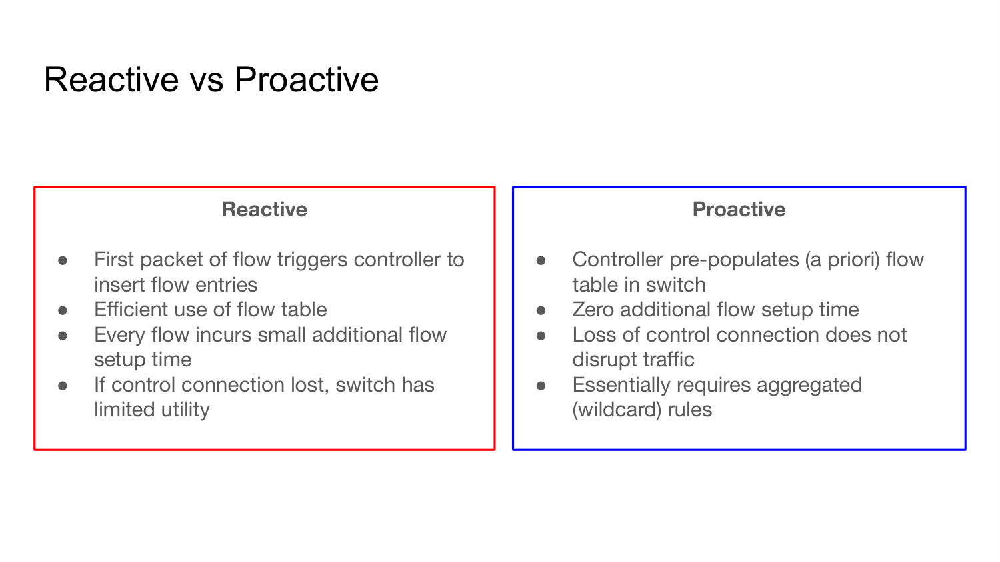

_Source: Lecture 004, slide 38._

## Trace the first and later packets of a reactively installed OpenFlow flow.

1. The first packet reaches a table miss. According to the miss rule, the switch buffers the packet or part of it and sends a `packet-in` event, including context such as the ingress port and possibly a buffer identifier.
2. The controller classifies the flow, checks policy, and selects a path. It sends `modify-state`/flow-mod messages to install the required entries, often on several switches.
3. The controller releases the first packet with `packet-out`, or a flow-mod referring to the switch's buffered packet causes equivalent forwarding. This step is needed because installing a rule does not by itself guarantee that the already-missed packet is replayed.
4. Later packets match locally and traverse the data plane without contacting the controller, so they avoid first-packet setup latency.
5. If the rule times out or is removed, `flow-removed` can report the reason and final counters so the controller can update its state.

This is a control loop, not per-packet remote forwarding: the controller handles the exceptional first packet and converts its decision into reusable data-plane state.

_Source: Lecture 004, slides 35-38._

## Walk through the SDN reaction to a link failure in the lecture example.

The switch first detects the failed link and sends an OpenFlow `port-status` message. The controller receives it and updates the network-wide link-state database.

A Dijkstra routing application that registered for link-state changes is invoked. It reads the topology and updated link state, computes new routes, and passes them to the controller's flow-table computation component. The controller then installs updated tables on the affected switches through OpenFlow.

This sequence shows the complete control loop: data-plane event, shared state update, application decision, rule compilation, and data-plane reprogramming.

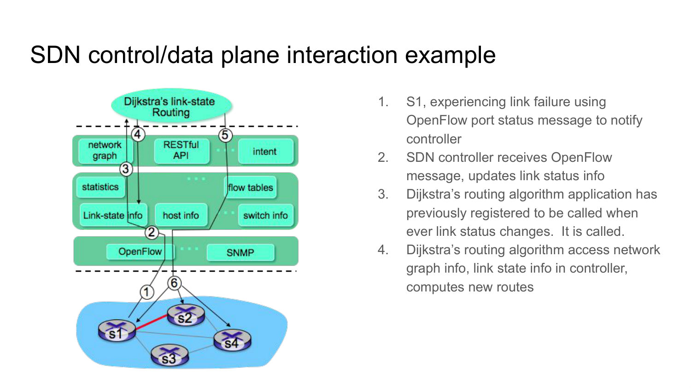

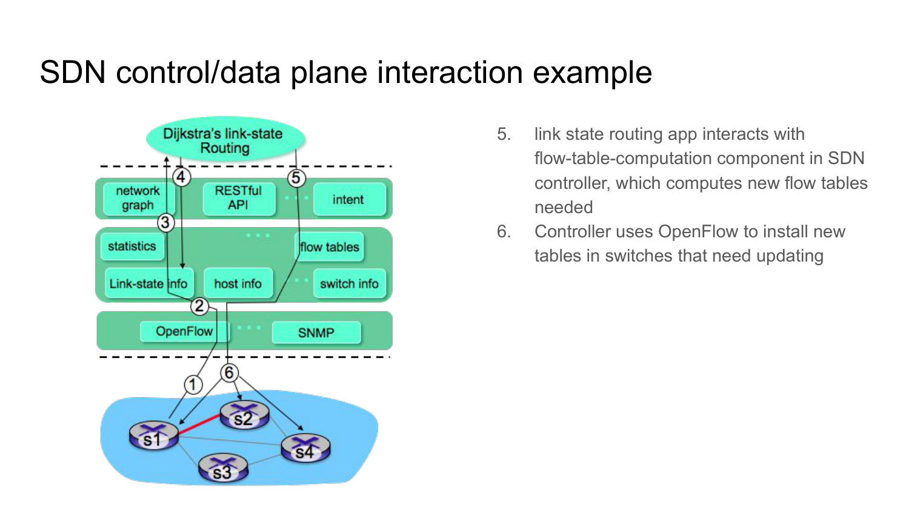

_Source: Lecture 004, slides 40-41._
