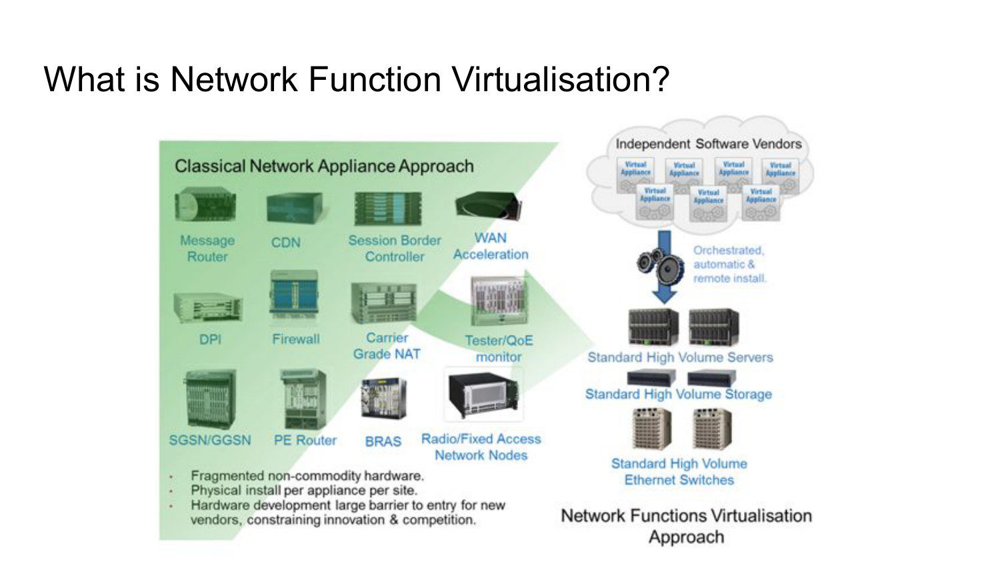
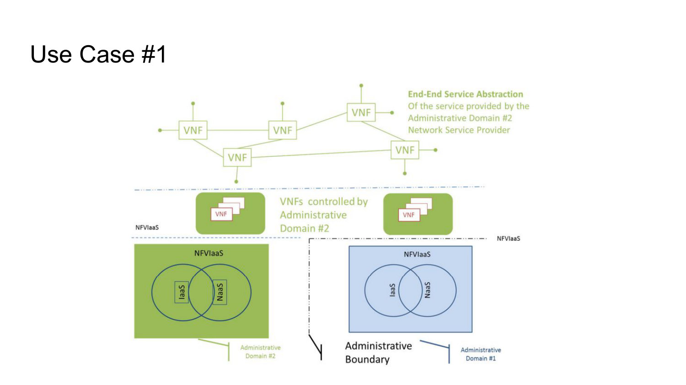
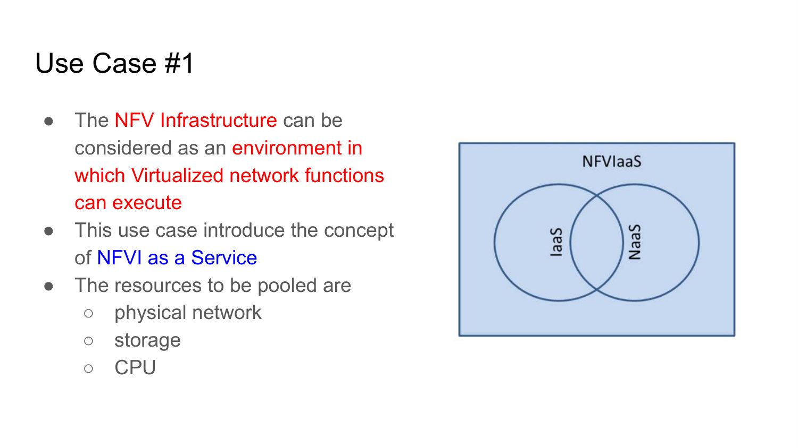
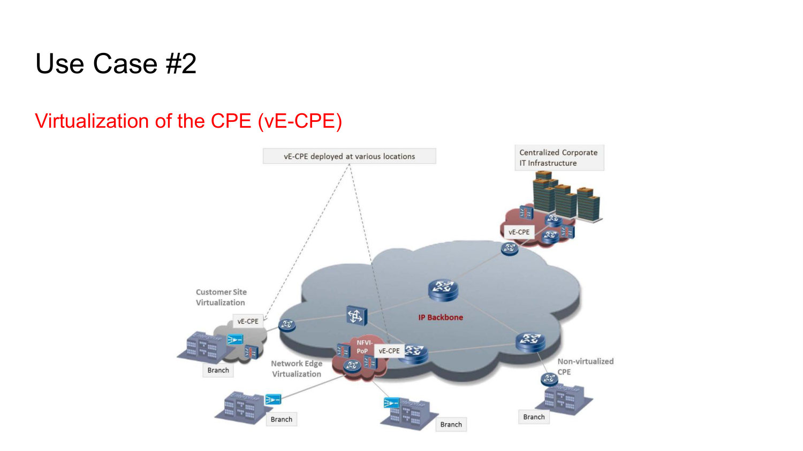
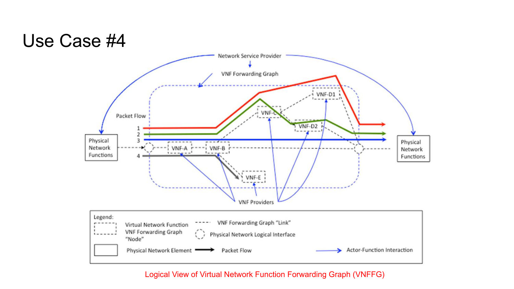
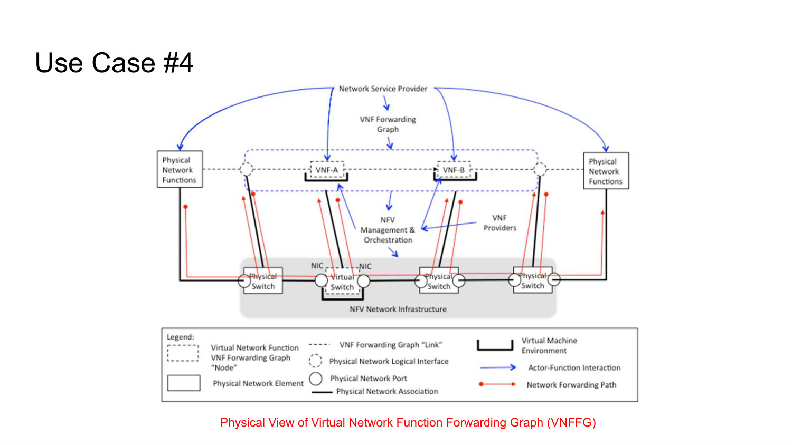
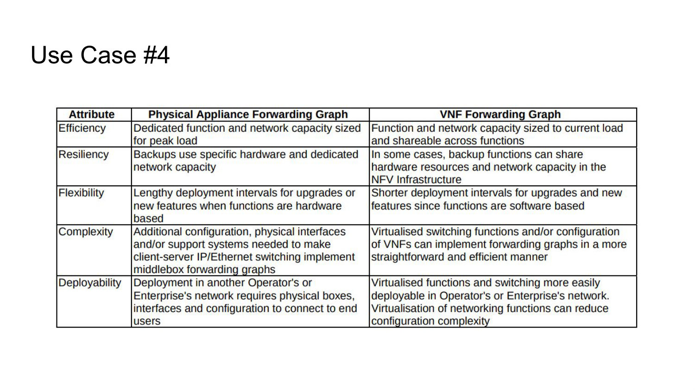
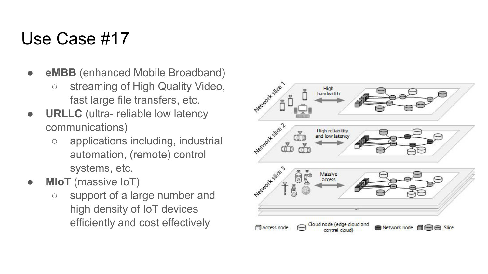
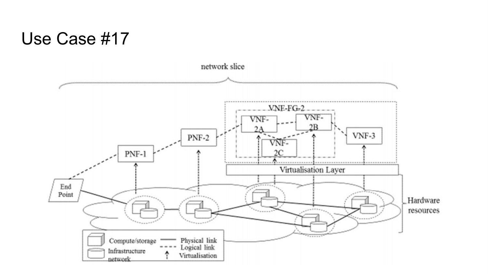
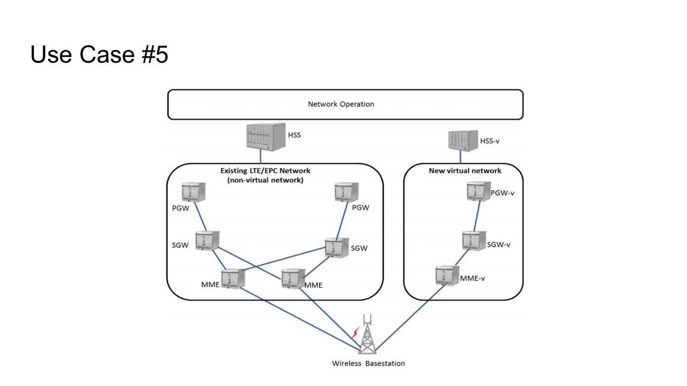

# 005 - NFV Use Cases

## What is a softwarized network, and what role does NFV play in it?

A softwarized network provides an end-to-end network service by interconnecting Physical Network Functions (PNFs) and Virtual Network Functions (VNFs). The service is defined by the functions and their connectivity, not by a fixed collection of appliances.

Network Function Virtualization is the key decoupling step: it moves network functions away from dedicated hardware and implements them as software on virtualized, industry-standard compute, storage, and switching resources. This enables faster service deployment, lower operational cost, and more flexible scaling and placement.

_Source: Lecture 005, slides 4-6._

## What new design and operational challenges appear when a network function becomes software?

The design problem changes from optimizing one appliance to deciding how a function scales across cloud or fog resources. The implementation must account for variable load, placement, shared infrastructure, and performance rather than assuming one purpose-built hardware node.

Operationally, the provider must automate provisioning, security, monitoring, lifecycle management, failure recovery, and connectivity. NFV removes appliance rigidity, but it does not remove operations; it turns operations into a distributed software-and-infrastructure problem.

_Source: Lecture 005, slides 7-8._

## What is NFV Infrastructure as a Service (NFVIaaS), and what problem does it solve?

NFVIaaS means one provider supplies the virtualized compute, storage, and network environment in which another provider's VNFs execute. The customer provider can deploy its network functions without owning physical points of presence everywhere.

This is valuable because global services must meet latency and reliability objectives at scale, yet few operators can build infrastructure in every region. Renting NFVI extends geographic reach and pools capital-intensive resources while preserving separation between the infrastructure provider and the network-service provider.

_Source: Lecture 005, slides 10 and 12-13._

## How does NFVIaaS separate end-to-end service ownership from infrastructure ownership across administrative domains?

In the lecture diagram, Administrative Domain 2 owns or controls the VNFs and presents the customer with the **end-to-end network-service abstraction**. Some of those VNFs run on NFVI supplied inside Domain 2, while others consume NFVIaaS from Administrative Domain 1. The service provider can therefore retain responsibility for function selection, composition, and customer policy without owning every server, link, or site.

The administrative boundary matters because the consumer cannot manage the provider's physical resources as though they were local. APIs expose allocatable compute and networking abstractions, while the commercial and operational contract must express latency, capacity, isolation, availability, security, observability, and failure responsibility. NFVIaaS hides provider internals, but it cannot hide whether the promised service-level objectives are met.

_Source: Lecture 005, slide 13._

## How does NFVIaaS relate to IaaS, PaaS, SaaS, and NaaS?

Traditional cloud models expose different layers. IaaS exposes virtual compute, storage, and networking; PaaS adds a managed application platform; SaaS exposes the application itself. NaaS is used for an offered network-connectivity capability.

NFVIaaS overlaps IaaS and NaaS but is specialized for hosting VNFs and meeting network-service requirements. It pools physical network, storage, and CPU resources and exposes an execution environment suitable for packet-processing functions.

_Source: Lecture 005, slides 11-12._

## What is Virtual Network Function as a Service (VNFaaS), and why is it attractive to enterprises?

VNFaaS lets an enterprise consume network functions operated in a provider's infrastructure instead of buying a dedicated appliance for every branch feature. Standalone appliances are expensive, inflexible, slow to install, and difficult to maintain across many sites.

The provider can host functions such as routing, firewalling, VPN termination, QoS, deep packet inspection, and WAN optimization as software. This shifts a large upfront investment into an outsourced service and lets functionality evolve independently of branch hardware.

_Source: Lecture 005, slide 15._

## Distinguish virtualized enterprise CPE (`vE-CPE`) from a virtualized provider edge (`vPE`).

`vE-CPE` virtualizes customer-premises equipment functions, such as the branch access router and related services. The virtual function can run at the customer site, at an NFVI point near the network edge, or centrally; in the provider-hosted case, the branch retains enough local Layer-2 or Layer-3 equipment for physical connectivity and its LAN is extended to the hosted functions.

`vPE` virtualizes provider-edge functions in the provider cloud, including customer-facing network-service behavior and core-facing PE behavior. Both reduce dependence on physical appliances, but they virtualize different logical locations and responsibilities.

_Source: Lecture 005, slides 16-18._

## Where can `vE-CPE` functionality run, and what placement trade-off changes with location?

The logical role does not force one physical location. The lecture shows three placements:

- **customer-site virtualization**, close to the branch;
- **network-edge NFVI**, shared at a provider point of presence;
- **centralized placement**, near the corporate or provider infrastructure.

Moving toward the customer reduces access-path latency and lets some service behavior survive a wider provider-path failure, but leaves more distributed resources to operate. Edge placement can balance proximity and pooling. Centralization maximizes resource sharing, uniform management, and rapid software upgrades, but makes branch service more dependent on access connectivity and may add delay.

An examiner's key distinction is therefore **logical function versus physical placement**: it remains vE-CPE because of the customer-edge behavior it provides, not because it must execute in a provider core.

_Source: Lecture 005, slides 17-18._

## How does traffic reach a `vE-CPE`, and what functions can it provide?

The enterprise still uses a local switch or minimal router for physical access. In this placement, the enterprise LAN is extended across the access network to the service provider's NFV environment, where the `vE-CPE` executes. Customer-site or edge placements shorten that extension, as the placement card explains.

The hosted function can provide routing, VPN termination, QoS enforcement, deep packet inspection, next-generation firewalling, and WAN optimization. Centralization makes upgrades and feature changes easier, but the access path and provider infrastructure must satisfy the enterprise's latency, availability, and isolation requirements.

_Source: Lecture 005, slides 17-18._

## What is a VNF Forwarding Graph?

A VNF Forwarding Graph defines the logical sequence and connectivity of network functions that packet flows traverse. It is the virtual equivalent of connecting physical appliances with cables, but it describes intent rather than one fixed physical wiring.

Its elements include physical or virtual network functions, their logical interfaces, packet flows, and the NFV infrastructure that realizes the connectivity. The graph may express more than a simple line: different flows can take different branches or reuse functions.

_Source: Lecture 005, slides 20-22._

## What is the difference between the logical and physical views of a VNF Forwarding Graph?

The **logical view** describes the required functions, interfaces, and flow order independent of location. It answers what service behavior the packets must experience.

The **physical view** maps those functions onto actual NFVI nodes and maps logical links onto switches, tunnels, and transport paths. Several logical VNFs can share a server, while one logical hop may cross several physical links.

This separation is the basis of orchestration: the service definition remains stable while the physical placement can change for capacity, failure recovery, or optimization.

_Source: Lecture 005, slides 21-22._

## Compare a physical-appliance forwarding graph with a VNF forwarding graph.

A physical graph dedicates hardware and network capacity for peak load. Backups need more dedicated appliances, upgrades require long hardware cycles, and interconnecting boxes adds cabling and configuration complexity.

A VNF graph can size and share compute and network capacity according to current demand. Backup functions may share spare resources, software upgrades deploy faster, and virtual switching implements chains more directly. It is also easier to deploy on another operator's infrastructure because the service is described in software.

The gain is flexibility and utilization, not free performance: shared resources and virtual connectivity still require careful orchestration and isolation.

_Source: Lecture 005, slide 23._

## What is network slicing?

Network slicing runs multiple logical networks on a common physical infrastructure. Each slice selects its own path and set of physical or virtual functions to meet the needs of one or more services.

For example, IoT devices and smartphones can attach to the same provider network yet reach different back-end systems through different functions. Sharing infrastructure improves utilization, while logical separation lets each service receive its required connectivity, processing, management, and performance behavior.

_Source: Lecture 005, slide 25._

## Compare the eMBB, URLLC, and mIoT slice categories.

**eMBB** targets enhanced mobile broadband, such as high-quality video and fast transfer of large files; its dominant concern is high data rate and capacity.

**URLLC** targets ultra-reliable low-latency communication for industrial automation and remote-control systems; latency and reliability dominate.

**mIoT** targets massive numbers and high densities of IoT devices; efficient connection management, coverage, and low cost per device dominate.

They demonstrate why one uniform network configuration cannot optimize every service objective.

_Source: Lecture 005, slide 26._

## What capabilities should a complete network slice provide?

A slice must provide connectivity between its terminals or gateways and apply in-path processing where the service needs it. It should also expose its own network and service-management capabilities, including real-time control.

Beyond packet forwarding, the slice must integrate with Operations Support Systems for service operation and Business Support Systems for administration, ordering, and charging. A slice is therefore an end-to-end managed logical network, not merely a VLAN or one isolated tunnel.

_Source: Lecture 005, slides 27-28._

## Is a network slice made only of VNFs? Explain its logical and physical composition.

No. The illustrated slice contains an endpoint, Physical Network Functions such as `PNF-1` and `PNF-2`, individual VNFs, and an entire VNF Forwarding Graph containing `VNF-2A`, `VNF-2B`, and `VNF-2C`. A service can therefore reuse unavoidable appliances while composing software functions around them.

At the logical level, dotted links describe the service connectivity and traversal among those elements. The virtualization layer maps VNFs onto shared compute and storage resources, while the infrastructure network realizes logical links over physical paths. PNFs remain directly tied to physical resources; VNFs are decoupled through virtualization.

Slice isolation is consequently **logical and resource-based**, not necessarily physical. Several slices may share servers and links as long as orchestration enforces their allocations, security, performance, and lifecycle boundaries.

_Source: Lecture 005, slide 28._

## Why is virtualizing the mobile core and IMS an important NFV use case?

Mobile cores and the IP Multimedia Subsystem traditionally contain many proprietary hardware appliances. Virtualization consolidates them on shared infrastructure and allows topology and capacity to be changed through software.

Expected benefits include lower total cost of ownership, better resource utilization, higher service availability and resilience, and dynamic reconfiguration to optimize performance. Because mobile core functions maintain important subscriber and session state, realizing these benefits also requires strong lifecycle management and failure handling.

_Source: Lecture 005, slides 30-31._

## How can a virtualized mobile core coexist with a legacy EPC during migration?

The legacy EPC contains physical MME, SGW, and PGW functions, while the parallel virtual network contains `MME-v`, `SGW-v`, and `PGW-v`. `HSS` and `HSS-v` are drawn above the two network boxes as their associated subscriber databases under common network operations. The base station is connected to both environments.

The diagram therefore demonstrates **coexistence** rather than a flag-day replacement and permits a staged migration. It does not specify whether migration occurs per subscriber, region, or another unit, nor does it define a validation or rollback procedure; those would be orchestration and operations design choices beyond the slide.

_Source: Lecture 005, slide 31._

## How do NFVIaaS, VNFaaS, forwarding graphs, and network slicing fit together?

NFVIaaS supplies the resource substrate. VNFaaS supplies individual network functions as consumable services. A VNF Forwarding Graph composes functions and connectivity into an ordered or branched packet-processing service.

A network slice is an instantiated, managed logical network that can include such graphs, connectivity, resource reservations, operational management, and business support. The concepts therefore progress from infrastructure, to function, to service composition, to an end-to-end isolated service environment.

_Source: Lecture 005, slides 10-28._
