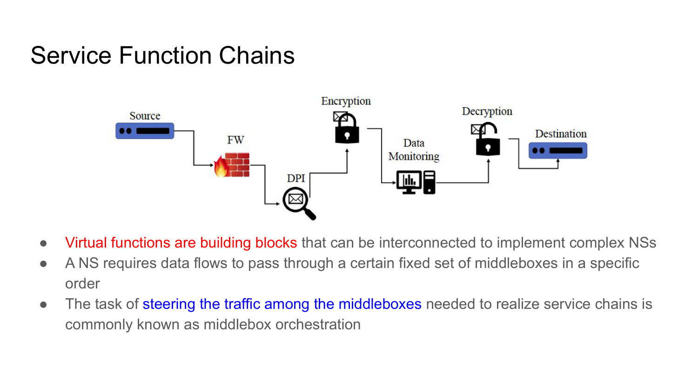
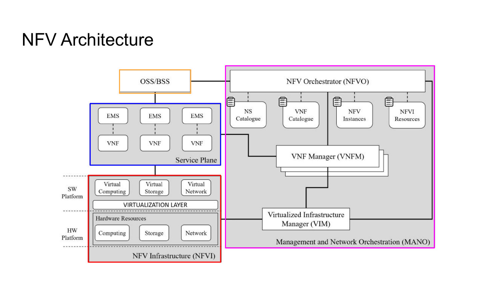
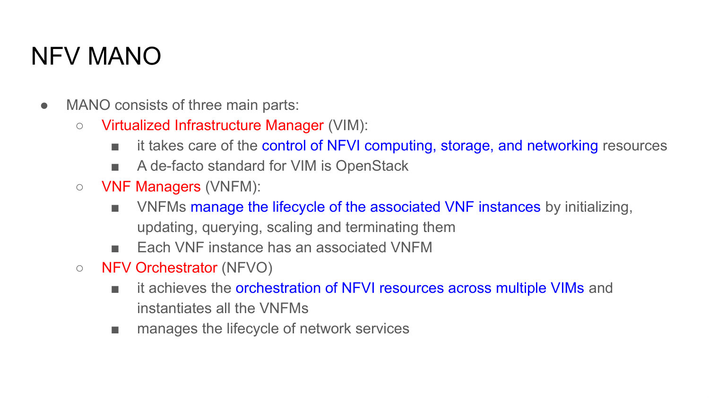
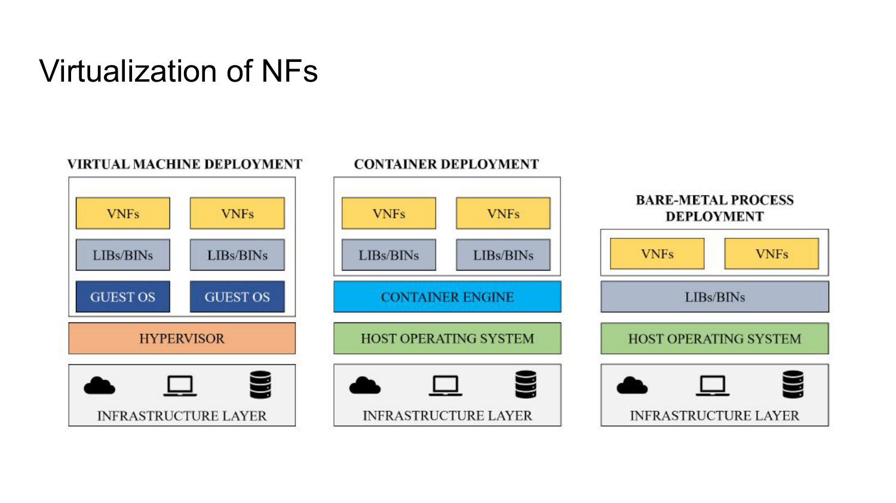
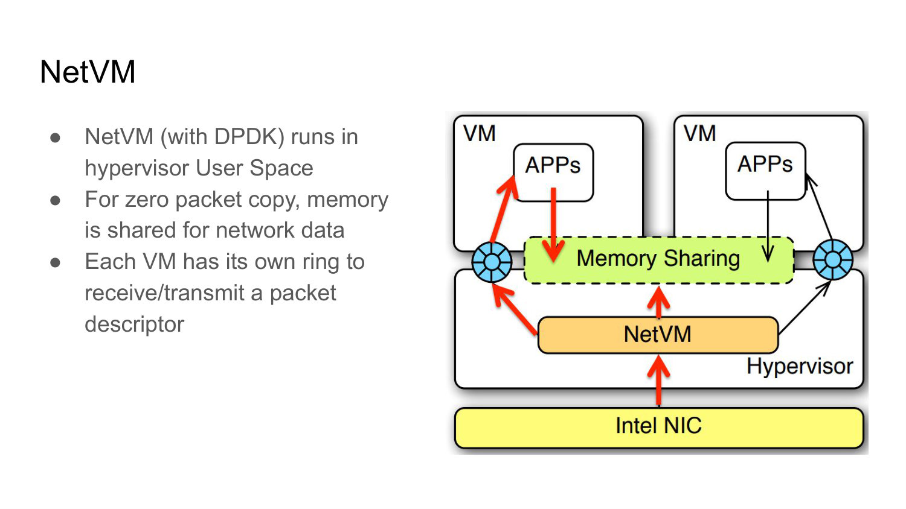
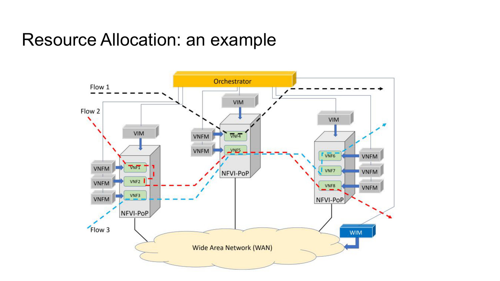
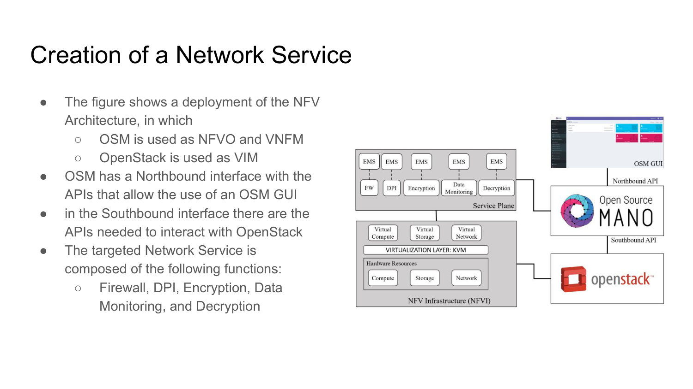
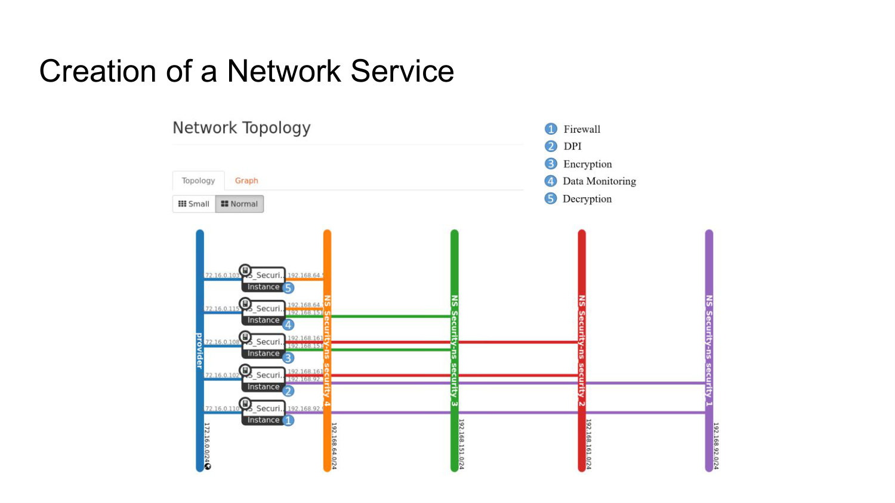

# 006 - Network Function Virtualization Architecture

## Why are middleboxes a motivation for NFV?

Enterprise networks deploy many middleboxes - firewalls, proxies, intrusion-detection systems, NATs, and optimizers - often in numbers comparable to routers and switches. Traditional middleboxes are expensive, require specialized staff, consume energy, have short product cycles, expose vendor-specific interfaces, and make new features slow to introduce.

NFV replaces these dedicated data-plane appliances with software network functions running on virtualized commodity off-the-shelf hosts. The goal is to decouple function lifecycle from hardware replacement and make deployment, scaling, and composition software operations.

_Source: Lecture 006, slides 4-6._

## What is a service function chain, and what is middlebox orchestration?

A service function chain is an ordered set of functions through which a flow must pass, for example firewall, deep packet inspection, encryption, monitoring, decryption, and destination. The virtual functions are reusable building blocks of a more complex network service.

**Middlebox orchestration** is the task of steering traffic through the correct function instances in the required order. It includes both composing the service and realizing connectivity between functions that may be distributed across the infrastructure.



_Source: Lecture 006, slide 7._

## What are the main components of the ETSI NFV architecture?

The architecture contains the **NFV Infrastructure (NFVI)**, the **Service Plane**, and **Management and Network Orchestration (MANO)**. NFVI supplies virtualized compute, storage, and networking. The service plane contains VNFs and their chains. MANO composes services and manages resources and lifecycles.

It also interfaces with **OSS**, which handles service provisioning, inventory, configuration, and faults, and **BSS**, which handles ordering, billing, and revenue. NFV therefore connects packet-processing technology with the full operational and business lifecycle.



_Source: Lecture 006, slides 9-10._

## What is an NFVI Point of Presence, and how is NFVI structured?

An NFVI Point of Presence is a node or site that virtualizes computation, storage, and networking and can host VNFs. Multiple NFVI-PoPs are interconnected by a transport network, allowing a service to span sites.

NFVI has a hardware platform containing compute, storage, and network resources, and a software platform containing virtualized representations of those resources plus a virtualization layer. The virtualization layer decouples VNF software from the specific hardware while exposing allocatable resources to management.

_Source: Lecture 006, slide 11._

## What is the NFV service plane, and what is the role of an EMS?

The service plane is populated by VNFs. A VNF may be offered alone or chained with others to realize a network service. A function or chain may fit in one VM or be distributed across several NFVI-PoPs.

An Element Management System is the VNF's management-facing interface. It lets users configure and observe the VNF much as they would a physical network function, while the underlying lifecycle and resources are handled by the NFV platform.

_Source: Lecture 006, slide 12._

## What is the purpose of NFV MANO?

MANO enables fast, scalable, and dynamic composition and allocation of VNFs for a network service. It determines how the service's functions are composed and how they are placed and scheduled across NFVI-PoPs.

It also centralizes service provisioning and lifecycle management. MANO is therefore responsible for turning a service descriptor into running, connected, monitored VNF instances while respecting resource and operational constraints.

_Source: Lecture 006, slide 13._

## Distinguish the VIM, VNFM, and NFVO in NFV MANO.

The **Virtualized Infrastructure Manager (VIM)** controls compute, storage, and networking resources within an NFVI domain. OpenStack is a common example.

The **VNF Manager (VNFM)** manages VNF-instance lifecycle: initialization, configuration or update, queries, scaling, healing, and termination. Each instance is associated with a VNFM.

The **NFV Orchestrator (NFVO)** coordinates resources across one or more VIMs, instantiates the necessary VNFMs, and manages the lifecycle of complete network services. The hierarchy is resource domain, function lifecycle, and service-wide orchestration.



_Source: Lecture 006, slide 14._

## What information is stored in the four MANO catalogues and repositories?

The **NS Catalogue** holds onboarded network-service definitions. The **VNF Catalogue** holds onboarded VNF packages containing the artifacts and metadata required to manage VNF lifecycle.

The **NFV Instances repository** records live VNF and network-service instances throughout their lifecycles. The **NFVI Resources repository** tracks available, reserved, and allocated infrastructure resources.

Catalogues describe deployable types; repositories describe current instances and capacity. Orchestration needs both desired templates and live state.

_Source: Lecture 006, slide 15._

## What is virtualization, and what benefits does it provide to NFV?

Virtualization creates software representations of physical CPU, storage, and networking resources. It can divide a large resource among consumers, isolate tenants, aggregate several resources into one logical pool, allocate capacity dynamically, and simplify distribution, deployment, and testing.

For NFV, these properties let functions be instantiated and moved without being tied to one appliance. The cost is additional abstraction and resource contention, which must be managed to preserve packet-processing performance and isolation.

_Source: Lecture 006, slide 17._

## Compare deploying a VNF in a virtual machine, a container, and a bare-metal process.

A **virtual machine** includes a guest operating system above a hypervisor. It offers strong isolation and heterogeneous guest support, but adds memory, startup, and I/O overhead.

A **container** shares the host kernel through a container engine. It is lighter and starts faster, but isolation and kernel independence are reduced.

A **bare-metal process** runs directly on the host operating system with its libraries. It has the least virtualization overhead but also the least separation and portability. The right choice depends on performance, isolation, operational consistency, and target support.



_Source: Lecture 006, slide 18._

## How does KVM support VNF deployment, and what is a hypervisor?

KVM is virtualization technology built into Linux that lets Linux host virtual machines. A hypervisor is the middleware layer that provides the virtual hardware platform on which guest operating systems run.

The lecture distinguishes native hypervisors installed directly on hardware, such as Xen or VMware ESX, from hosted hypervisors executed within a host operating system, listing KVM and desktop virtualization tools as examples. In either case, the hypervisor multiplexes physical resources and isolates guests.

_Source: Lecture 006, slide 19._

## What is NetVM, and how does it reduce packet-processing overhead between VMs?

NetVM is a VM-based NFV platform built over KVM and Intel DPDK. Its purpose is to avoid repeated packet copies and slow virtual I/O when several VNFs on the same host form a chain.

NetVM runs in hypervisor user space and uses shared memory for network data. Each VM has its own ring containing packet descriptors for receive and transmit. The packet payload can remain in shared memory while small descriptors move between functions, enabling zero-copy chaining and much higher throughput.



_Source: Lecture 006, slides 20-21._

## What decisions are included in NFV resource allocation?

Resource allocation decides where VNFs should be placed and when or where running functions should migrate. It must account for compute and storage capacity, network bandwidth and delay, service-chain connectivity, and operational constraints.

The objective can be load balancing, CAPEX or OPEX reduction, energy saving, admission of more requests, or recovery from failures. The NFVO performs this service-wide optimization using resource information from infrastructure managers.



_Source: Lecture 006, slides 23-24._

## In the lecture deployment example, what roles do OSM and OpenStack play?

Open Source MANO (OSM) acts as the NFVO and VNFM: it exposes northbound GUI/API access, stores service and VNF descriptors, and orchestrates the service lifecycle.

OpenStack acts as the VIM. OSM uses southbound APIs to ask OpenStack to create compute instances, networks, and related resources. The target service chains firewall, DPI, encryption, monitoring, and decryption functions.

This illustrates the MANO split: OSM understands the network service, while OpenStack controls the virtual infrastructure that hosts it.



_Source: Lecture 006, slide 26._

## What are the controller and compute nodes in the OpenStack environment used by the example?

The OpenStack **controller node** runs and coordinates the cloud services needed to operate the environment, including API and control components.

The **compute node** runs the hypervisor that hosts VNF instances and the networking agent that connects them. The OSM platform is deployed on its own node and controls the OpenStack environment through APIs.

Separating control services from packet-processing workloads improves organization and allows compute capacity to scale independently.

_Source: Lecture 006, slide 27._

## What are the main steps for creating the example network service with OSM and OpenStack?

First, register the OpenStack site as a VIM in OSM, supplying its endpoint and credentials. Upload the VNF VM images to OpenStack so compute instances can be created from them.

Next, create a VNF Descriptor for every VNF and a Network Service Descriptor for the complete chain. Package and onboard those descriptors into OSM. OSM can then instantiate the service by requesting resources from OpenStack, creating the VNF instances, and connecting them according to the service definition.

The representative command sequence makes the ownership boundary concrete:

```bash
osm vim-create --name openstack-site --user admin \
  --password userpwd --auth_url http://10.10.10.11:5000/v2.0 \
  --tenant admin --account_type openstack

openstack image create "Firewall" --file firewall.qcow2 \
  --disk-format qcow2 --container-format bare --public

osm vnfd-create firewall_vnfd.tar.gz
osm nsd-create ns_security_nsd.tar.gz
```

The first two commands prepare the infrastructure and image in the VIM; the last two onboard function-level and service-level intent into OSM. Onboarding a descriptor does not yet instantiate the service.

The command uses OpenStack's valid `--container-format bare`. Slide 28 prints `base`, which is normalized here as an apparent typographical error rather than reproduced as an invalid image format.



_Source: Lecture 006, slides 28-32._

## Distinguish a VNFD from an NSD.

A **VNF Descriptor (VNFD)** is a YAML or JSON configuration model for one VNF. It describes deployment and management information used by the VNFM during instantiation and lifecycle operations, including images, connection points, resource needs, and scaling-related data.

A **Network Service Descriptor (NSD)** describes the structure of the complete network service: which VNFs participate, how they connect, and how the service should be instantiated. The VNFD is a function-level blueprint; the NSD composes those blueprints into service-level intent.

_Source: Lecture 006, slides 29-31._

## How do the main VNFD fields tell OSM how to instantiate and connect the lecture's firewall VNF?

A compact reconstruction of the descriptor is:

```yaml
vnfd:vnfd-catalog:
  vnfd:
    - id: firewall_vnfd
      name: firewall_vnf
      connection-point:
        - {name: eth0, type: VPORT}
        - {name: eth1, type: VPORT}
      mgmt-interface:
        cp: eth0
      vdu:
        - id: firewall_vnfd-VM
          image: Firewall
          interface:
            - external-connection-point-ref: eth0
              name: eth0
              type: EXTERNAL
              virtual-interface: {type: VIRTIO, bandwidth: "0"}
            - external-connection-point-ref: eth1
              name: eth1
              type: EXTERNAL
              virtual-interface: {type: VIRTIO, bandwidth: "0"}
          vm-flavor:
            memory-mb: 1024
            storage-gb: 3
            vcpu-count: 2
```

`connection-point` exposes the VNF's service-level attachment names. `mgmt-interface.cp: eth0` tells lifecycle management which connection point reaches the VNF's management interface. The VDU selects the `Firewall` image and maps each external connection point onto a VIRTIO interface in the VM. Finally, `vm-flavor` requests 1 GiB of RAM, 3 GiB of storage, and two virtual CPUs.

The VNFD therefore answers both **what must be booted** and **how the orchestrator may attach it**. It does not say which other VNF sits beyond `eth1`; that service-level composition belongs in the NSD.

_Source: Lecture 006, slide 30._

## How does the NSD turn five VNFDs into the firewall-DPI-encryption-monitoring-decryption topology?

The `constituent-vnfd` section gives the five function packages stable member indices:

```yaml
constituent-vnfd:
  - {member-vnf-index: 1, vnfd-id-ref: firewall_vnfd}
  - {member-vnf-index: 2, vnfd-id-ref: dpi_vnfd}
  - {member-vnf-index: 3, vnfd-id-ref: encryption_vnfd}
  - {member-vnf-index: 4, vnfd-id-ref: dataMonitoring_vnfd}
  - {member-vnf-index: 5, vnfd-id-ref: decryption_vnfd}
```

Virtual Link Descriptors then join specific connection-point references:

| VLD | Endpoints |
| --- | --- |
| `provider` | every VNF's `eth0` management connection point |
| `ns_security_1` | `firewall:eth1` <-> `dpi:eth1` |
| `ns_security_2` | `dpi:eth2` <-> `encryption:eth1` |
| `ns_security_3` | `encryption:eth2` <-> `dataMonitoring:eth1` |
| `ns_security_4` | `dataMonitoring:eth2` <-> `decryption:eth1` |

The member index says **which instance in this service**; `vnfd-id-ref` says **which function blueprint**; the connection-point reference says **which exposed interface**. When OSM resolves those references through the VIM, the declarative links become the OpenStack networks shown in the topology. Thus the picture is not hand-wired separately—it is the realization of the NSD.

The slide screenshot varies capitalization between `datamonitoring_vnfd` in the constituent list and `dataMonitoring_vnfd` in later VLD references. Since descriptor identifiers are case-sensitive, a usable NSD must choose one spelling consistently; the snippet normalizes on `dataMonitoring_vnfd`, matching the VLD references.


_Source: Lecture 006, slides 31-32._
