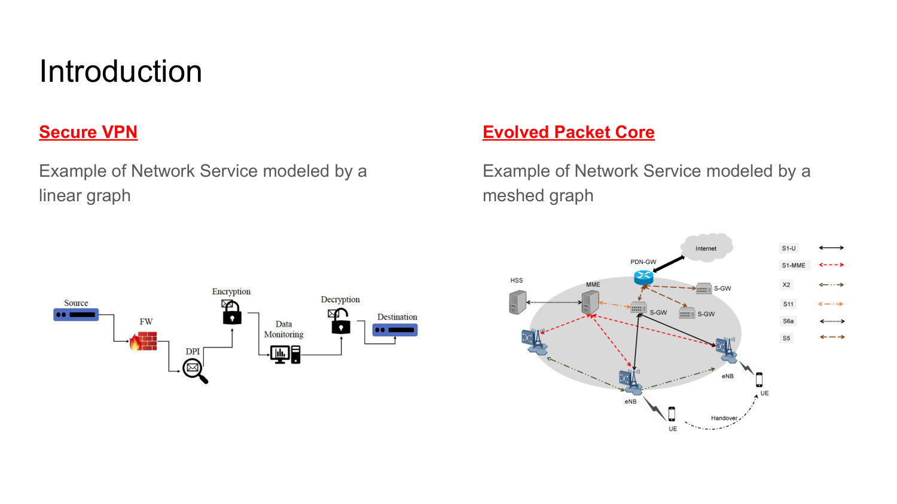
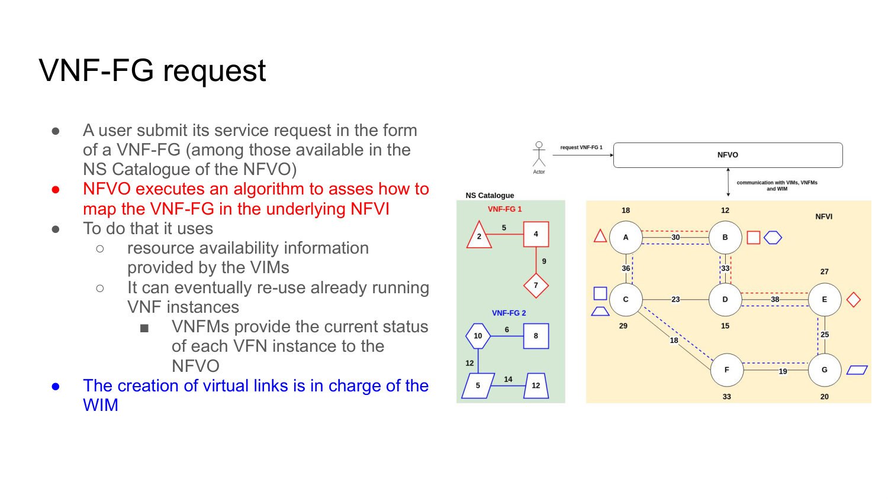
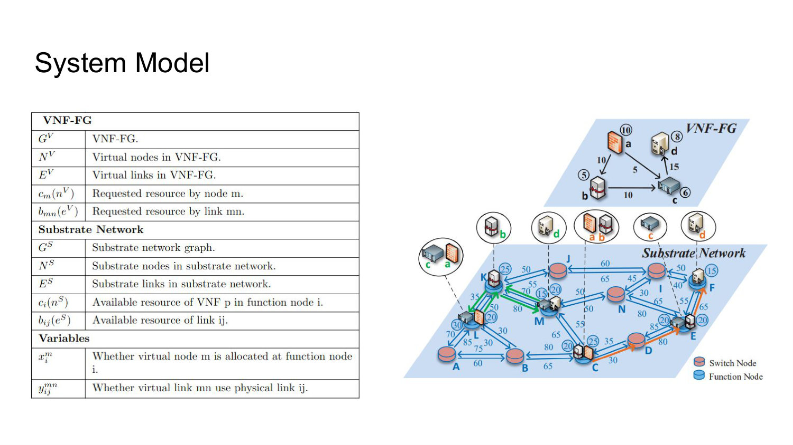
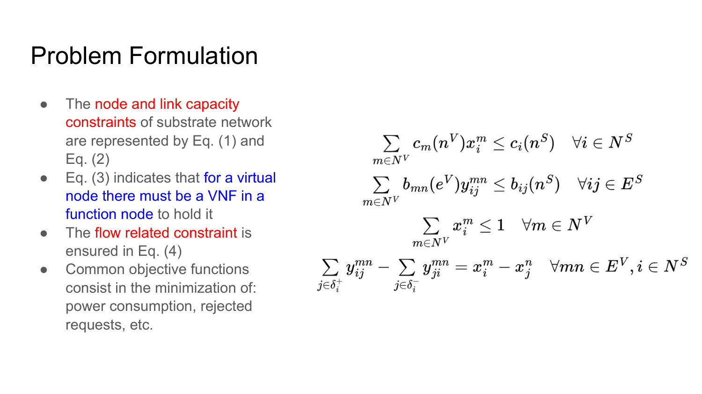
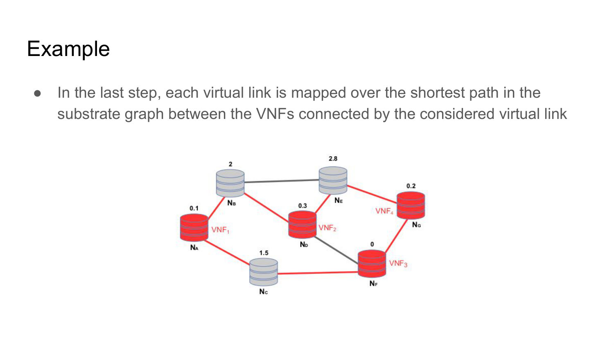
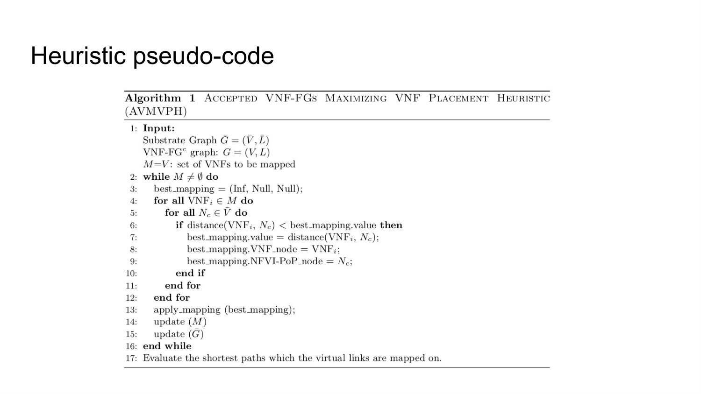
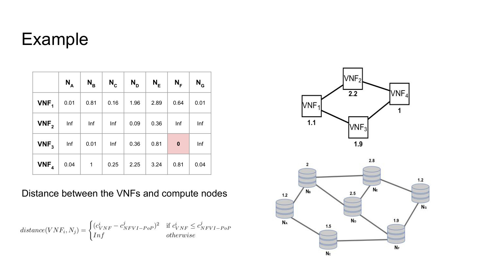

# 007 - VNF Placement

## How is a network service represented as a graph, and when is it a chain rather than a mesh?

A network service is modeled as a graph in which nodes are network functions and arcs are the logical connections or traffic relationships between them.

If every packet traverses an ordered sequence of functions, the graph is a **chain**; a secure VPN with firewall, inspection, encryption, monitoring, and decryption is an example. More complex services have branches, shared functions, or several traffic relationships and require a **meshed graph**, as in an Evolved Packet Core.

The graph is service intent. Placement later maps its virtual nodes and links onto physical infrastructure.



_Source: Lecture 007, slides 4-5._

## What must be done to instantiate a VNF Forwarding Graph as a network slice?

Compute and storage resources must be provisioned to create the VNF instances. Bandwidth and buffering must be reserved for each virtual link. Finally, network switches must be programmed so that traffic follows the requested logical connectivity between VNFs.

The ETSI MANO framework coordinates these tasks. A successful slice is therefore not just running VMs: functions, link resources, and forwarding behavior must all be created consistently.

_Source: Lecture 007, slide 6._

## How do the NFVO, VIM, VNFM, and WIM cooperate on a VNF-FG request?

The user selects a VNF-FG from the NFVO's service catalogue. The NFVO runs the placement algorithm that maps the request onto NFVI resources.

VIMs report available compute, storage, and local networking resources. VNFMs report the status of existing VNF instances, which the NFVO may reuse instead of creating new ones. The Wide-area Infrastructure Manager (WIM) creates the virtual links across the transport network.

The NFVO makes the service-wide decision, while the other managers supply domain state and execute lifecycle or connectivity actions.



_Source: Lecture 007, slide 7._

## What is the VNF placement problem, and what assumptions define the lecture's static scenario?

VNF placement is the problem of mapping VNF-FG virtual nodes and links onto an NFVI while allocating compute and bandwidth resources. The scenario considers an NFVIaaS provider that must instantiate a known set of network slices.

It is **static** because each request's bandwidth demand is fixed, each VNF-FG's functions and connections do not change, and the number and set of requests are known in advance. These assumptions remove arrivals, departures, and changing traffic, but the mapping problem remains combinatorial.

_Source: Lecture 007, slide 9._

## What are the main elements and decision variables in the VNF placement system model?

The request graph contains virtual nodes, virtual links, per-VNF compute demands, and per-link bandwidth demands. The substrate graph contains eligible function nodes, physical links, node capacities, and link capacities.

A binary node variable states whether virtual node `m` is placed on substrate function node `i`. A binary link variable states whether virtual link `mn` uses physical link `ij`.

These variables connect service intent to physical allocation: a solution specifies both where every function runs and which substrate path realizes every logical connection.



_Source: Lecture 007, slide 10._

## What constraints make a VNF placement feasible?

Node-capacity constraints ensure that the total compute demand of VNFs placed on a substrate node does not exceed its available capacity. Link-capacity constraints ensure that the summed bandwidth of virtual links routed through a physical link does not exceed its capacity.

An assignment constraint such as `sum_i x_i^m <= 1` prevents virtual node `m` from being placed more than once; by itself it does **not** guarantee placement. If every accepted request must be instantiated, the normalized condition is equality to one, or equality to a separate admission variable. Flow-conservation constraints make the selected physical links form a continuous path between the substrate nodes hosting the two endpoint VNFs.

A placement that satisfies compute but not connectivity, or connectivity but not bandwidth, is not feasible.



_Source: Lecture 007, slides 10-11._

## What objective functions can be used for VNF placement?

The constraints define what is allowed; the objective defines which feasible solution is preferred. Common objectives include minimizing power consumption, operating cost, or the number of rejected service requests. Others can balance load, reduce path length, or preserve spare capacity for future requests.

Different objectives can favor different mappings. Consolidating VNFs may save energy but reduce resilience; spreading them may improve fault isolation but consume more transport bandwidth. The optimization criterion must therefore reflect the provider's operational goal.

_Source: Lecture 007, slide 11._

## Why is a heuristic used for VNF placement?

The placement problem is NP-hard: the number of combinations grows rapidly with the number of VNFs, candidate hosts, and possible paths. Exact optimization can become too slow for an NFVO that must make practical admission and placement decisions.

A heuristic gives up a guarantee of global optimality in exchange for polynomial-time execution and a usable solution. The lecture uses the greedy **Accepted VNF-FGs Maximizing VNF Placement Heuristic (AVMVPH)**.

_Source: Lecture 007, slide 13._

## What are the two main steps of AVMVPH?

First, AVMVPH greedily maps VNF nodes. At each iteration it selects the feasible VNF/host pair that leaves the smallest residual processing capacity on the chosen NFVI-PoP - a best-fit strategy that tries to pack resources tightly.

After all selected VNFs have been placed, it maps each virtual link onto a shortest path in the substrate graph between the hosts of its endpoint VNFs.

The decomposition simplifies the problem, but it also means node placement is chosen before full path consequences are known.



_Source: Lecture 007, slides 13 and 21._

## How does the AVMVPH distance metric choose a VNF-to-host mapping?

For VNF `i` requiring capacity `c_i` and NFVI-PoP `j` with available capacity `c_j`, the metric is `(c_i - c_j)^2` when `c_i <= c_j`; otherwise it is infinity.

Infinity excludes hosts that cannot fit the VNF. Among feasible pairs, minimizing the squared difference chooses the host whose remaining capacity is closest to zero after placement. The `best_mapping` tuple records the VNF, the selected NFVI-PoP, and the metric value.

Squaring preserves the best-fit ordering while producing a non-negative distance.

_Source: Lecture 007, slides 14 and 16-20._

## Walk through the iterative structure of the AVMVPH pseudo-code.

The algorithm starts with the set of VNFs still to be mapped. It resets `best_mapping`, scans every remaining VNF and every candidate function node, and retains the feasible pair with the smallest distance.

It then applies that mapping, removes or updates the mapped VNF, and updates the substrate node's residual capacity. The loop repeats until no VNFs remain. Finally, the algorithm computes the shortest substrate paths for the virtual links.

Recomputing after each placement is essential because every greedy choice changes which later choices are feasible.



_Source: Lecture 007, slide 15._

## Work through the complete AVMVPH example: which mappings are selected, and how are the virtual links then routed?

At every iteration the algorithm chooses the feasible VNF/host cell with minimum squared capacity distance, removes that VNF, and recomputes feasibility using the new residual capacity:

| Iteration | Selected mapping | Distance | Host residual capacity |
| ---: | --- | ---: | ---: |
| 1 | `VNF3 -> NF` | `0` | `0` |
| 2 | `VNF1 -> NA` | `0.01` | `0.1` |
| 3 | `VNF4 -> NG` | `0.04` | `0.2` |
| 4 | `VNF2 -> ND` | `0.09` | `0.3` |

The first choice is exact best fit. At the second iteration, equivalent minima can exist—for `VNF1`, `NA` and `NG` initially both show `0.01`—so the displayed execution resolves the tie by the algorithm's scan/order behavior. This reminds us that a greedy heuristic should define a tie-breaker if reproducible placement matters.

Only after node placement does AVMVPH route the diamond-shaped request links over shortest substrate paths:

```text
VNF1(NA) -- VNF2(ND):  NA - NB - ND
VNF1(NA) -- VNF3(NF):  NA - NC - NF
VNF2(ND) -- VNF4(NG):  ND - NE - NG
VNF3(NF) -- VNF4(NG):  NF - NG
```

The figure shows a topologically valid shortest-path realization. Because slides 16-21 provide no link-bandwidth demands or capacities, it does not prove satisfaction of the link-capacity constraints; it illustrates only the node-first, routing-second decomposition.




_Source: Lecture 007, slides 16-21._

## What are the main strengths and weaknesses of the AVMVPH decomposition?

The approach is simple, fast, and tends to consolidate compute by filling hosts tightly. Shortest-path routing then keeps individual virtual links locally efficient. These properties make it practical for an NFVO.

However, greedy node packing can create network bottlenecks or make later links infeasible, because link placement is considered only after all VNF placements. It can also reduce resilience by concentrating functions. A more sophisticated heuristic could include bandwidth, delay, failure domains, or look-ahead in the node-placement score.

The algorithm is therefore a practical approximation, not a proof of optimal placement.

_Source: Lecture 007, slides 13-21._
