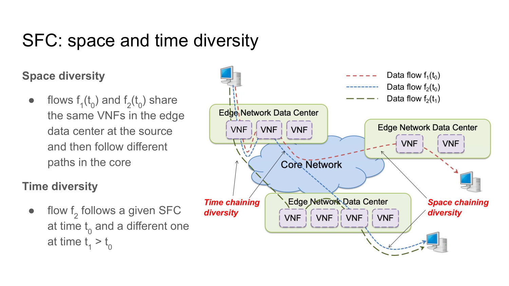
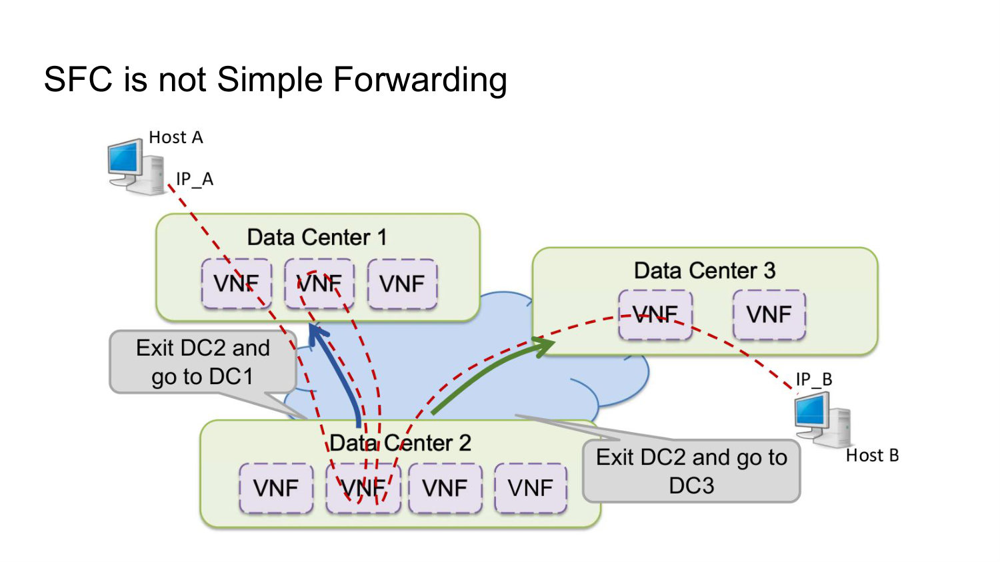
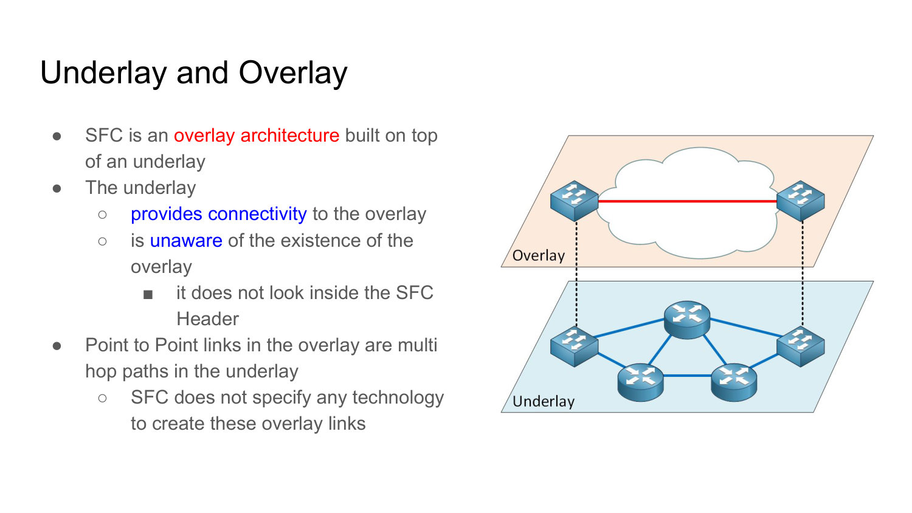
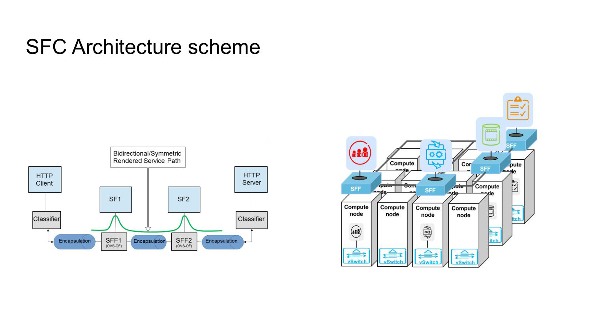
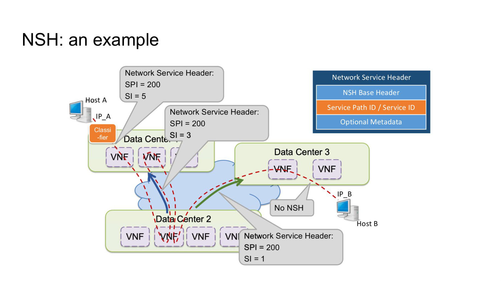
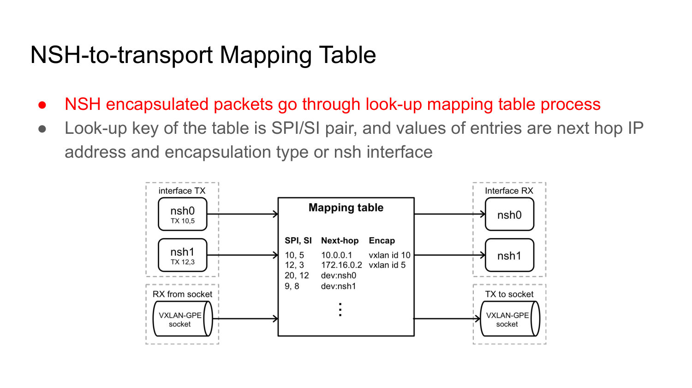
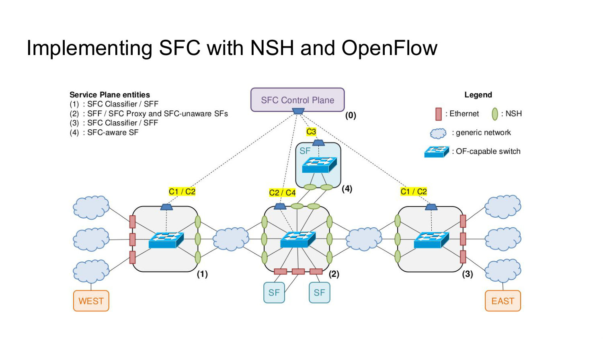
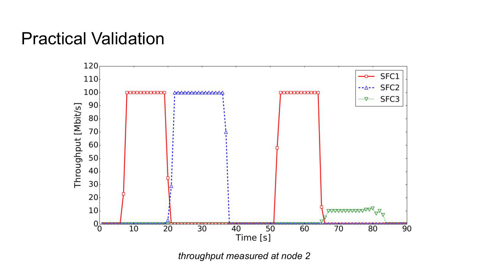
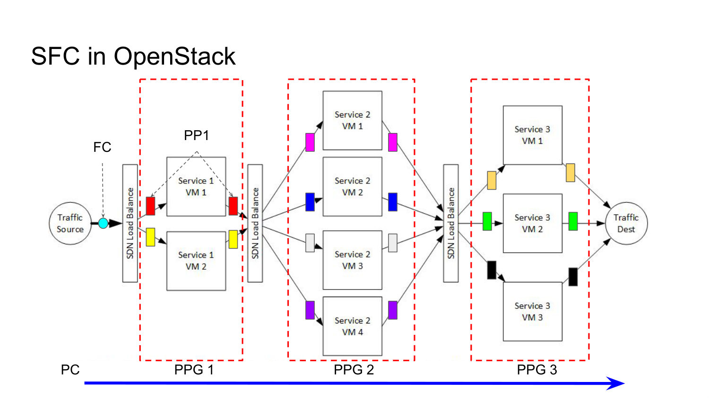

# 008 - Service Function Chaining

## How do NFV and SDN together make service function chaining programmable?

NFV replaces fixed hardware appliances with VNFs that can be instantiated, stopped, scaled, or moved across NFVI sites. SDN programs the connectivity that carries traffic among those functions.

Together they make both **deployment** and **interconnection** dynamic. An operator can change which instances form a service and redesign the traffic path without recabling appliances. Service Function Chaining formalizes the ordered traversal that a packet or flow must follow through those functions.

_Source: Lecture 008, slides 4-5._

## What are space diversity and time diversity in service function chaining?

**Space diversity** means that two simultaneous flows can share some VNFs and then take different paths or functions because they have different service requirements or destinations.

**Time diversity** means the same flow class can follow one chain at time `t0` and a different chain later, for example after scaling, policy change, failure, or load adaptation.

These properties show why a chain cannot be reduced to static physical cabling: the mapping between traffic and functions can depend on flow identity and time.



_Source: Lecture 008, slide 6._

## Why cannot ordinary destination-based IP forwarding always implement an SFC?

IP forwarding normally chooses the next hop from the packet's destination address. In an SFC, the same source and destination pair may need to visit the same VNF more than once or leave that VNF through different ports depending on which chain steps have already been completed.

The destination address alone does not carry this history, so a router can face conflicting rules for the same destination. SFC forwarding must encode both the selected path and the packet's current position within it, usually in a service-specific header.



_Source: Lecture 008, slides 7-8._

## What is a Service Function Path, and where is it represented?

An **SFP** refines the abstract Service Function Chain using policy and operational constraints and may be partially or fully specified. The actual sequence of specific SFFs and SFs visited by a packet is the **Rendered Service Path (RSP)**. A classifier assigns traffic to an SFP, whose service-path identity is carried in the SFC encapsulation header.

SFC-aware nodes use that identity and progress information for service-plane forwarding, while ordinary network protocols still provide hop-by-hop transport through the underlying topology.

The separation avoids overloading the original IP destination with service-chain history.

_Source: Lecture 008, slide 10; RFC 7665._

## Explain the relationship among the SFC overlay, the underlay, and tunneling.

SFC is an **overlay** architecture. Its logical point-to-point links connect classifiers, forwarders, and functions. The **underlay** supplies physical or IP connectivity and may realize one overlay link as a multi-hop path; it does not inspect or understand the SFC header.

Tunnels such as GRE, IPsec, MPLS, or VXLAN can connect Service Function Forwarders. They encapsulate the service packet in an outer header, so intermediate underlay nodes process only that outer transport header.

SFC defines the service path but does not mandate one technology for building the overlay links.



_Source: Lecture 008, slides 11-12._

## What are the main SFC service-plane logical elements?

An **SFC classifier** applies policy to incoming traffic, selects the SFP, and adds the appropriate SFC header. A **Service Function (SF)** processes the packet; it may be SFC-aware or may understand only the original packet.

A **Service Function Forwarder (SFF)** reads the SFC header and sends traffic to the next connected function or forwarder. An **SFC proxy** removes and restores SFC encapsulation on behalf of an SFC-unaware function.

These roles separate traffic classification, service processing, chain-aware forwarding, and compatibility adaptation.



_Source: Lecture 008, slides 13-14._

## How is a bidirectional or symmetric service implemented using directional service paths?

Traffic in both directions must be classified: the HTTP-client side classifies the forward flow, and the server side classifies the return flow. Each ingress adds service-chain encapsulation, and the SFFs steer packets through a related pair of **direction-specific** SFPs/RSPs using the same service-function instances—for example, `SF1 -> SF2` in one direction and `SF2 -> SF1` in the other.

There is not one RSP that is intrinsically bidirectional. The two directions need their own path identity and state, while stateful functions correlate the two halves of the conversation. Encapsulation is removed at the far boundary before endpoint delivery and added anew when traffic enters from the other side.

"Symmetric" therefore describes equivalent service treatment of both directions; it does not mean one packet somehow travels both ways or that the original IP destination alone encodes the chain.


_Source: Lecture 008, slide 14; RFC 7665._

## What are the C1, C2, C3, and C4 SFC control-plane interfaces?

`C1` controls classifiers and their traffic-classification rules. `C2` exchanges forwarding information and SFP state with Service Function Forwarders.

`C3` communicates with SFC-aware Service Functions and collects information produced by their packet processing. `C4` communicates instructions and retrieves state from SFC proxies.

The interfaces mirror the service-plane roles, giving the control plane a distinct way to configure and observe each class of component.

_Source: Lecture 008, slide 15._

## What does the Network Service Header provide?

NSH is a service-plane encapsulation that provides SFP identification, transport-independent chaining, and packet-level network or service metadata.

Because NSH is independent of the underlay tunnel, the same chain semantics can be carried over different transports. Metadata can convey context needed by service functions, while the path fields solve the history problem that ordinary destination-based forwarding cannot express.

_Source: Lecture 008, slide 16._

## What are the NSH Service Path Identifier and Service Index?

The **Service Path Identifier (SPI)** is a 24-bit value assigned by the classifier. It identifies the selected SFP.

The **Service Index (SI)** is an 8-bit progress counter that identifies the packet's current location within the path. It is decremented as the packet advances through service hops.

The pair answers two questions: "which chain?" and "which step of that chain?" This is the history missing from the original IP header.



_Source: Lecture 008, slides 16-17._

## How does an NSH-to-transport mapping table forward a packet?

The node looks up the packet's `(SPI, SI)` pair. The matching entry supplies the next-hop IP address and the encapsulation type, or identifies a local NSH interface.

After a service step, the SI changes, so the same SPI can map to a different next hop. The table therefore translates service-path position into concrete transport behavior while keeping the service definition independent of a particular underlay.

The sample table makes both possible outputs explicit:

| `(SPI, SI)` | Next hop/action | Encapsulation |
| --- | --- | --- |
| `(10, 5)` | `10.0.0.1` | VXLAN, ID 10 |
| `(12, 3)` | `172.16.0.2` | VXLAN, ID 5 |
| `(20, 12)` | `dev:nsh0` | — |
| `(9, 8)` | `dev:nsh1` | — |

The first two entries tunnel to a remote next hop; the last two deliver to a local NSH interface. Thus an SFF lookup can select transport forwarding or local service attachment using the same service-path key.



_Source: Lecture 008, slide 18._

## What is the QoS-differentiation scenario used in the SFC implementation example?

A high-priority and a low-priority user share a congestible link. The network must inspect traffic and react to overload by throttling the low-priority flow, preserving guaranteed bandwidth for the high-priority flow.

The example demonstrates that chain selection can depend on runtime information produced by a service function. SFC is therefore not only static traversal; the control plane can select different chains after observing packet or performance state.

_Source: Lecture 008, slide 20._

## How are NSH and OpenFlow divided in the SFC implementation example?

NSH carries the selected service path and progress inside packets. OpenFlow provides communication and rule installation between the SFC control plane and the service-plane switches.

The scenario contains a control-plane entity, two classifiers, an intermediate node acting as both SFF and proxy, one SFC-aware function, and two SFC-unaware functions. OpenFlow programs how packets reach these elements; the proxy adapts NSH for functions that cannot process it.



_Source: Lecture 008, slides 21-22._

## How is an NSH-capable interface configured in the practical validation?

An open-source NSH kernel module creates NSH interfaces on the relevant nodes. Each interface is assigned an `(SPI, SI)` pair, mapped to a transport-level next hop, and configured with the inbound `(SPI, SI)` values it should accept.

The example uses VXLAN for the transport encapsulation. Deep Packet Inspection, a traffic shaper, and an integrity checker act as service functions. The configuration therefore binds chain position, transport, and function behavior.

_Source: Lecture 008, slide 23._

## What are the three SFCs defined in the practical validation?

`SFC1` duplicates the monitored flow toward DPI for baseline classification. `SFC2` sends high-priority traffic through the integrity checker; `SFC3` sends low-priority traffic through the traffic controller that limits bandwidth.

When a monitored flow begins, DPI supplies the classification and the controller installs the corresponding class-specific path. Slide 24 uses EAST/WEST direction labels inconsistently, so the reliable distinction is the traffic class and treatment, not that contradictory label.

_Source: Lecture 008, slide 24._

## How does the dynamic SFC procedure classify and redirect a new flow?

The switches first receive proactive rules that establish the monitored `SFC1` path. When a monitored flow begins, the orchestrator starts DPI and later reads its classification result.

If the flow is high priority, the controller installs rules for `SFC2`; otherwise it installs rules for `SFC3`. The sequence combines proactive baseline forwarding with reactive, state-driven specialization.

_Source: Lecture 008, slides 25-26._

## What does the practical-validation throughput graph demonstrate about `SFC1`, `SFC2`, and `SFC3`?

The traces occur in different time intervals and show the behavior measured at node 2:

| Chain | Observed throughput | Interpretation |
| --- | ---: | --- |
| `SFC1` | about `100 Mbit/s` | Baseline inspected traffic is forwarded without the class-specific limiter. |
| `SFC2` | about `100 Mbit/s` | High-priority traffic traverses the integrity-check path while retaining line-rate throughput. |
| `SFC3` | about `10 Mbit/s` | Low-priority traffic traverses the traffic controller, which enforces the bandwidth limit. |

The result validates more than reachability. DPI classification leads the controller to select a different chain, and the selected service function produces the intended measurable policy effect. High-priority integrity processing does not impose the low-priority cap, while the traffic-controller path does.



_Source: Lecture 008, slides 24-26._

## How does OSM represent a VNF Forwarding Graph in a Network Service Descriptor?

OSM stores ETSI-MANO SFC information in the NSD YAML under a `vnffgd` element. The descriptor contains a **Rendered Service Path (RSP)** list and a **classifier** list.

Each RSP defines an ordered path as tuples containing the VNF, order, entry interface, and exit interface. A classifier defines the traffic assigned to the path through match attributes. The descriptor therefore couples "what traffic" with "which ordered function traversal."

```yaml
vnffgd:
  - name: VNFFGD_NAME
    rsp:
      - name: RSP_NAME
        vnfd-connection-point-ref:
          - vnfd-ingress-connection-point-ref: VNF_INGRESS_CP
            vnfd-egress-connection-point-ref: VNF_EGRESS_CP
            vnfd-id-ref: VNF_NAME
            order: 1
    classifier:
      - rsp-id-ref: RSP_NAME
        match-attributes: TRAFFIC_TYPE
```

Reading from the inside out: the tuple identifies one VNF and its entry/exit interfaces; `order` locates it in the rendered path; `rsp` collects ordered tuples; and the classifier points at that RSP and defines the matching traffic. The NSD can contain several paths and classifiers under the same VNFFG.

_Source: Lecture 008, slides 28-29._

## What are the four steps for creating an SFC in OpenStack Neutron?

First create a **Flow Classifier (FC)** containing the header-based traffic policy. Next create **Port Pairs (PPs)**, each representing one service-function instance with ingress and egress ports.

Then group one or more equivalent instances into **Port Pair Groups (PPGs)**, which can support load balancing. Finally create a **Port Chain (PC)** that binds one or more flow classifiers to an ordered list of PPGs.

The sequence progresses from traffic selection, to function instances, to scalable function groups, to the complete ordered chain.



_Source: Lecture 008, slides 30-31._
