# 009 - Segment Routing and SRv6

## What is Segment Routing, and where does it keep per-flow state?

Segment Routing is a source-routing architecture in which an ingress or source steers a packet through an ordered list of **segments**. A segment is an instruction: it may identify a topological waypoint, an adjacency, a service, or another local behavior.

Its semantic can be **global within the SR domain**, so every relevant node interprets the identifier consistently, or **local to one SR node**, so only the advertising or owning node interprets the instruction after routing has delivered the packet there. Global reachability and local execution are compatible: a routable locator can bring an SRv6 SID to its owner, whose MyLocalSID table then supplies the local function.

The segment list is carried with the packet, so transit nodes execute the currently active instruction rather than maintaining separate state for every engineered flow. Per-flow policy state is concentrated at the ingress or headend that classifies the traffic and imposes the segment list.

This makes explicit paths and services possible without installing end-to-end flow state in every intermediate router.

_Source: Lecture 009, slides 4-9._

## What are the ingress, transit, and egress roles in an SR domain?

The **ingress SR node** classifies traffic and imposes or selects the segment list. A **transit SR node** forwards according to the active segment and may execute a segment endpoint behavior if that segment belongs to it.

The **egress SR node** completes the SR policy and delivers the packet toward its final destination or next domain. These are roles relative to a policy: the same router can be ingress for one flow and transit or egress for another.

_Source: Lecture 009, slide 5._

## How can one Segment Routing list express both topological and service instructions?

The ingress pushes an ordered list whose entries have defined semantics. A node SID can require travel through a particular router, an adjacency SID can require a particular outgoing link, and a service SID can invoke a local function such as a VM-hosted network service.

The active segment is executed first; once it completes, the next segment becomes active. One list can therefore say, conceptually, "reach router X, apply service Y, use adjacency Z, then reach the egress."

The data plane sees one sequence of instructions even though the instructions represent different kinds of behavior.

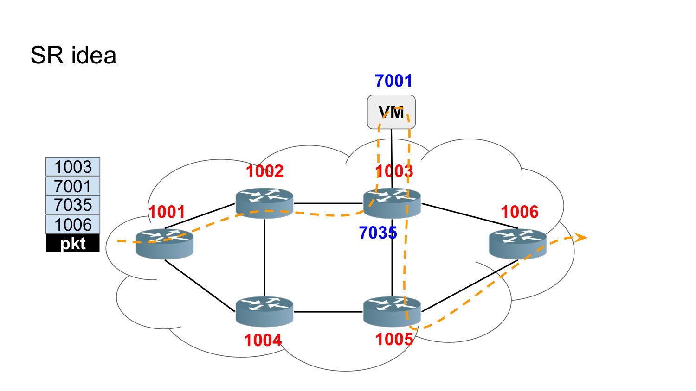

_Source: Lecture 009, slides 6-9 and 38-42._

## Compare distributed, centralized, and hybrid Segment Routing control planes.

In a **distributed** model, routing protocols such as OSPF or BGP allocate or advertise segments, and each node decides which traffic to steer and computes its own source-routed policy.

In a **centralized** model, an SR controller allocates or instantiates segments, computes policies, and tells headends which traffic to steer onto them.

A **hybrid** model retains distributed reachability while using a controller for cases needing a wider view, such as computing a policy to a destination outside the local IGP domain. SR does not require one control-plane architecture.

_Source: Lecture 009, slide 10._

## On which data planes can Segment Routing be implemented?

The two main instantiations are **SR-MPLS** and **SRv6**. SR-MPLS represents segments as MPLS labels and can reuse the MPLS forwarding plane without changing its basic label operations.

SRv6 represents segments as IPv6 addresses and carries an ordered list in the IPv6 Segment Routing Header. This combines IPv6 reachability with endpoint behaviors bound to local SIDs.

The SR architecture supplies common source-routing semantics; the data plane determines how segments are encoded and executed.

_Source: Lecture 009, slide 11._

## What do the Segment Routing `PUSH`, `NEXT`, and `CONTINUE` operations mean?

`PUSH` inserts a segment at the top of the segment list, normally when a headend steers traffic into a policy or when one policy is bound into another.

`NEXT` is used when the active segment has completed; processing advances to and inspects the next segment. `CONTINUE` means the active segment is not yet complete, so it remains active while the packet is forwarded toward the node or condition that completes it.

These operations distinguish imposing a policy, completing an instruction, and ordinary transit within an instruction.

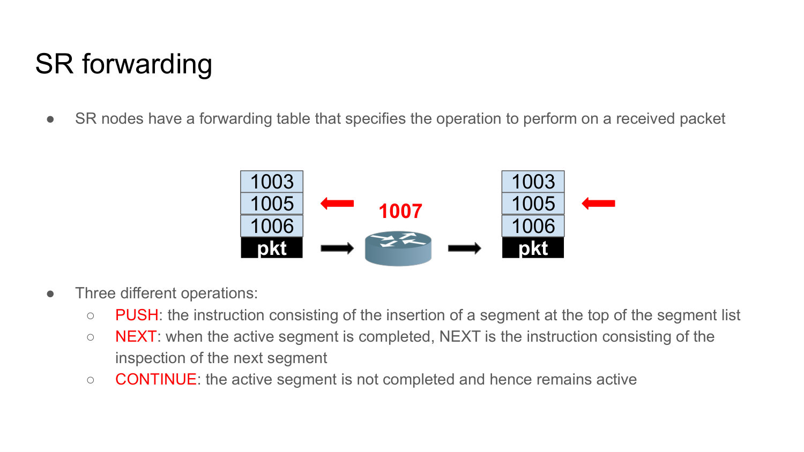

_Source: Lecture 009, slides 12-14._

## How is an SR Policy identified?

An SR Policy is identified by the tuple `<headend, color, endpoint>`. The **headend** is the node where the policy is instantiated. The **endpoint** is its destination; both can be expressed as IPv4 or IPv6 addresses.

The **color** is a 32-bit value that associates the policy with an intent, such as low latency. A flow classified with that color and endpoint can be steered into the corresponding policy at the headend.

The tuple separates the desired service intent from the specific segment list currently selected to realize it.

_Source: Lecture 009, slide 16._

## What are candidate paths and segment lists within an SR Policy?

An SR Policy may contain one or more candidate paths. Each candidate path is dynamic or explicit and is associated with one or more SID lists that describe concrete source-routed ways to reach the policy endpoint.

Preferences rank candidate paths, while weights can distribute traffic among SID lists belonging to a selected candidate. A headend may learn the candidates from local configuration or a Path Computation Element.

This hierarchy allows a stable intent tuple to have primary, alternate, and load-sharing realizations.

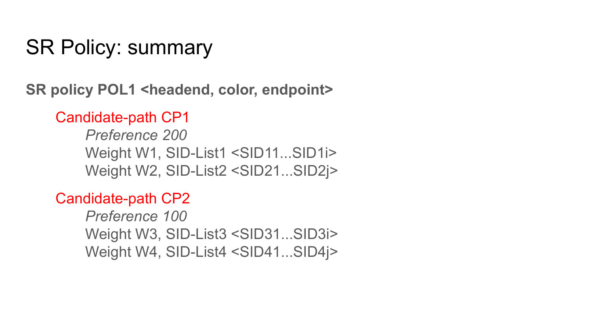

_Source: Lecture 009, slides 17-18._

## What is a Binding SID, and why is it useful?

A Binding SID identifies an SR Policy as one forwarding object. The headend installs a forwarding entry for the BSID whose action is to steer matching packets onto the policy's selected SID list.

For example, a packet matching BSID `B` can be transformed into a packet carrying `<S1, S2, S3>`. Other policies can refer to `B` instead of repeating the full list, which supports policy composition, hides internal details, and reduces the segment-list depth exposed upstream.

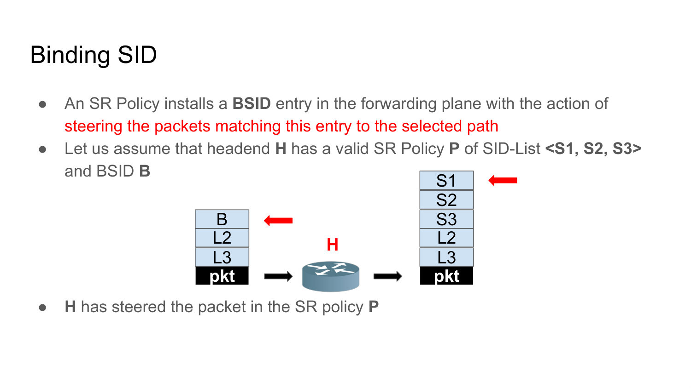

_Source: Lecture 009, slide 19._

## Where is the Segment Routing Header instantiated in SRv6?

The SRH may be created by the host or server that originates the packet, if it is SR-capable, or by the ingress router of an SR domain on behalf of an ordinary source.

The ingress model is especially important for incremental deployment: end hosts and non-SR transit nodes can use normal IPv6, while the SR domain adds and processes the policy information at its boundary.

_Source: Lecture 009, slide 21._

## What are the main fields of the IPv6 Segment Routing Header?

`Next Header` identifies the protocol after the SRH. `Hdr Ext Len` gives the SRH length in 8-octet units, and `Routing Type` identifies this routing-header format.

`Segments Left` indexes the next segment to process and is decremented at each segment endpoint. `Last Entry` indexes the final element stored in the segment-list array. Flags and a tag carry policy-related information. The segment list contains 128-bit IPv6 SIDs, and optional TLVs carry extensible metadata.

The array is stored in reverse path order, which is why the indexes require careful interpretation.

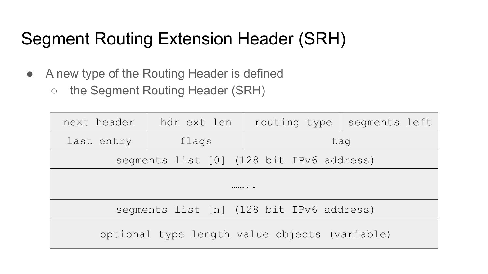

_Source: Lecture 009, slides 22-23 and 29-30._

## Why does the IPv6 destination address change during SRv6 processing?

Only the router whose own SID appears in the IPv6 destination address is required to inspect and execute the SRH. Therefore the currently active segment is copied into the outer IPv6 destination field.

When that endpoint completes the segment, it decrements `Segments Left`, copies the next SID from the SRH into the destination address, and performs a normal FIB lookup. Non-endpoint transit routers simply route toward that destination.

This design makes ordinary IPv6 forwarding deliver the packet between SR-aware endpoints.

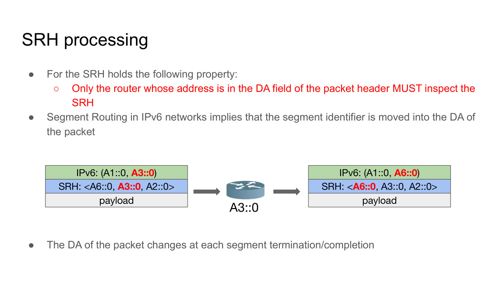

_Source: Lecture 009, slide 24._

## What is the MyLocalSID table?

Every SRv6-capable node maintains a MyLocalSID table containing the local SIDs explicitly instantiated on that node. Each entry binds a SID to one endpoint instruction or function.

When the packet's destination matches a local SID, the node executes the associated behavior rather than treating it as an ordinary host address. The table is therefore the bridge between a routable 128-bit SID and local network programming.

_Source: Lecture 009, slides 25-26 and 39._

## Compare the SRv6 `End` and `End.X` functions.

`End` is the basic endpoint behavior. It advances the SRH by decrementing `Segments Left`, updates the destination address to the next segment, performs a FIB lookup, and forwards normally.

`End.X` is an endpoint Layer-3 cross-connect behavior. In addition to advancing the segment list, it forwards through a specified adjacency or link. `End` says "continue by routing to the next SID"; `End.X` says "continue through this particular Layer-3 adjacency."

_Source: Lecture 009, slides 26-28 and 40-42._

## Walk through the SRv6 `End` behavior when `Segments Left` is greater than zero.

The node first confirms that the destination SID is in MyLocalSID and is bound to `End`. It then decrements `Segments Left`, replaces the IPv6 destination address with `SegmentList[Segments Left]`, performs a FIB lookup on that new destination, and forwards according to the result.

The order matters: decrement first, then use the new index. The next segment becomes visible to ordinary IPv6 forwarding only after the destination field is updated.

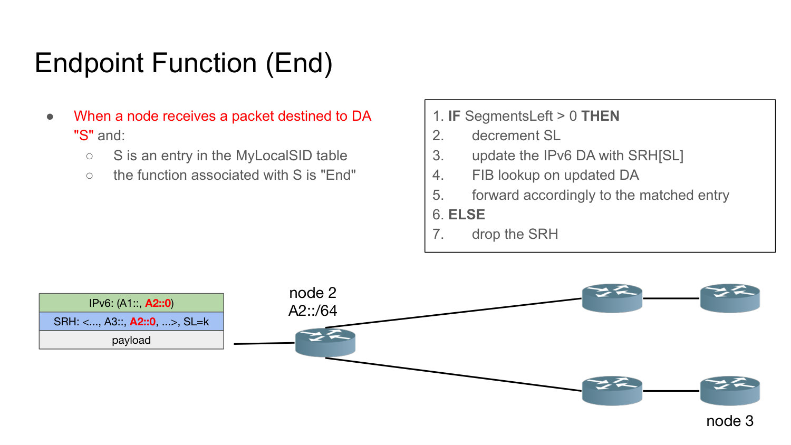

_Source: Lecture 009, slides 27-28._

## How does an SRv6 source initialize the segment list and destination address?

If the intended path is `A2`, then `A3`, then `A4`, the SRH stores the list in reverse array order: `SegmentList[0]=A4`, `[1]=A3`, and `[2]=A2`. For three segments, `Segments Left` and `Last Entry` are initialized to 2.

The outer IPv6 destination is set to the first path segment, `A2`, and the packet is sent using normal IPv6 forwarding. The reverse storage lets decrementing the index move forward along the intended path.

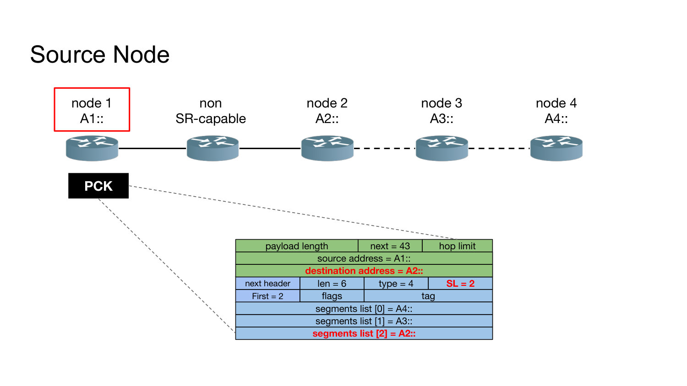

_Source: Lecture 009, slides 29-30._

## Trace the destination address and `Segments Left` for the SRv6 path `A2 -> A3 -> A4`.

The source stores the SIDs in reverse array order—`[A4, A3, A2]`—but makes the first path instruction the IPv6 destination:

| Processing point | Outer IPv6 destination | `Segments Left` | What happens next |
| --- | --- | ---: | --- |
| source `A1` | `A2::` | 2 | Plain IPv6 forwarding carries the packet toward A2. |
| endpoint `A2` after `End` | `A3::` | 1 | A2 decrements first, loads `SegmentList[1]`, then looks up A3. |
| endpoint `A3` after `End` | `A4::` | 0 | A3 loads `SegmentList[0]` and routes toward A4. |
| final endpoint `A4` | `A4::` | 0 | A4 executes the local behavior bound to this final SID. |

A non-SR router between these points changes neither the SRH nor `Segments Left`; it sees only the currently active IPv6 destination. The most common indexing error is to read the displayed array top-to-bottom as path order. It is storage order, whereas the decreasing index produces execution order.


_Source: Lecture 009, slides 29-36._

## Compare a non-SR transit node with an SR segment endpoint.

A non-SR transit node performs plain IPv6 forwarding based only on the current destination address. It does not inspect or modify the SRH, so SRv6 can cross ordinary IPv6 routers.

An SR endpoint is SR-capable and sees one of its local SIDs in the destination field. It inspects the SRH and executes the bound behavior, normally advancing the segment list or performing a specialized function.

The current destination address, not merely the presence of an SRH, determines which routers must process SR semantics.

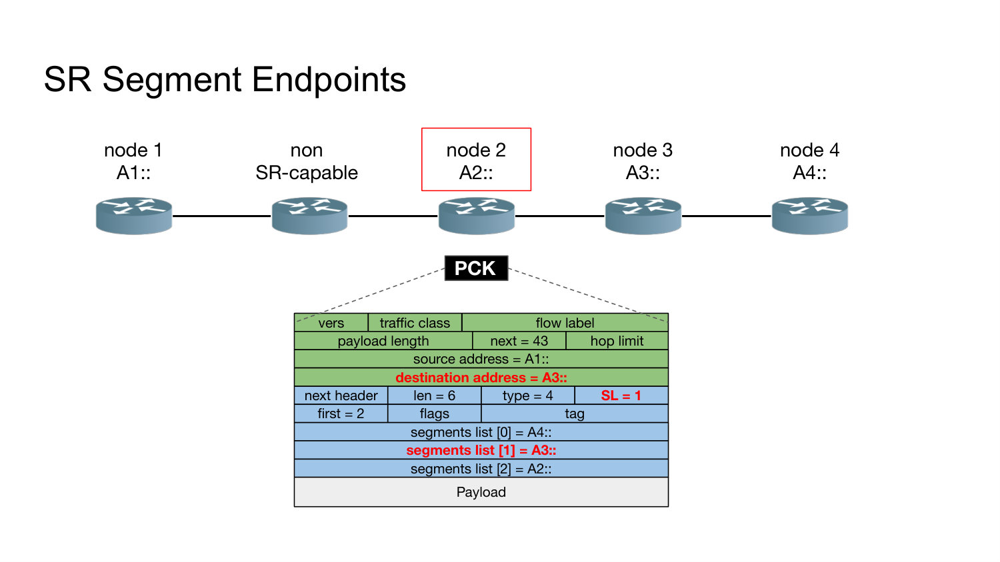

_Source: Lecture 009, slides 31-34._

## What happens at the final SRv6 endpoint when `Segments Left` is zero?

When the final local SID is reached with no remaining segment, the node executes the behavior bound to that SID in MyLocalSID. In the simplified lecture walkthrough, that behavior removes the outer IPv6 and SR headers and processes or delivers the payload.

Decapsulation is **not** a universal consequence of `Segments Left = 0`: a different final SID can specify delivery to an inner IPv6 packet, an interface, a service, or another local action. The common fact is only that no later SID remains to become the destination.

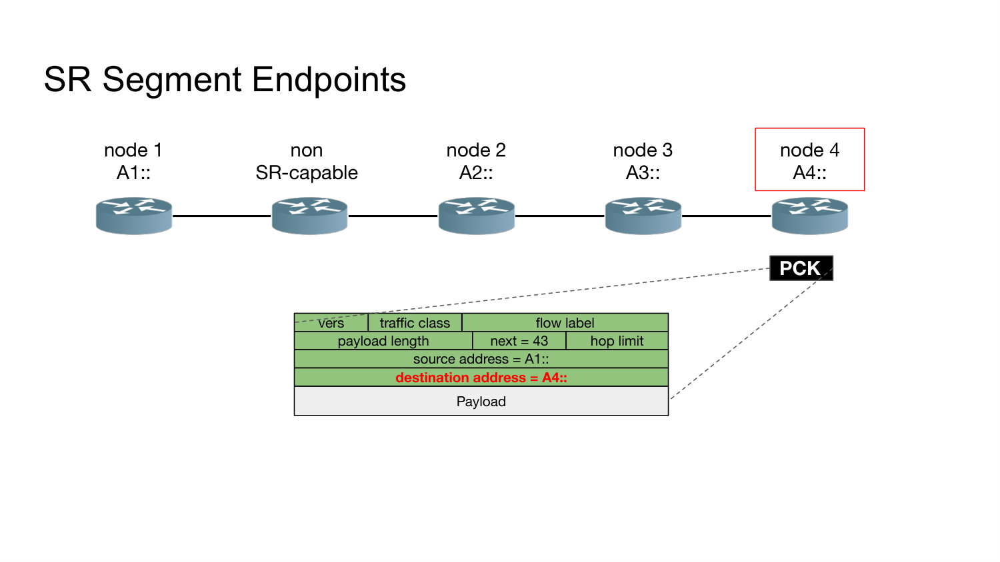

_Source: Lecture 009, slides 35-36._

## How is an SRv6 SID divided into locator, function, and arguments?

An SRv6 SID is logically written as `LOC:FUNCT`, optionally followed by `:ARGS`. The **locator** consists of the most significant `L` bits and is normally routable toward the node that owns the SID.

The **function** is an opaque local identifier interpreted by that node through MyLocalSID. Optional **arguments** supply parameters required by the function. Locator length is flexible, so operators design the bit allocation to fit routing and local behavior needs.

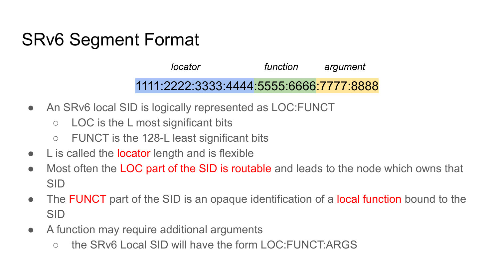

_Source: Lecture 009, slide 38._

## How can an SRv6 SID invoke an arbitrary network function?

MyLocalSID does not have to bind a SID only to built-in routing behaviors. A node can bind a local SID to a VM or software function, so reaching that SID invokes complex packet processing.

This turns an IPv6 address into a programmatic instruction. Topological and service behaviors can therefore appear in the same segment list, enabling a source-routed service chain without separate per-flow state at each transit router.

_Source: Lecture 009, slide 39._

## In the lecture's SID allocation example, what do `AK::0` and `AK::CJ` represent?

Node `K` advertises locator prefix `AK::/64`, so ordinary routing delivers any SID under that prefix to K. The last 64 bits encode the local function.

Value `0` denotes the basic `End` function, while value `CJ` denotes `End.X` over K's link `CJ`. Thus `A5::0` means reach node 5 and execute `End`; `A5::57` means reach node 5 and cross-connect onto its adjacency toward node 7.

_Source: Lecture 009, slides 40-42._

## What is TI-LFA, and how does Segment Routing support fast repair?

Topology-Independent Loop-Free Alternate provides local protection for a link, node, or Shared Risk Link Group failure, targeting recovery within about 50 ms.

The repairing router precomputes a repair segment list. Upon detecting the failure, it immediately inserts that list - for example, a SID that forces traffic through a safe alternate adjacency - rather than waiting for global routing reconvergence.

SR is well suited to this because a local node can express the repair as explicit instructions carried by the affected packets.

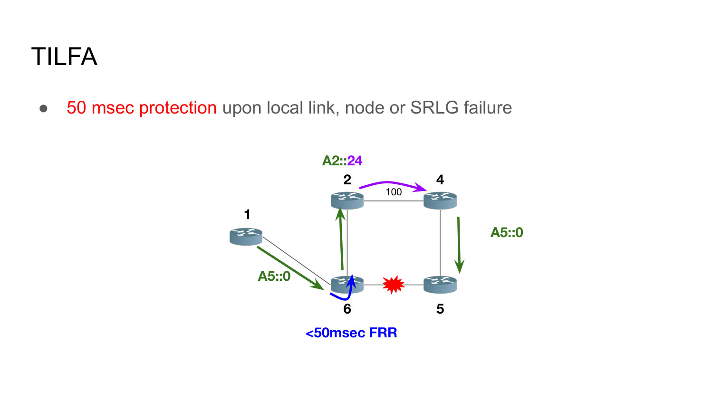

_Source: Lecture 009, slides 43-44._

## How does SRv6 realize an overlay service over an underlay?

An edge node advertises an overlay service SID and binds it in MyLocalSID to an SRv6 behavior. When traffic for a remote overlay prefix reaches that SID, the edge creates an outer IPv6/SRv6 policy that carries the original tenant packet across the underlay to the remote edge.

Underlay routers forward the outer header. The remote endpoint removes the SR encapsulation and releases the original packet toward the overlay destination. The overlay endpoints remain independent of the exact underlay path.

_Source: Lecture 009, slides 45-48._

## What does `End.B6` do in the lecture's overlay example, and how does it bind an overlay SID to an underlay SR policy?

The ingress advertises overlay reachability but installs service-to-policy bindings in MyLocalSID:

```text
V::/64  -> End.B6 <A2::24>
V::1    -> End.B6 <A3::0, A2::24>
```

When the original tenant packet `(T::1 -> V::x)` matches one of these bindings, the lecture's `End.B6` behavior preserves it as the **inner packet** and constructs the outer SRv6 transport. The lecture abbreviates this behavior as `End.B6`; RFC 8986 calls the encapsulating behavior `End.B6.Encaps`. With the one-segment list `<A2::24>`, the outer destination can be the egress SID directly; a separate SRH is unnecessary in the simplified example. With `<A3::0, A2::24>`, the outer destination begins as `A3::0` and an SRH carries the ordered instructions so A3 is visited before the egress.

In the lecture's simplified walkthrough, final processing at `A2::24` removes the underlay wrapper and forwards toward node 4, releasing the original tenant packet toward `V::x`. In standards-based SRv6, decapsulation requires an appropriate decapsulation behavior or flavor; plain `End.X` supplies only the Layer-3 cross-connect. The overlay prefix therefore selects a **service**, while the bound segment list selects the **underlay realization**. A more specific overlay SID can request a different SLA without changing the tenant's own headers.

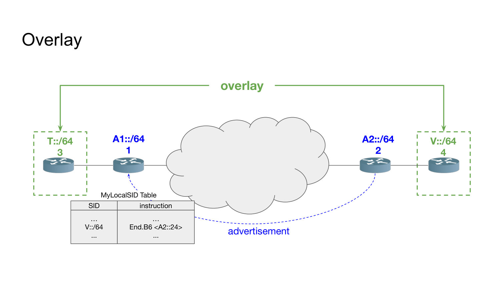

_Source: Lecture 009, slides 39 and 45-53; RFC 8986, section 4.13._

## How can an SRv6 overlay request an underlay SLA such as low latency?

Instead of binding an overlay SID to only the remote edge, the ingress binds a more specific service SID to a segment list that includes a waypoint or policy representing the low-latency path before the egress segment.

Packets matching that overlay service are encapsulated with the corresponding SRH. The underlay still uses IPv6 forwarding between segments, but the segment list forces the intended SLA-aware path. A different overlay SID can select a different underlay intent without changing the tenant packet.

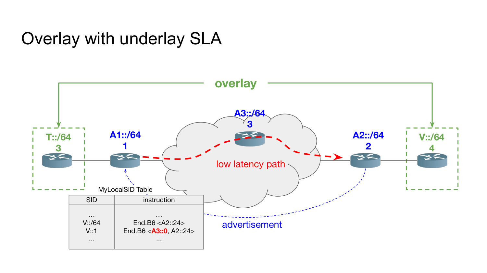

_Source: Lecture 009, slides 49-53._

## How does the integrated NFV example use SRv6 for service chaining?

The ingress maps an overlay service SID to a segment list containing SIDs bound to VM applications, intermediate endpoint behavior, and the remote edge. The original tenant packet is encapsulated; each service SID directs it to a node that invokes the corresponding VM-hosted function.

After a function completes, SRv6 advances to the next SID, so one packet-carried policy determines both topology and ordered network-function execution. The final segment delivers the packet back to the overlay destination.

This illustrates SRv6 network programming: routing, SLA waypoints, and NFV services share one instruction list.

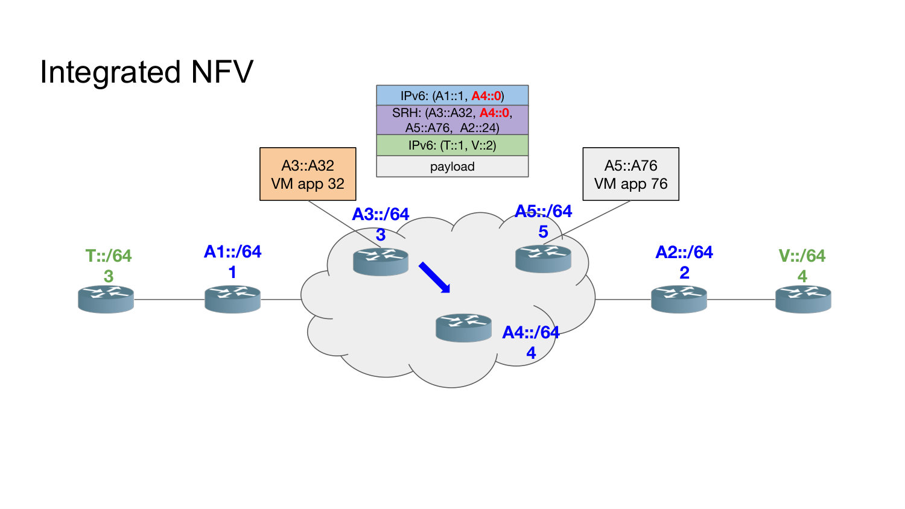

_Source: Lecture 009, slides 54-60; RFC 8986, sections 4.13 and 4.16._

## Trace the exact `V::2` service chain in the integrated NFV example.

The ingress binding is:

```text
V::2 -> End.B6 <A3::A32, A4::0, A5::A76, A2::24>
```

For an inner packet `(T::1 -> V::2)`, the active outer destination and behavior evolve as follows:

| Active SID | Meaning |
| --- | --- |
| `A3::A32` | Route to node 3 and invoke VM application 32. |
| `A4::0` | Visit node 4 and execute its basic `End` waypoint behavior. |
| `A5::A76` | Route to node 5 and invoke VM application 76. |
| `A2::24` | Reach the remote edge; in the lecture walkthrough, remove the wrapper and forward toward node 4 for overlay delivery. |

The lecture's `End.B6`—standards terminology: `End.B6.Encaps`—initially wraps the untouched tenant packet in an outer IPv6/SRH policy whose first active destination is `A3::A32`. Each local service completes its instruction and exposes the next SID; ordinary IPv6 forwarding carries the packet between service endpoints. In the simplified final step, processing at `A2::24` removes the underlay wrapper and the original destination `V::2` becomes visible again. Plain standards-based `End.X` does not itself decapsulate, so an implementation needs the appropriate decapsulation behavior or flavor in addition to the cross-connect semantics.

This single list expresses two service invocations, one topological waypoint, and final overlay delivery. The VM SIDs are not merely addresses of machines: their MyLocalSID bindings mean **execute these functions in this order**.

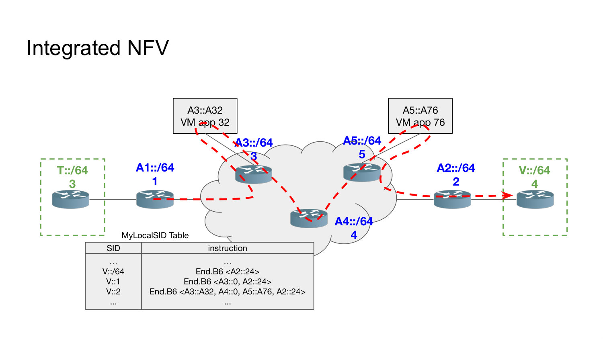

_Source: Lecture 009, slides 54-60; RFC 8986, sections 4.13 and 4.16._
