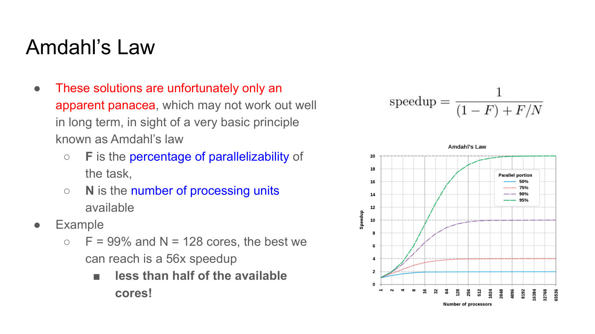
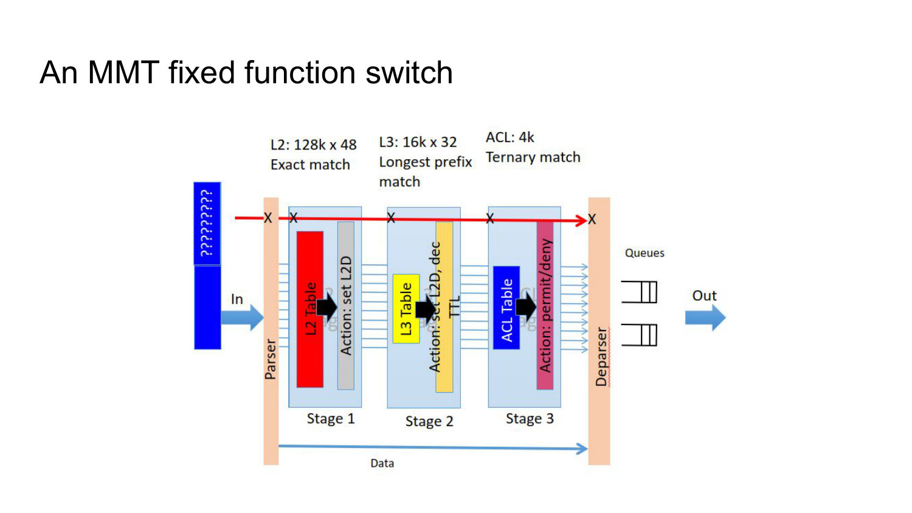
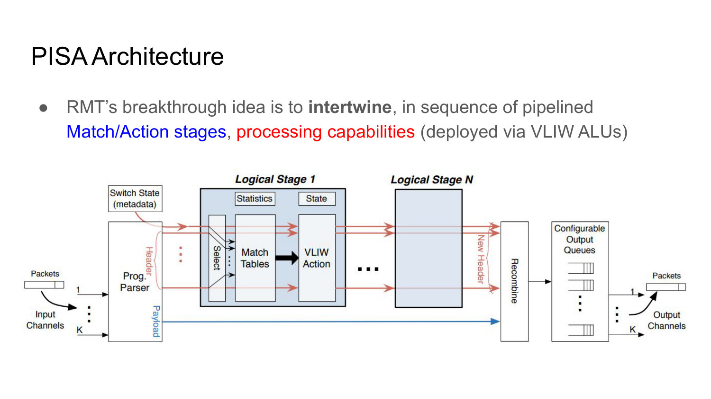
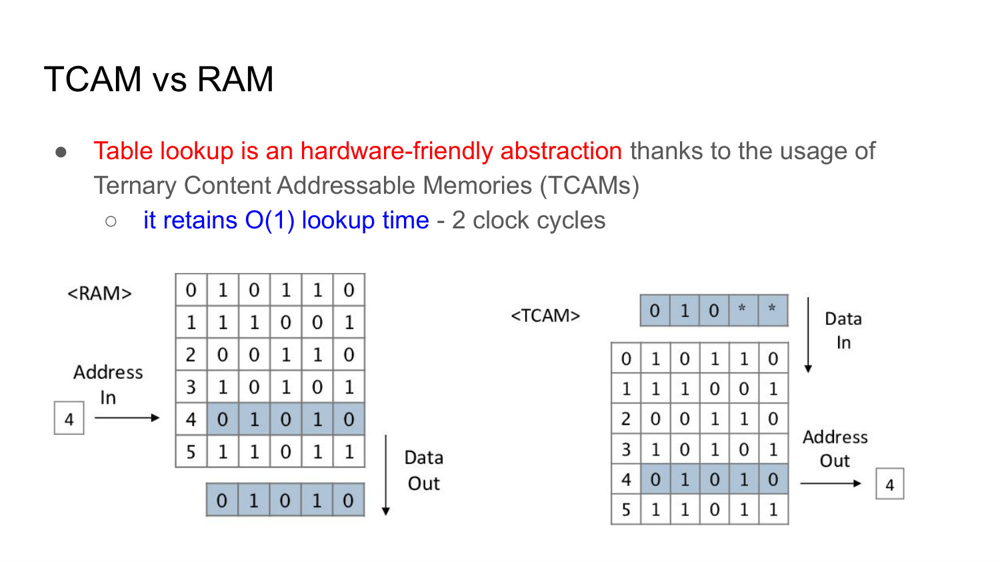
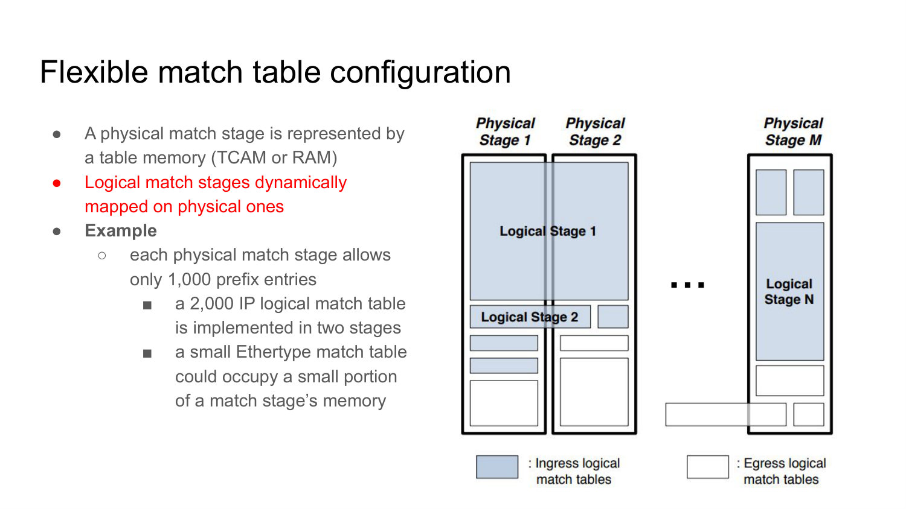
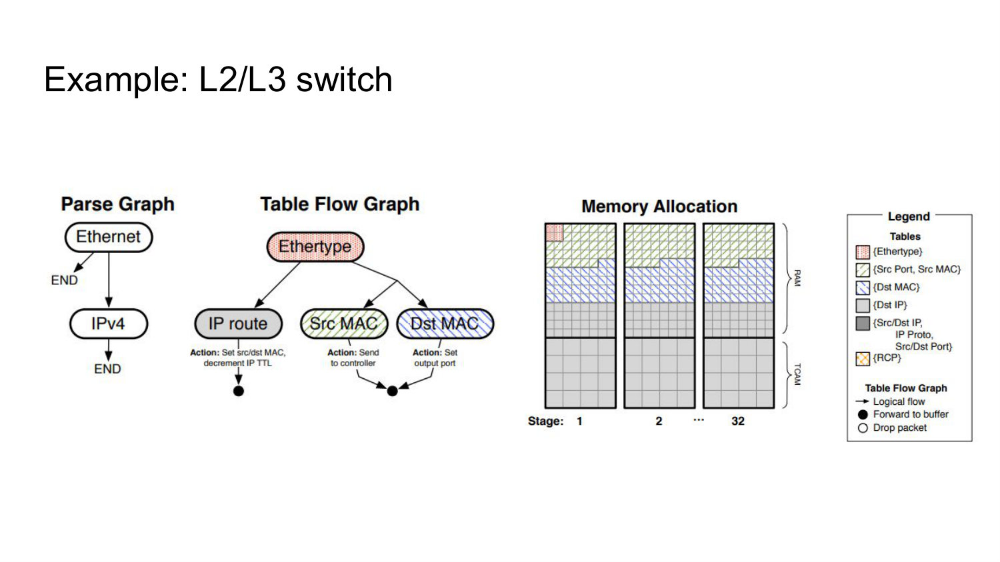
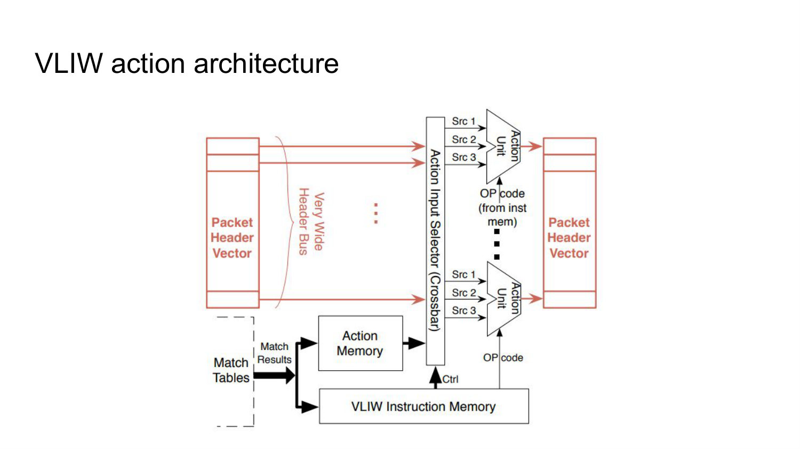
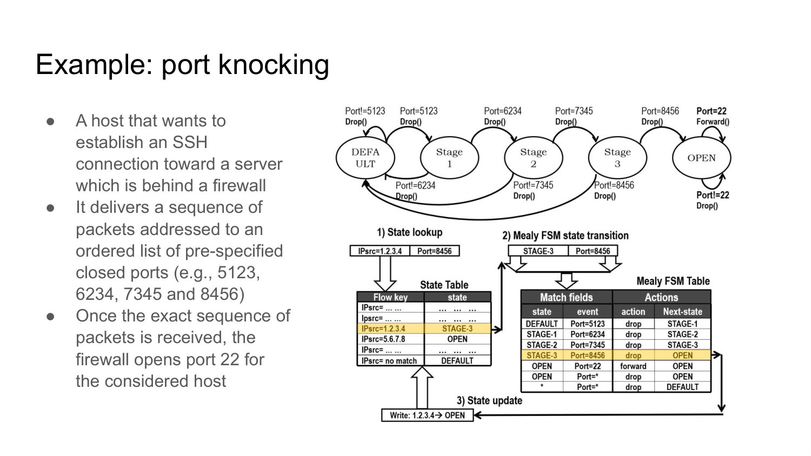

# 010 - Programmable Data Plane

## Why do fixed-function switch chips limit network innovation?

Traditional switch ASICs implement a known set of operations - parse known headers, look up fixed fields, rewrite data, add or remove tunnel headers, and forward or drop - in fixed-size tables arranged in a predetermined pipeline.

Table widths, depths, recognized fields, actions, and stage order are chosen when the chip is fabricated. The device is fast, but a new protocol or action that does not fit the predefined pipeline may require new hardware. Data-plane programmability tries to preserve ASIC speed while making those processing choices reconfigurable.

_Source: Lecture 010, slide 4._

## Why is data-plane programmability described as a win-win for operators and vendors?

Operators can implement and deploy new functions through a device programming interface instead of waiting for a vendor hardware cycle. Vendors can sell a common programmable platform rather than predicting and hard-wiring every customer use case.

NFV was an early form of this idea: functions became software on general-purpose infrastructure, reducing CAPEX and increasing flexibility. However, NFV also exposes the performance limits of software packet processing, which motivates programmable switching hardware.

_Source: Lecture 010, slide 5._

## Why are software acceleration and horizontal VNF scaling not a complete answer to performance?

Techniques such as DPDK and VPP reduce software I/O overhead, and horizontal scaling runs several VNF instances in parallel. Both improve performance but cannot remove the serial portion of a processing task.

Amdahl's law gives `speedup = 1 / ((1-F) + F/N)`, where `F` is the parallelizable fraction and `N` is the number of processing units. With 99% parallelism and 128 cores, the maximum speedup is only about 56 times, far below 128. Adding cores therefore gives diminishing returns.



_Source: Lecture 010, slides 6-7._

## What is the basic compromise behind a programmable data plane?

The design uses an ASIC to guarantee very high, predictable packet throughput but exposes controlled programmability through a domain-specific language such as P4.

General-purpose software offers flexibility but may miss line-rate requirements; a completely fixed ASIC offers performance but cannot evolve. A programmable switch restricts the programming model to operations the hardware can execute safely at wire speed.

_Source: Lecture 010, slide 8._

## What steps does a conventional data plane perform on a received packet?

The control plane first establishes a packet-processing policy. The data plane executes it by parsing selected packet bytes, choosing the required sequence of processing operations, applying actions such as checksum updates or counter changes, and forwarding the modified packet according to the results.

In a conventional device, the available parsers, tables, and actions are well defined in advance. Programmability exposes more of this logic to systematic and rapid reconfiguration.

_Source: Lecture 010, slide 10._

## Compare a Single Match Table with Multiple Match Tables.

A Single Match Table combines all relevant header fields in one wide lookup. To express flexible behavior, it may need entries for a huge cross-product of field combinations, wasting memory.

Multiple Match Tables use smaller tables over subsets of fields in a pipeline. Later stages can depend on earlier results, which reduces duplication and supports incremental decisions. Fixed-function MMT switches are still limited because the number of stages, widths, depths, fields, and order are predetermined.



_Source: Lecture 010, slides 11-12._

## What is the definition of a programmable data plane?

A programmable data plane exposes packet-processing logic so it can be systematically, rapidly, and comprehensively reconfigured by control software.

This includes programming how headers are parsed, creating tables that match arbitrary fields at different protocol layers, and defining new processing actions. Merely changing values in a fixed IP forwarding table is control-plane programmability; changing what the pipeline can parse, match, and do is data-plane programmability.

_Source: Lecture 010, slide 13._

## Why does OpenFlow not fully satisfy the programmable-data-plane definition?

OpenFlow offers multi-layer matching and a hardware-friendly match/action abstraction, so it can express many innovative functions using actions already built into the switch.

Its limitation is that the controller selects among predefined headers, fields, and actions. Classic OpenFlow cannot define a new protocol parser, invent an arbitrary new action, or naturally express stateful packet processing. It programs **entries in a known pipeline**, whereas a language such as P4 also programs the pipeline's structure and behavior.

_Source: Lecture 010, slide 14._

## What design challenge must a programmable switch architecture solve?

It must choose elementary operations and composition primitives expressive enough for useful packet and flow processing, but restricted enough to guarantee wire-speed execution on hardware.

The common solution is to extend match/action rather than expose an unrestricted CPU programming model. PISA focuses on reconfigurable parsing and stateless pipelines, while OpenState extends match/action with programmer-defined state transitions.

_Source: Lecture 010, slide 16._

## What is the PISA/RMT pipeline architecture?

PISA uses a programmable parser followed by a sequence of match/action stages and a deparser. The Reconfigurable Match Tables idea interleaves memory-based matching with processing capabilities implemented by VLIW-style ALUs.

Each stage can classify headers or metadata and execute supported actions. Intermediate metadata carries results between stages. The deparser serializes the final headers back into an outgoing packet.

The pipeline processes many packets concurrently, one per stage, so programmability must respect stage resource and timing limits.



_Source: Lecture 010, slide 18._

## Compare RAM and TCAM for match-table lookup.

RAM is addressed by a specific key and is efficient for exact-match lookup. TCAM compares an input against all stored ternary patterns in parallel, where each bit can be 0, 1, or wildcard.

This makes TCAM well suited to prefix and wildcard rules and gives effectively constant lookup time - the lecture cites two clock cycles - independent of table length. The trade-off is greater area, energy use, and cost than ordinary RAM.



_Source: Lecture 010, slide 19._

## In what ways does RMT go beyond a fixed-function multiple-table switch?

RMT allows field definitions to change and new fields to be parsed. The number, topology, width, and depth of logical match tables can be specified. New actions can be defined from supported primitives, and modified packets can be sent to selected queues.

Logical requirements are compiled onto a finite set of physical memories and ALUs. RMT is therefore reconfigurable, not unlimited: the compiler must fit the program into the target's stage resources.

_Source: Lecture 010, slide 20._

## How are logical match tables mapped onto physical pipeline stages?

A physical stage provides a fixed quantity of RAM or TCAM. The compiler maps logical tables onto those memories according to width, depth, match type, dependencies, and available action resources.

A logical table larger than one stage can span several stages; for example, 2,000 prefixes may occupy two stages that each hold 1,000. A small Ethertype table may use only part of one stage, allowing other logical tables to share the remaining memory.

This mapping is how a flexible program becomes a concrete wire-speed hardware configuration.



_Source: Lecture 010, slide 21._

## What must be specified to implement the lecture's programmable L2/L3 switch?

The **parse graph** says which headers are recognized and extracts Ethertype, IPv4 destination, Layer-2 source, and Layer-2 destination onto the header bus.

The **table-flow graph** specifies which fields each logical table matches and the dependency order among Ethertype, IP routing, source-MAC, and destination-MAC processing. The **memory allocation** maps those logical tables to physical pipeline stages.

These three descriptions cover syntax extraction, logical forwarding behavior, and target resource realization.



_Source: Lecture 010, slides 22-23._

## What is a Very Long Instruction Word architecture, and why is it useful in a switch?

A VLIW instruction explicitly contains several primitive operations that should execute in parallel on different functional units. The compiler, rather than a dynamic CPU scheduler, decides which operations can safely run together.

In a programmable switch stage, the match result selects a VLIW action that drives several ALUs over packet fields or metadata in one bounded cycle. This provides useful action programmability while preserving predictable line-rate timing.



_Source: Lecture 010, slides 24-25._

## How does OpenState generalize the OpenFlow match/action abstraction?

Ordinary match/action can be modeled as a mapping `T: I -> O`, where input symbols are supported matches and output symbols are supported actions. A TCAM implements the mapping.

OpenState adds a programmer-defined state set and changes the model to `T: S x I -> S x O`. The same packet match can therefore produce a different action depending on the current state, and processing can update that state.

It preserves compatibility with OpenFlow-style hardware while enabling dynamic, stateful forwarding behavior.

_Source: Lecture 010, slides 27-28._

## Why is OpenState naturally modeled as a Mealy machine?

A Mealy machine is a finite-state machine whose output depends on both the current state and current input, and whose transition selects a next state. That is exactly the OpenState mapping `T: S x I -> S x O`.

The formal model makes two new abilities explicit: identical packet fields can trigger different actions in different states, and each packet can cause a state transition. Conventional stateless OpenFlow is the special case with no meaningful programmer state.

_Source: Lecture 010, slide 28._

## How do OpenState's state table and Mealy-machine table cooperate for each packet?

The datapath first extracts a flow key and uses an exact-match **state table** to recover that flow's current programmer-defined state. It then combines the state with current packet fields when matching the **extended finite-state-machine table**. The selected transition supplies both packet actions and the next state:

```python
flow_key = extract_flow_key(packet)
state = state_table.get(flow_key, DEFAULT_STATE)

transition = xfsm_table.match(state, packet.headers)
execute(transition.packet_actions, packet)

state_table[flow_key] = transition.next_state
```

The state table answers, "what happened previously for this flow?" The Mealy table answers, "given that history and this input, what should happen now?" Separating the two avoids duplicating all packet-match rules for every active flow: many flows hold small state values while sharing one transition program.

In the port-knocking example, the flow key identifies the client, the stored value records how much of the knock sequence it has completed, and the XFSM transition both changes that value and decides whether to drop or eventually allow SSH. A production design can define different lookup and update scopes, but the lecture's simple case updates the same per-client state it looked up.



_Source: Lecture 010, slides 28-29._

## How does the port-knocking example demonstrate stateful data-plane processing?

A client behind a firewall sends packets to a precise sequence of normally closed ports, such as 5123, 6234, 7345, and 8456. The firewall advances one state only when the next expected knock arrives; an incorrect input can reset or leave the sequence closed.

After the final correct knock, the per-host state becomes `OPEN`, and traffic to SSH port 22 is forwarded. The same SSH packet is therefore dropped in the default state but accepted in the open state, demonstrating state-dependent output and transitions entirely in the data plane.


_Source: Lecture 010, slide 29._

## Compare PISA and OpenState as approaches to programmable forwarding.

PISA makes the packet-processing structure programmable: custom parsing, configurable match/action stages, metadata, actions, and deparsing are compiled onto a high-speed pipeline.

OpenState focuses on stateful behavior while retaining the existing OpenFlow match/action hardware model. It adds a state lookup and state transition so actions can depend on flow history.

PISA primarily answers "what headers and actions can the pipeline implement?" OpenState answers "how can the result depend on prior packets?" A target may combine both ideas.

_Source: Lecture 010, slides 16-29._
