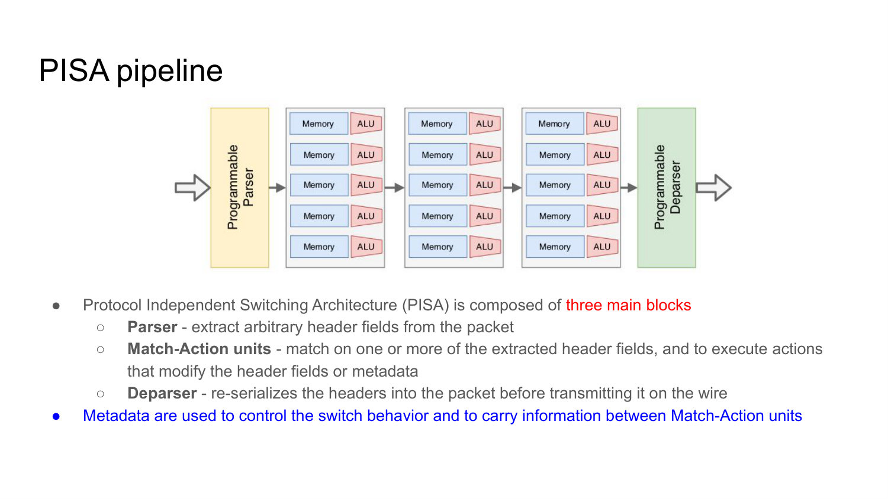
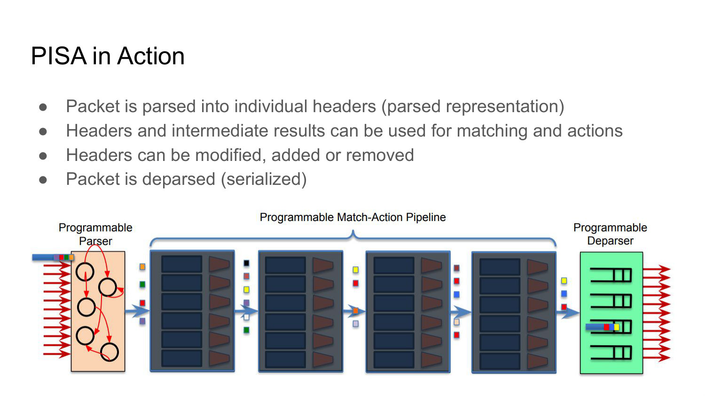
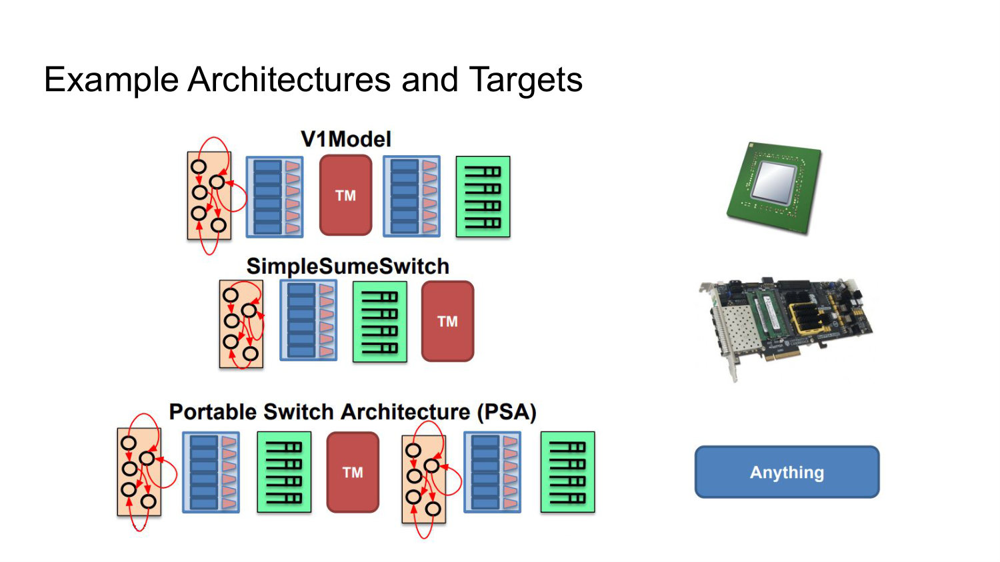
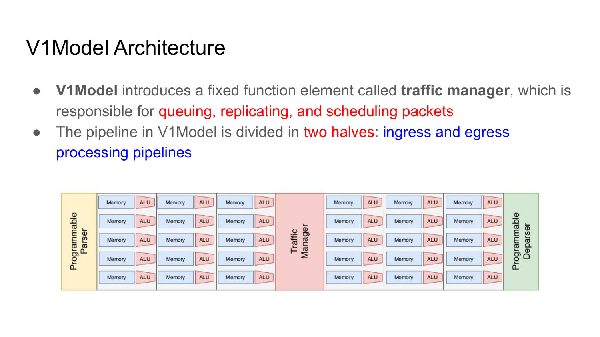
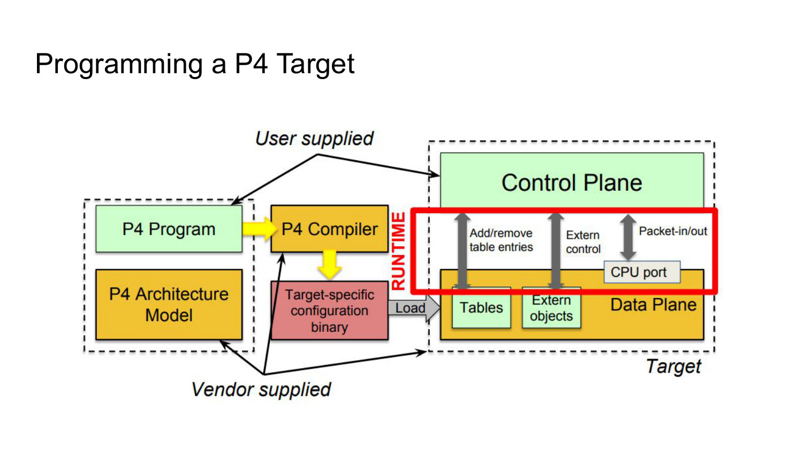
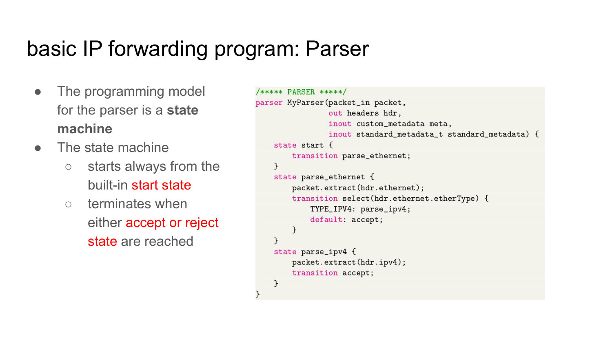
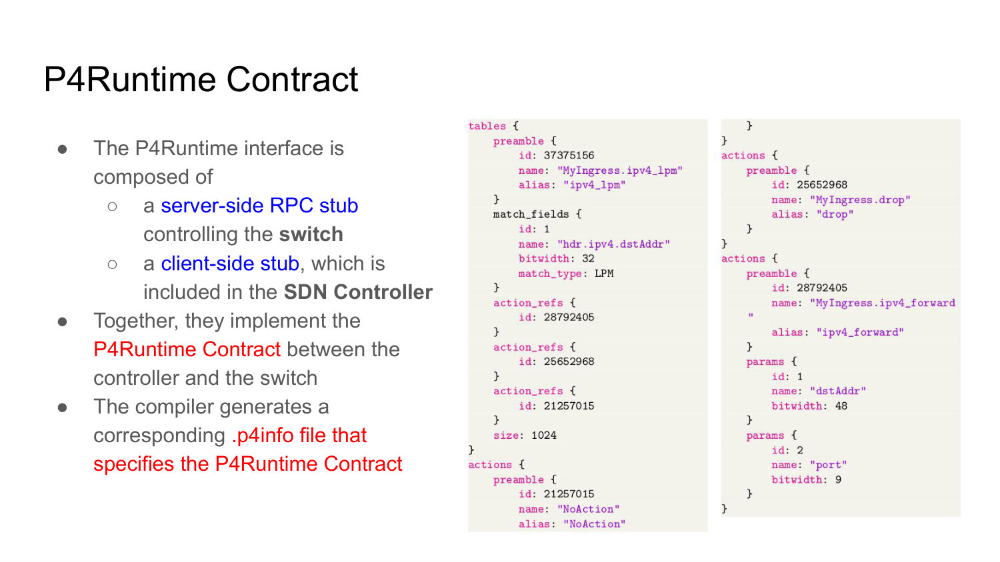
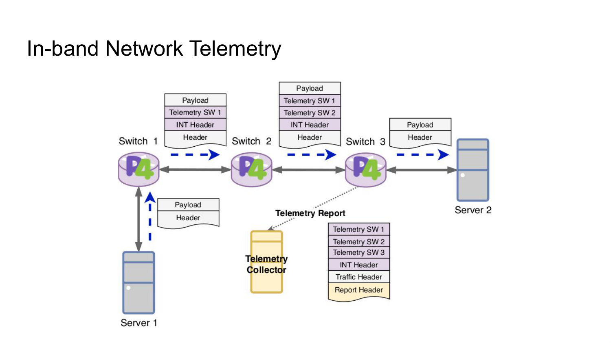
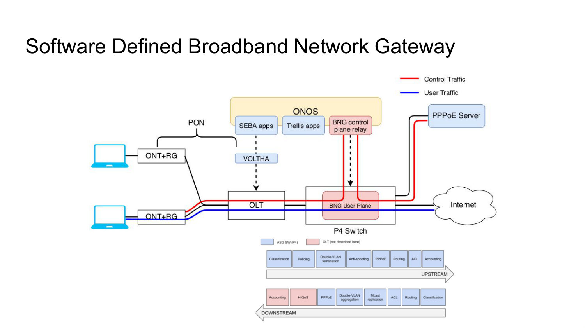

# 011 - The P4 Ecosystem

## How do fixed-function and programmable stages differ in a high-speed switch pipeline?

A high-speed switch processes several packets concurrently in a multi-stage pipeline. Each stage contributes part of the forwarding decision by operating on selected header fields or metadata.

A **fixed-function stage** understands only the protocols, fields, and actions chosen by the vendor. A **programmable stage** can be configured to parse user-defined fields and apply a compiled match/action program.

Programmability changes the behavior available at a stage, but the target still imposes finite table, ALU, timing, and pipeline resources.

_Source: Lecture 011, slide 4._

## What are the three main blocks of PISA, and what role does metadata play?

The programmable **parser** extracts arbitrary headers into a structured representation. The **match/action pipeline** matches extracted fields or metadata and executes actions that modify headers or metadata. The **deparser** serializes the selected and modified headers into the outgoing packet.

Metadata is internal information used to control processing and carry intermediate results from one match/action stage to another. Unlike emitted headers, metadata normally exists only inside the pipeline.



_Source: Lecture 011, slides 5-6._

## Walk through a packet's lifecycle in a PISA switch.

The parser recognizes the packet's protocol sequence and extracts individual headers. Match/action stages then use headers and intermediate metadata to classify the packet, build the forwarding decision incrementally, and modify, add, or remove headers.

Finally, the deparser emits the valid headers in the programmed order and appends the remaining payload. Because packets occupy different stages concurrently, the lifecycle must complete within the target's bounded per-stage processing budget.



_Source: Lecture 011, slide 7._

## What is P4, and what does target independence mean?

P4 is a high-level language for describing packet-processing pipelines. The programmer specifies how packets are parsed, matched, transformed, and emitted rather than writing low-level instructions for a particular chip.

Target independence means the same high-level program is not tied to one hardware implementation. A target-specific compiler translates it into the available stages and allocates table and action resources. Independence is constrained by the selected P4 architecture and target capabilities: a program must still fit the target and use the facilities its architecture exposes.

_Source: Lecture 011, slide 8._

## Why does P4 define a P4 architecture in addition to the language?

P4 targets are heterogeneous: they have different pipeline blocks, resources, fixed-function units, and capabilities. The language alone cannot pretend all targets are identical.

A P4 architecture, described by an `arch.p4`-style file, is a contract between the program and compiler. It defines the programmable blocks, their interfaces, and the target facilities visible to the program. The program is portable among targets implementing that architecture, while the compiler handles target-specific mapping.



_Source: Lecture 011, slides 9-10._

## What does a generic `arch.p4` definition expose?

It defines the input and output interfaces between pipeline blocks, including the signals and metadata passed among them. It declares **externs**, which expose target-specific fixed-function facilities such as checksum units, hash functions, counters, meters, or registers.

It may also extend core P4 types with target-supported match kinds or other architectural types. An architecture such as PSA therefore describes the programmable contract without revealing every low-level implementation detail.

_Source: Lecture 011, slide 11._

## What is distinctive about the V1Model architecture?

V1Model divides packet processing into ingress and egress pipelines. Between them is a fixed-function **traffic manager** responsible for queueing, replication, and scheduling.

The program controls the parsers, match/action blocks, and deparsers exposed by V1Model, while the architecture defines how metadata and packets pass through the traffic manager. This is a concrete example of an architecture mixing programmable blocks with fixed-function services.



_Source: Lecture 011, slide 12._

## What inputs are supplied by the P4 programmer and by the target vendor when programming a P4 device?

The user supplies the P4 program that defines packet behavior. The vendor or target ecosystem supplies the architecture model, compiler backend, target-specific configuration libraries, and the runtime implementation for that device.

The compiler combines the program with the architecture contract to produce a target pipeline configuration and control-plane metadata. At runtime, the controller populates tables and operates extern objects through the target's control interface.

This division lets users define behavior without implementing a new compiler or hardware driver for every program.



_Source: Lecture 011, slide 13._

## Why does P4 omit loops, pointers, and dynamic memory allocation?

P4 resembles C syntactically, but it describes bounded packet processing rather than a general-purpose program. Switching ASICs have limited local memory and must guarantee that each packet completes a stage within a fixed time.

Unbounded loops, pointer-based memory access, and dynamic allocation would make execution time and resource use difficult to predict. Removing them lets the compiler statically analyze and map the program onto a deterministic pipeline.

_Source: Lecture 011, slide 15._

## What major parts must a V1Model P4 program define?

It defines header and metadata types, a parser, ingress processing, egress processing, and a deparser. V1Model templates also connect architecture-specific checksum verification and update controls around these blocks.

The headers describe the packet representation; the parser constructs it; ingress and egress controls apply tables and actions; the deparser rebuilds the packet. These sections mirror the target architecture and make the pipeline explicit in source code.

_Source: Lecture 011, slides 15-17._

## In the lecture's P4 program, how do on-wire headers differ from metadata and from the `headers` aggregate?

```c
typedef bit<9> egressSpec_t;
typedef bit<48> macAddr_t;

// ipv4_t is declared separately with the IPv4 fields shown on the slide.

header ethernet_t {
    macAddr_t dstAddr;
    macAddr_t srcAddr;
    bit<16> etherType;
}

struct custom_metadata {
    /* internal pipeline fields would go here */
}

struct headers {
    ethernet_t ethernet;
    ipv4_t ipv4;
}
```

A `header` type describes serialized packet fields and each header instance has a validity bit. Before extraction, `hdr.ethernet` is invalid; `packet.extract(hdr.ethernet)` copies bytes from the packet and marks it valid. A program can also invalidate or create headers before deparsing.

The `headers` struct simply aggregates the header **instances** passed between parser, controls, and deparser; the struct itself is not another on-wire header. `custom_metadata` holds internal values used during processing. Metadata is neither extracted from nor automatically emitted into the packet, so it can carry decisions without changing the wire format.

_Source: Lecture 011, slide 17._

## How does a P4 parser work?

A P4 parser is a state machine. It always begins in the built-in `start` state. Each state can extract a header and choose the next state according to parsed values, such as transitioning from Ethernet to IPv4 when the Ethertype indicates IPv4.

Parsing terminates at `accept` for a valid recognized representation or `reject` for failure. This explicit graph lets a program support user-defined protocol sequences rather than relying on a vendor-fixed parser.



_Source: Lecture 011, slide 18._

## Walk through the lecture's Ethernet/IPv4 P4 parser line by line.

```c
const bit<16> TYPE_IPV4 = 0x0800;

state start {
    transition parse_ethernet;
}

state parse_ethernet {
    packet.extract(hdr.ethernet);
    transition select(hdr.ethernet.etherType) {
        TYPE_IPV4: parse_ipv4;
        default: accept;
    }
}

state parse_ipv4 {
    packet.extract(hdr.ipv4);
    transition accept;
}
```

`start` consumes no bytes and transfers control to `parse_ethernet`. That state extracts a fixed-width Ethernet header, advancing the input cursor and making `hdr.ethernet` valid. Its `select` then branches on the extracted EtherType. IPv4 traffic moves to `parse_ipv4`, which extracts and validates the IPv4 header; other EtherTypes take the default transition.

`accept` means **stop parsing with the headers obtained so far**. It does not inherently mean forward the packet. Non-IPv4 Ethernet packets can therefore be accepted as an Ethernet-only representation and later forwarded, dropped, or otherwise handled by ingress logic. `reject`, by contrast, signals parser failure.

_Source: Lecture 011, slide 18._

## What is the difference between ingress and egress processing in a P4 program?

Ingress processing usually performs the main classification and forwarding decision. It defines actions, tables, and the order in which they are applied, often setting the output port and modifying headers.

Egress processing runs after the traffic manager and can apply behavior that depends on the selected egress port or queue. For example, it can add a VLAN tag only on ports that require tagged output.

Separating the two allows policy before queueing and port-specific adaptation after the egress choice.

_Source: Lecture 011, slides 19-20._

## What packet changes does the lecture's `ipv4_forward` P4 action perform, and why?

```c
typedef bit<9> egressSpec_t;

action ipv4_forward(macAddr_t dstAddr, egressSpec_t port) {
    standard_metadata.egress_spec = port;
    hdr.ethernet.srcAddr = hdr.ethernet.dstAddr;
    hdr.ethernet.dstAddr = dstAddr;
    hdr.ipv4.ttl = hdr.ipv4.ttl - 1;
}
```

The control-plane table entry supplies a next-hop MAC address and output port. Writing `egress_spec` selects that egress. The action first uses the frame's old destination MAC—the address of this router interface—as the outgoing source MAC, then replaces the destination with the next hop. Finally it decrements the IPv4 TTL so a routing loop cannot persist indefinitely.

The action assumes it is invoked for a valid IPv4 packet with a usable TTL and that checksum processing elsewhere in the architecture will update the IPv4 header checksum. It illustrates an important P4 division: source code defines **what the action does**, while each runtime table entry supplies **which next hop and port** it should use for a prefix.

_Source: Lecture 011, slide 19._

## How does the `ipv4_lpm` table declare its contract, and why is it applied only to valid IPv4 headers?

```c
table ipv4_lpm {
    key = {
        hdr.ipv4.dstAddr: lpm;
    }
    actions = {
        ipv4_forward;
        drop;
        NoAction;
    }
    size = 1024;
    default_action = drop();
}

apply {
    if (hdr.ipv4.isValid()) {
        ipv4_lpm.apply();
    }
}
```

The key says entries match the IPv4 destination by longest prefix. The action list is the set of legal behaviors a control-plane entry may select, `size` requests capacity for 1,024 entries, and `default_action` makes an unmatched IPv4 packet fail closed.

The validity guard matters because a non-IPv4 Ethernet packet took the parser's `default: accept` path and has no extracted IPv4 header. Matching `hdr.ipv4.dstAddr` in that case would use an invalid field. Compilation defines the table and legal actions, but it does not create the routing entries; the controller later populates prefixes, `dstAddr`, and `port` through P4Runtime.

_Source: Lecture 011, slide 19._

## What does the P4 deparser do?

The deparser defines the order in which valid parsed or newly created headers are serialized into the outgoing packet. It therefore controls how the packet is rebuilt after pipeline modifications.

```c
control MyDeparser(packet_out packet, in headers hdr) {
    apply {
        packet.emit(hdr.ethernet);
        packet.emit(hdr.ipv4);
    }
}
```

Emission order is wire order. `emit` serializes only a header marked valid, so a non-IPv4 packet accepted by the parser emits Ethernet and skips the invalid `hdr.ipv4`; invalidating a parsed header removes it from the reconstructed packet. Bytes beyond the last parsed field are included by default, so the program does not need to explicitly emit the payload or headers it deliberately left unparsed.

_Source: Lecture 011, slide 21._

## How does P4Runtime differ from OpenFlow?

P4Runtime is the control-plane interface for a data plane whose pipeline was defined in P4. Like OpenFlow, it lets a controller manage table entries and runtime state, but it is not limited to a protocol and action set standardized in advance.

The controller can operate the custom tables, actions, counters, and other objects produced by the P4 program. OpenFlow programs a largely predefined pipeline; P4Runtime controls a program-defined pipeline.

_Source: Lecture 011, slide 22._

## Which P4 changes require recompiling and loading the pipeline, and which can P4Runtime make while it runs?

Compilation combines the P4 program with the selected architecture and target backend. It produces a target pipeline configuration plus P4Info, the controller-facing schema for that particular program.

| Compile/load time | P4Runtime time |
| --- | --- |
| Header formats and parser states | Entries in already-declared match tables |
| Which tables, keys, and actions exist | Action parameters for those entries |
| Control flow among tables | Runtime state of counters, meters, registers, and other externs when exposed by the selected architecture and target |
| Deparser order and declared externs | Packet-in/packet-out and pipeline-independent session control |

Changing a route from one next hop to another is a runtime entry update. Adding a new protocol header, parser transition, table key, action implementation, or emitted header changes the pipeline schema and requires recompilation and target loading.

This boundary prevents a common misconception: P4Runtime controls a **custom** pipeline, but it does not turn every runtime request into arbitrary new P4 source. The controller must use the objects and identifiers exposed by the P4Info that matches the loaded pipeline.


_Source: Lecture 011, slides 13 and 22-23._

## What is the P4Runtime contract, and what is the purpose of the `.p4info` file?

P4Runtime uses a server-side RPC stub on the switch and a client-side stub in the controller. Together they implement the runtime contract for controlling the compiled pipeline.

The P4 compiler generates a `.p4info` file that describes the P4-visible entities and the numeric identifiers defined for **that pipeline/P4Info**: tables, actions, match fields, counters, and related objects. The controller uses this schema to construct valid runtime requests without reverse-engineering target-specific configuration. It must not assume those identifiers remain unchanged after a different program is compiled and loaded.



_Source: Lecture 011, slide 23._

## How does In-band Network Telemetry work?

INT collects network statistics without requiring the control plane to poll every device continuously. The source injects an INT header into a normal data packet, packet clone, or dedicated probe.

The header contains instructions describing which telemetry to collect. Each INT-capable switch interprets them and appends available metadata, such as its identity, queue state, or timing information. The last INT node removes the telemetry header and sends a report to a collector for analysis.

INT turns the data path itself into the measurement path and can report per-packet conditions that periodic polling would miss.



_Source: Lecture 011, slides 25-27._

## What is a Broadband Network Gateway, and why is a P4-based SD-BNG useful?

A BNG manages subscriber access in a broadband network. It establishes and tracks sessions, aggregates subscriber traffic, applies access policy, and routes traffic into the provider core.

Traditional BNGs often expose closed proprietary APIs and require costly integration across vendor equipment. With P4, BNG packet-processing behavior can run on merchant silicon and be controlled through an open API such as P4Runtime. This reduces vendor coupling and can lower deployment and operational cost while allowing the pipeline to evolve in software.



_Source: Lecture 011, slides 28-29._

## In the lecture's SD-BNG architecture, how are subscriber control and line-rate user traffic separated?

Subscriber devices connect through an Optical Network Terminal and Residential Gateway (`ONT+RG`), the Passive Optical Network, and the Optical Line Terminal (`OLT`). ONOS hosts SEBA and Trellis applications; VOLTHA provides control toward the access equipment. A BNG control-plane relay exchanges subscriber/session signaling with the PPPoE server and programs the BNG user plane.

The P4 switch carries ordinary subscriber **user traffic** at line rate between the access side and the Internet. Its programmed pipeline performs functions such as classification, policing, VLAN termination or aggregation, anti-spoofing, PPPoE processing, routing, ACL enforcement, accounting, multicast replication, and downstream hierarchical QoS. Control traffic is diverted through the control-plane path rather than making the line-rate pipeline implement the entire session-management application.

The split is useful because the control plane handles slower, stateful subscriber lifecycle decisions, while the P4 data plane repeatedly enforces the resulting per-subscriber forwarding policy. Open interfaces connect the two, replacing a closed monolithic BNG without pretending that every BNG responsibility belongs in the switch ASIC.


_Source: Lecture 011, slide 29._
